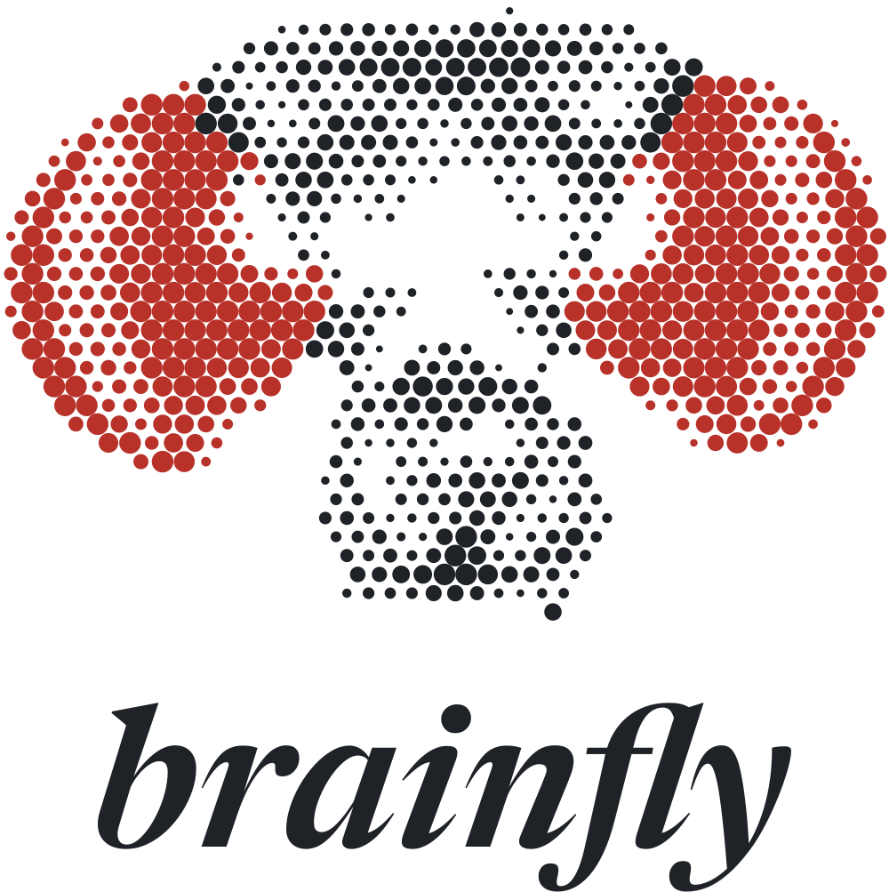
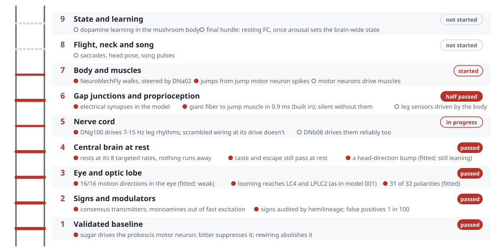

<p align="center">
  <picture>
    <source media="(prefers-color-scheme: dark)" srcset="assets/logo-dark.svg">
    
  </picture>
</p>

<p align="center"><i>Closing the loop from connectome to fly.</i></p>

brainfly is an open attempt to turn a complete fruit fly connectome into a fly that senses, decides
and moves, and to say at every layer which parts are validated, which are fitted and which are
still guesses.

It works from **MaleCNS v1.0**, the first map of a whole fly central nervous system, brain and nerve
cord in one animal: **166,700 neurons and 25.6 million connections**, traced synapse by synapse in
electron microscopy. Because the nerve cord is in the map, a simulated body can be driven through the
fly's real motor neurons rather than through a few hand-picked command neurons. Nobody has done that
yet. The best-known attempt, Eon Systems' March 2026 "embodied fly", maps brain to body
[by hand, by its own account](https://eon.systems/updates/embodied-brain-emulation), and it has no
nerve cord.

## A wiring diagram is not a working fly

A connectome records who connects to whom. It doesn't record which neurons spike and which signal in
graded steps, what sign each synapse has, where the electrical synapses are, what the neuromodulators
do, or how the muscles respond. Theory says the wiring alone
[often can't pin down a network's dynamics](https://www.nature.com/articles/s41593-025-02080-4), and
in 2026 a worm's connectome with a trained decoder
[walked a simulated fly body realistically](https://www.biorxiv.org/content/10.64898/2026.03.20.713233v1).
A simulation that looks like a fly proves little.

So brainfly adds biology one layer at a time and holds each layer to two tests, written down before
it runs: it has to match data from real flies, and it has to **stop working when the wiring is
scrambled**. The plan, the evidence behind it, and a diagnosis of what has gone wrong so far are in
the [research report](reports/Embodied%20fly%20connectome%20simulation.md).

## Where it stands (September 2026)

* **One brain now rests, escapes a looming threat, and tastes.** Rung 4's resting brain, given flyvis's
  eyes, passes rung 1's taste tests and a looming escape test at once. The test was pre-registered, run on
  fresh seeds, and gated on scrambled wiring, which abolishes both behaviors
  ([`experiments/taste_escape.py`](experiments/taste_escape.py)):
  - **Taste:** sugar on the left taste neurons raises the proboscis motor neuron MN9 by 21 Hz (t = 30), a
    tenth of the drive barely moves it, and bitter or Ir94e neurons veto it. Water does nothing, and MN9
    rests quietly at 3 Hz with no spontaneous extensions.
  - **Escape:** a looming disk raises the loomed side's giant fiber, the neuron that fires the escape jump,
    by 26 Hz, while the other side stays put.
  - **Rest:** the rest of the brain stays at its measured rates, with 99.96% of calibrated cell types within
    a factor of 2 of their targets.

  Three changes to the resting brain made this possible, each traced by an experiment:
  1. **Depression by synapse class.** Short-term depression now follows the literature by synapse class,
     instead of the ORN-to-PN value at every cholinergic synapse, which capped fast inputs
     ([`experiments/depression_rules.py`](experiments/depression_rules.py)).
  2. **No same-type synapses between visual projection neurons.** Most of these join axon terminals in the
     neurons' optic glomerulus, but a point neuron counts them as input to the cell. On the left, where the
     reconstruction gives them a larger share, they made the LPLC2s ignite at rest in about half the flies
     ([`experiments/vpn_axoaxonic.py`](experiments/vpn_axoaxonic.py)).
  3. **Rung 1's taste route keeps rung 1's settings.** Its 129 cholinergic neurons go undepressed, since no
     depression has been measured at any taste synapse. Its 42 descending neurons rest at 2 Hz instead of
     0.1. The 0.1 Hz came from walking and escape neurons, while the gnathal descending neurons with
     measured rates fire tonically (DSOG1 at about 17 Hz, the octopaminergic VUMd neurons at 4). A literature review
     ([notes](research_notes/Rung%204%20resting%20state%20data/taste_at_rest.md)) traced the lost taste to
     exactly these two settings, and pilots ruled out broader versions that set off spontaneous MN9 bouts
     ([`experiments/taste_route.py`](experiments/taste_route.py)).

<picture>
  <source media="(prefers-color-scheme: dark)" srcset="assets/tastes-dark.svg">
  
</picture>

One simulated fly at rest until sugar reaches its left taste neurons (left). Sugar's route through the
brain lights up, and MN9 is ringed when it fires. Right, the mean of 8 flies: the second-order taste neurons
answer sugar with or without bitter. Bitter's veto acts further down, on the premotor loop and MN9.
`python assets/tastes.py` redraws it.

<picture>
  <source media="(prefers-color-scheme: dark)" srcset="assets/sees-dark.svg">
  
</picture>

The escape, in escape_at_rest2.py's brain, before the taste route's change (after it, the giant fiber rises 26 Hz, against 25):
one fly with flyvis's eyes, at rest until a dark disk looms at its left eye. The left eye's looming
detectors light up over the resting activity, and the left giant fiber, silent at rest, fires as the
disk arrives (ringed). Right: the loomed side's LC4, LPLC2 and giant fiber, mean of the 8 flies of that
test's confirmation run. `python assets/sees.py` redraws it.

* **The connectome's compass holds a heading, in its own circuit.** No published model gets a
  head-direction bump from synapse counts times one weight, and neither did rung 4's brain. A literature
  review ([notes](research_notes/Rung%204%20resting%20state%20data/head_direction_models.md)) traced why:
  flat inhibition from ring neurons makes up 75% of the EPGs' input, and the first attempt had left it out.
  With the ring neurons in, per-class gains fitted by CMA-ES, and slow homeostasis in each neuron (Renart
  et al. 2003), the ring's 460 neurons hold a bump like a fly's with no cue. It's 90° wide, EPGs fire
  about 2–3 Hz, and it drifts at D = 0.011 rad²/s (flies in darkness: about 0.003–0.04). It visits every
  heading and passes rung 4's bump test on unseen seeds
  ([`experiments/ring_fit3.py`](experiments/ring_fit3.py)). Inside the whole resting brain it keeps a
  fly-like bump but favors half the ring. Homeostasis in place would have to average over far longer
  runs than tried so far, because the bump takes about 20 minutes to diffuse around the ring
  ([`experiments/ring_whole.py`](experiments/ring_whole.py)).

<picture>
  <source media="(prefers-color-scheme: dark)" srcset="assets/compass-dark.svg">
  
</picture>

The head-direction ring alone, with no cue (left: the ellipsoid body's 16 wedges lit by their EPGs;
right: the same run over a minute). `python assets/compass.py` redraws it.

* **Looming now reaches the escape neuron through the eyes, LC4 included.** brainfly tiles flyvis's
  fitted optic lobe onto the male eye's 1,771 columns (`FlyvisNative`, `brainfly/optic.py`). All 16
  T4/T5 motion detector types, in both eyes, prefer their biologically correct direction, with the
  lattice orientation taken from dendrite anatomy alone. A looming disk (`brainfly/eye2d.py`) drives
  LPLC2 and the giant fiber, the neuron that fires the escape jump, on the loomed side only; the giant
  fiber first fires about 80 ms before contact. The other looming detector, LC4, stayed silent. In
  flyvis's best model its main input, T2, answers only light turning on, while a real T2 answers
  darkening too (Keleş et al. 2020), and a looming disk is darkening. With the best flyvis model
  whose T2 does that, LC4 on the loomed side rises by 9.4–9.7 Hz, with peaks of 26 Hz, and the other
  side's doesn't move. That passed its pre-registered test on a fresh seed
  ([`experiments/eyepath_native_t2.py`](experiments/eyepath_native_t2.py)). Rung 3 isn't passed yet:
  that model gets 29 of the 32 known contrast polarities right, one short of the bar, and one of the
  16 motion directions wrong. No pretrained flyvis model gets both, so the next step is training one.

<picture>
  <source media="(prefers-color-scheme: dark)" srcset="assets/looming-dark.svg">
  
</picture>

A dark disk looms at the fly's left eye. With flyvis's model 001 (red), whose T2 answers darkening,
LC4 on that side climbs to 29 Hz; with model 000 (dashed) it doesn't move. LPLC2 and the giant fiber
respond to both, more strongly with 001. Each line is the mean of 6 flies at the same gain and seed
(the two experiments' sweeps). `python assets/looming.py` redraws it from the saved results.

* **The brain now steers a body, and the body turns with a rotating drum: the project's first
  pre-registered passes.** Seen through `FlyvisNative`, a drum turning counterclockwise sweeps
  front-to-back across the left eye. The left HS cells fire 29 Hz, against 10 Hz when it turns the
  other way, the right ones the reverse, and the steering neuron DNa02 follows on the same side (3.3
  against 0.8 Hz), confirmed on a fresh seed. Rewiring the connectome at random, with every neuron
  keeping as much input as before, abolishes both signals in three rewirings out of three, while the
  neurons stay active. Then the loop is closed: NeuroMechFly (FlyGym) walks inside the drum while
  DNa02 sets the drive to each side of its body (`brainfly/body.py`), and all 8 flies turn with the
  drum, at about 0.4 times its speed. The link from DNa02 to the legs is an assumption: the nerve cord
  isn't simulated, and a walking controller stands in for it.

<picture>
  <source media="(prefers-color-scheme: dark)" srcset="assets/optomotor-dark.svg">
  
</picture>

The optomotor pathway, open loop (left; `experiments/optomotor.py`) and closed loop (right;
`experiments/closed_loop.py`). `python assets/optomotor.py` redraws it from the saved results.

* **Rung 1 passes, on the sixth attempt.** Shiu et al.'s whole-brain recipe, the best-validated model
  of the fly brain, runs away on MaleCNS as it stands. A test against Brian2, an idea borrowed from
  doomfly, found brainfly's implementation of it three steps out of line, and the first three
  attempts were rerun on the corrected kernel. The pass runs on `HybridBrain`, brainfly's own
  engine, with Shiu's neuron model and four changes, each from the report or the literature: each
  synapse divided by its target's size, fast transmission only from neurons with a known fast
  transmitter, no Kenyon-to-Kenyon excitation, and no synapses onto sensory neurons. The network stays
  stable, sugar drives the proboscis motor neuron in proportion to its rate, bitter and Ir94e
  suppress it, and scrambling the wiring abolishes the route. Shuffling the synapses' strengths does
  not, so the route rests on which neurons connect ([details](#rung-1-in-detail)).
* **The brain now rests at the rates real neurons do, though not yet with their rhythm (rung 4).**
  Rung 4 asks the brain to rest like a fly: a mean rate of 4 Hz or less, resting functional
  connectivity (FC) that matches whole-brain imaging of real flies (Turner et al. 2021, 20 flies), and
  a head-direction bump. [`brainfly/imaging.py`](brainfly/imaging.py) reproduces the flies' FC
  exactly and takes the same measurement of a simulation. Attempt 1 fitted one bias per cell type to
  measured resting rates, and failed: a few central-complex neurons burst, and the fit didn't carry
  over to fresh starts. Attempt 2 added the short-term depression measured at the fly's cholinergic
  synapses, a reset below rest and measured thresholds. On fresh starts, 99.99% of the 11,770 cell
  types now rest within a factor of 2 of their targets, nothing runs away, and every type measured in
  real flies fires at its measured rate (MBON11 37.1 Hz, against 37.2). The resting FC still misses.
  It correlates with the flies' at r = 0.38, no better than the same neurons firing independently
  (0.40), and randomly rewired networks calibrated the same way do better (0.50). The model's
  correlations run along a few strong pathways, while the flies' are broad and diffuse, and the bump
  doesn't move. Fitting per-type gains to the imaging itself, rung 4's original plan, comes next
  ([`experiments/rest_calibration2.py`](experiments/rest_calibration2.py)).

<picture>
  <source media="(prefers-color-scheme: dark)" srcset="assets/rest-dark.svg">
  
</picture>

One simulated fly at rest in attempt 2 (left; 1 s of brain time per loop, each red speck a neuron
firing in that 100 ms). The types measured in real flies sit at their literature rates in attempt 2
(red) and were far off in attempt 1 (grey). The flies' resting FC is broad and diffuse, and the
model's runs along a few strong pairs (bottom). `python assets/rest.py` redraws it.
* **The model brainfly inherited fails in three places, each traced to a modelling choice**
  ([below](#where-it-started)). Light dies at the first synapse after the eye, commands from the
  brain never reach the motor neurons, and scrambled wiring signals as well as the real wiring.

## The ladder

Each rung adds the kind of model neuron and the data the biology calls for. A rung passes only if it
meets a benchmark from real flies, fixed in advance, and the effect goes away under scrambled wiring.
From the [report's plan](reports/Embodied%20fly%20connectome%20simulation.md#nine-rungs-to-an-embodied-fly-each-gated-by-real-fly-data-and-a-null-control):

<picture>
  <source media="(prefers-color-scheme: dark)" srcset="assets/ladder-dark.svg">
  
</picture>

`python assets/ladder.py` redraws it from the experiments' saved verdicts.

| Rung | What it adds | Passes when | Status |
|---|---|---|---|
| 1. Validated baseline | Shiu et al.'s recipe on MaleCNS: raw synapse counts × one weight, silent at rest, 0.1 ms steps | sugar drives the proboscis motor neuron MN9, bitter and Ir94e inhibit it, the network stays stable, weight shuffles abolish it | **passed** on the sixth attempt (pre-registered, fresh seeds, null gated on scrambled wiring): stable, MN9 follows the sugar rate, bitter and Ir94e suppress it, and rewiring abolishes the route. It survives weight shuffles, so the route rests on which neurons connect |
| 2. Signs and modulators | MaleCNS's consensus transmitters; dopamine, octopamine and serotonin taken out of fast excitation | rung 1 still passes and false positives stay near Shiu's 1% | in progress: rung 1's pass uses consensus transmitters with the monoamines out of fast excitation; false positives not yet measured |
| 3. Eye and optic lobe | a graded optic lobe with per-type parameters; the missing photoreceptor input filled in | contrast polarity for at least 30 of 32 cell types; T4/T5 direction selectivity; looming responses of tens of Hz | in progress: flyvis on its own terms gets all 16 T4/T5 directions right, drives LPLC2 and the giant fiber, and carries a rotating drum to the steering neuron DNa02 with the right sign. With a flyvis model whose T2 responds to decrements, looming drives LC4 too, at peaks of 26 Hz, but that model gets 29 of 32 contrast polarities right, one short, and T5a's direction wrong. None of flyvis's 8 models with such a T2 gets more than 29, so the next step is training one that does |
| 4. Central brain | per-type gains fitted to whole-brain resting-state imaging | held-out functional connectivity; a head-direction bump; a mean rate of 4 Hz or less | in progress: two pre-registered attempts failed. The second rests at every measured rate with nothing running away, but its FC is no closer to the flies' than independent firing or scrambled wiring, and its bump doesn't move. Its successor keeps rung 1's taste and the looming escape passing (pre-registered), and the head-direction ring alone now holds a fly-like bump. Open: whether FC is the right test, since shared neurons and one brain-wide signal explain the flies' FC without any network ([`rest_measurement.py`](experiments/rest_measurement.py)) |
| 5. Nerve cord | Pugliese et al.'s recipe: raw counts, excitability scaled by size, graded premotor neurons, strong descending drive | DNg100 and DNb08 produce 7–15 Hz leg rhythms | not started |
| 6. Electrical synapses and proprioception | a curated layer of gap junctions; leg sensors driven by the body | giant fiber to jump muscle in 0.7–1.2 ms, slowing without the gap junctions as in *shakB* mutants | not started |
| 7. Body and muscles | a FlyGym body stepped with the brain: motor neurons drive torques, then a musculoskeletal foreleg | force per spike and twitch time match; the fly falls when its motor neurons are silenced | started: NeuroMechFly walks under a walking controller that the brain steers through DNa02; no motor neurons or muscles yet |
| 8. Flight, neck and song | wing power and steering, head pose, courtship song | saccades within about 10 wingbeats; song pulses about 35 ms apart | not started |
| 9. State and learning | arousal, hunger, the mushroom body's dopamine learning rule | 80–90% depression after 1 s of odour paired with dopamine | not started |

## Rung 1 in detail

<picture>
  <source media="(prefers-color-scheme: dark)" srcset="assets/taste-dark.svg">
  
</picture>

The pass, on fresh seeds ([`experiments/shiu_rewiring.py`](experiments/shiu_rewiring.py)): sugar drives
the proboscis motor neuron in proportion to its rate, bitter and Ir94e taste neurons suppress it, and in
40 networks with scrambled wiring sugar never reaches it. `python assets/taste.py` redraws it.

[Shiu et al. (2024)](https://pmc.ncbi.nlm.nih.gov/articles/PMC11446845/) simulated the FlyWire brain
as leaky integrate-and-fire neurons sharing one set of parameters, with a single free parameter: how
much one synapse moves its target. 91% of its 164 testable predictions held, nearly all of them in taste and grooming circuits.
[`brainfly/shiu.py`](brainfly/shiu.py) runs the same recipe on MaleCNS, and
[`experiments/shiu_baseline.py`](experiments/shiu_baseline.py) tests it against criteria fixed
before its first run:

| Test | Result |
|---|---|
| Sugar taste neurons drive MN9, the motor neuron that extends the proboscis | 65 Hz. This is the calibration target, not an independent test. |
| Water taste neurons drive MN9 | **No**: 1.5 Hz. |
| Bitter and Ir94e taste neurons cut sugar's drive by at least 25% | By 90% and 87%, but inside a network that was running away, so unreliable. |
| The network stays stable | **No**: 4,226 undriven neurons pass 100 Hz, and the activity outlasts the drive. |
| Scrambled wiring abolishes sugar → MN9 | 0 of 20 weight shuffles and 0 of 20 degree-preserving rewirings activate MN9. |

The verdict is a **fail**. These numbers come from a rerun.
[`tests/test_shiu_brian2.py`](tests/test_shiu_brian2.py) runs brainfly's kernel side by side with
Brian2, the simulator Shiu's results come from (an idea taken from
[doomfly](https://github.com/nftechie/doomfly)). The first version of the kernel failed it three ways.
It kept input that reached a neuron during its refractory period, which Brian2 drops. It delivered
input before applying the threshold instead of after, which shortened the synaptic delay by a step.
And it held neurons refractory one step too long. On a small random network it ran 27% hot. The
corrected kernel matches Brian2 spike for spike, and all four rung-1 experiments were rerun on it (the
first runs are in git history). The runaway shrank, from 7,443 hot neurons to 4,226, but every verdict
stood. A follow-up that was not pre-registered,
[`experiments/shiu_runaway.py`](experiments/shiu_runaway.py), found the runaway in the central brain,
mostly among the mushroom body's Kenyon cells, igniting within about 100 ms. Removing the nerve cord,
the synapses onto sensory neurons, the monoamine synapses (by a rule that, as the third attempt
revealed, also silenced most Kenyon-cell output) or the Kenyon-cell-to-Kenyon-cell synapses shrinks
it, to between 1,134 and 3,811 neurons above 100 Hz, and none of them stops it. At 0.20 mV per
synapse and above, the activity outlasts the drive. At 0.20 mV itself no neuron passes 100 Hz, but
13,511 are active, and the network fires 2.5 times harder after the drive than during it. At 0.18 mV
and below, it stays quiet, but sugar moves MN9 by 1.8 Hz at most. So no single global weight
carries Shiu's recipe over to MaleCNS, which counts more synapses per connection than FlyWire. (The
calibration grid also only searched down from Shiu's 0.275 mV, and hitting Shiu's own calibration
target would have needed a higher weight.)

The second attempt, [`experiments/shiu_scaled.py`](experiments/shiu_scaled.py), also pre-registered,
divides every synapse onto a neuron by that neuron's size, the scaling that the few recordings
comparing synapse counts with synaptic strength favour, or by the square root of its size. Total
synapse count stands in for size, since MaleCNS's tables carry no volumes, and both recipes calibrate
to 1.1 mV per synapse, the top of the grid. Both fail. Dividing by size comes closest of any attempt.
Only 20 undriven neurons pass 100 Hz, the most STABLE allows. MN9 follows the sugar rate: silent at 10
and 25 Hz, 68 Hz at 100 Hz. And bitter and Ir94e silence it. But activity outlasts the drive, at 23%
of its level, and 11 of 20 weight shuffles drive MN9 as well, although no degree-preserving rewiring
does. So the route depends on which neurons connect, but not enough on how strongly. The square root
runs away, with 10,278 neurons above 100 Hz. No recipe tried so far gives Shiu's MN9 response without
lasting activity or a loss of specificity.

The third attempt, [`experiments/shiu_mb.py`](experiments/shiu_mb.py), pre-registered, follows the
wiring. An average Kenyon cell gets about 284 synapses from other Kenyon cells and 55 from dopamine
neurons, both counted as fast excitation, against 125 from olfactory projection neurons and 48
inhibitory ones from APL. Neither is fast excitation in the fly: acetylcholine acts on Kenyon cells
partly through inhibitory muscarinic receptors, and dopamine, octopamine and serotonin are slow
modulators. Taking both out of the fast network (4.2 million monoamine and 1.2 million
Kenyon-to-Kenyon synapses) fails too, and it removed more than intended. Its rule for monoamine
neurons, a consensus *or predicted* transmitter of dopamine, octopamine or serotonin, also caught
4,058 of the 4,064 Kenyon cells. MaleCNS's machine prediction calls them dopaminergic, while their
consensus transmitter, like the literature, is acetylcholine. So most of the synapses removed as
monoamine synapses were Kenyon-cell outputs, and the mushroom body's output was all but silenced.
Calibration lands on 0.55 mV, where every taste test passes on paper: sugar drives MN9 at 167 Hz,
water at 80 Hz, and bitter and Ir94e cut sugar's drive by 99% and 89%. But there MN9 fires 128 Hz
when sugar arrives at only 10 Hz. The runaway drives MN9, not
the sugar, and all 20 weight shuffles and all 20 rewirings drive it as well. The network runs away
(4,764 undriven neurons above 100 Hz), and APL fires at 290 Hz with Kenyon cells averaging 68 Hz. The
first run, on the old kernel, reported every taste test passing at 0.385 mV. There too MN9 fired as
fast at 10 Hz sugar (99 Hz) as at 100 Hz (77 Hz), so that pass was no sugar response either. Taste
tests alone can't tell a response from a runaway, which is why the criteria include STABLE and
NULL.

The fourth attempt, [`experiments/shiu_signs.py`](experiments/shiu_signs.py), pre-registered,
builds on the density recipe. A diagnostic that wasn't pre-registered had traced that recipe's lasting
activity to pars intercerebralis neurosecretory cells and prow and SMP interneurons. Most of them
have no transmitter MaleCNS could call, which the sign rule counts as fast excitation by default. So
this attempt keeps in the fast network only synapses from neurons with a known fast transmitter. It
removes synapses from the 541 neurons whose consensus transmitter is a monoamine and from the 2,352
with no consensus transmitter (sensory neurons exempted), as well as Kenyon-to-Kenyon synapses. It
runs on `HybridBrain` with Shiu's neuron model, and it adds a criterion: MN9 must follow the sugar
rate. It fails.

What it gets right: MN9 follows the sugar rate (0 Hz at 10 Hz sugar, 62 Hz at 100 Hz), only 8
undriven neurons pass 100 Hz, and bitter and Ir94e cut sugar's drive by 99.8% and 84%. What fails:
activity still outlasts the drive, at 14% of its level. It sits in the Ir94e taste neurons, which
input onto their axon terminals keeps firing, and in nerve-cord circuits. And 18 of 20 weight
shuffles drive MN9, while no degree-preserving rewiring does. A check afterwards showed why that
weight shuffle can't be passed. Shuffling the counts runs these networks away, with 50,000–83,000
neurons above 100 Hz. Even shuffling the final synaptic strengths leaves 9,000–27,000 there. A
network that runs away drives MN9 whatever its routing.

The fifth attempt, [`experiments/shiu_sensory.py`](experiments/shiu_sensory.py), pre-registered,
adds what the report's rung-1 recipe specifies and the first four left out: no synapses onto
sensory neurons. It is the first network on MaleCNS to pass STABLE. Activity stops with the drive,
apart from the proboscis motor program winding down over about 250 ms, and only 2 undriven neurons
pass 100 Hz. MN9 follows the sugar rate (0 Hz at 10 Hz sugar, 43 Hz at 100 Hz), and bitter and Ir94e
cut sugar's drive by 99.9% and 84%.

It still fails, on its null. The global weight shuffle runs these networks away (61,000–79,000
neurons above 100 Hz), so this attempt instead shuffled strengths among each neuron's inputs of one
sign. That keeps every neuron's partners and its total excitation and inhibition. Sugar still drives
MN9 in 15 of 20 such networks, which stay quiet. Degree-preserving rewiring, which scrambles who
connects to whom, abolishes the route in all 20 and leaves the network quiet too. So in this model,
the route from sugar to MN9 depends on which neurons connect, not on which of a neuron's partners
carries which strength.

So the sixth attempt, [`experiments/shiu_rewiring.py`](experiments/shiu_rewiring.py),
pre-registered, gates on the report's rule that a rung passes only if its effect degrades under
scrambled wiring, and reports the weight shuffles without gating on them. It tests the fifth
attempt's network unchanged, calibrated weight included, on seeds no earlier run used. The null has
two parts: degree-preserving rewiring, and rewiring that keeps each synapse's target superclass (so
each neuron keeps its number of synapses into each of the 27 superclasses). **It passes.** Activity
stops with the drive, and only 2 undriven neurons pass 100 Hz. MN9 is silent at 10 Hz sugar and
fires 41 Hz at 100 Hz. Bitter and Ir94e cut sugar's drive by 100% and 81%. And both kinds of
rewiring abolish the route in 20 of 20 networks, which stay quiet. As reported but not gated,
shuffling the strengths among each neuron's inputs leaves the route in 16 of 20, and global
shuffles run 18 of 20 networks away.

What the pass means: on MaleCNS, Shiu's neuron model gives a stable network in which sugar drives the
proboscis motor neuron in proportion to its rate, and bitter and Ir94e suppress it, through a route
set by which neurons connect. Getting there took four changes, each from the report or the
literature:
- each synapse divided by its target's size
- fast transmission only from neurons with a known fast transmitter, with the monoamines moved out
- no Kenyon-to-Kenyon excitation
- no synapses onto sensory neurons
It also took a choice of null, made after the fifth attempt. What it doesn't show: that the route
depends on the synapses' relative strengths, as Shiu found on FlyWire; the water response, which
never appears; and Shiu's grooming test, which MaleCNS can't run.

Two limits apply throughout. The taste-neuron labels are provisional: LB3a as water and LB3b–c as
sugar come from an unreviewed MaleCNS port, and LB1a–d as bitter and LB1e as Ir94e-like from summaries
of the gustatory connectome papers. And Shiu's grooming test (JO-CE neurons drive aBN1, JO-F neurons
don't) can't run here, because MaleCNS has no aBN1 annotation.

## Where it started

brainfly began from a simple whole-CNS model, still here as `brainfly.FlyBrain`. It runs each of MaleCNS's 166,700 neurons as the same leaky
integrate-and-fire unit, following [Fly64](https://github.com/ornata/fly): a 100 ms membrane stepped
every 20 ms, a constant drive plus noise, and each neuron's inputs scaled to add up to 1. It is fast,
about 6 ms per 20 ms step on an Apple M4 Pro CPU, and it gets short routes right. Drive the looming
detectors on one side, and that side's giant fiber, the neuron that fires the escape jump, fires:

<picture>
  <source media="(prefers-color-scheme: dark)" srcset="assets/loom-dark.svg">
  
</picture>

In 8 simulated flies, driving the 165 LC4 and LPLC2 looming detectors on the fly's left for one
second takes the left giant fiber from 0.2 to 25 spikes a second in every fly. The right one stays
silent, and 162 of the 187 other neurons that speed up by 5 Hz or more are on the left
(`python assets/loom.py` redraws it). That is real but weak evidence. It's a short, heavily weighted
feedforward route that simple graph traversal also predicts, and it hasn't been run against scrambled
wiring yet.

Past shortcuts like this one, the inherited model fails. The report traces each failure to a choice
that no validated fly model makes:

| Symptom | Measured | Likely causes | What the evidence points to |
|---|---|---|---|
| Light stops at the first synapse after the eye | L1 +0.1 Hz; LC4 and LPLC2 unmoved | Photoreceptors inhibit the lamina, and a spiking neuron that is silent at rest can't be inhibited further. | A graded retina and lamina. Done: right signs, too weak. |
| Looming is too weak even with a graded eye | LPLC2 +1.2–1.5 Hz, against tens of Hz in real flies | MaleCNS has 3,377 of about 10,650 expected photoreceptors, and 962 of its 1,769 lamina columns get no photoreceptor input. Normalisation dilutes the rest; one gain for every type; a 100 ms membrane. | Fill in the missing input, model the eye in 2-D, and give the optic lobe flyvis's fitted per-type time constants, resting levels and synapse strengths. All done: with a realistic looming disk, LPLC2 +3.4–5.1 Hz, LC4 +0.7 Hz and the giant fiber +1.4–1.7 Hz. A fast loom doesn't help LC4: on MaleCNS wiring, flyvis's OFF pathway rests below threshold. flyvis on its own terms (`FlyvisNative`) drives LPLC2 at tens of Hz and the giant fiber in every fly; LC4 waits on T2's polarity. |
| Commands never reach the motor neurons | Under 0.6 Hz in every motor group | Sum-to-one normalisation dilutes a command roughly 100–1,000× per synapse; no size-scaled excitability; a slow membrane; weak drive; no electrical synapses. | Raw counts × one scale; excitability scaled by size; graded premotor neurons; test DNg100 and DNb08. |
| Scrambled wiring signals as well as the real wiring | 0.87 vs 0.83 bits at 2 ms steps | Under normalisation a rewiring leaves every neuron's total input unchanged, and the test only measured loudness. | Tests of routing, against a ladder of null models. |
| Resting activity runs hot | About 12 Hz in the central brain, against a metabolic ceiling of about 4 Hz | Constant drive; no presynaptic gain control. | A zero or fitted baseline. |

In the report's words, "the failures are a map of which refinements the evidence requires rather than
a sign that the approach is broken."

<details>
<summary><b>Every experiment on the inherited model</b></summary>

<br>

| Script | Question | Answer |
|---|---|---|
| `experiments/motor_readout.py` | Does what the fly sees reach its command neurons, with Fly64's settings or brainfly's? | No, with either. Under Fly64's settings every neuron rests at threshold, and the command neurons fire at 3–4 Hz (forward 0.8 Hz) whatever the scene, darkness included; no scene moves any of them by 3 Hz. Under brainfly's defaults they are nearly silent, and just as blind. |
| `experiments/inject.py` | Past the eye, do the detectors drive the right outputs? | Yes, on the same side only: driving the left looming detectors raises the left giant fiber by 17 Hz (at 0.3 V a step) to 46 Hz (at 0.8 V), and courtship-tracking LC10a raises the left steering neuron DNa02 by 1.9–4.2 Hz; the right side's stay within 0.2 Hz. |
| `FlyBrain(sensory_input=False)` | Why do the smell neurons sit at the rate ceiling? | Olfactory receptor neurons get 0.43 of their 0.45 net input from each other. Removing synapses onto sensory neurons ends the runaway. |
| a two-fly song test (since removed) | Can two brains signal to each other through song and hearing? | Yes, but only through loudness, and at 2 ms steps scrambled wiring carries as much (0.87 vs 0.83 bits). |
| `experiments/eyepath.py` | Does a graded retina and lamina let looming through? | With the right signs along the whole pathway, but LPLC2 rises only 1.2–1.5 Hz: a fail against its 3 Hz bar. Its all-spiking reference run shows the original model's failure: a loom drops the photoreceptors by 7 Hz, but L1 moves 0.1 Hz and LC4, LPLC2 and the giant fiber not at all. |
| `experiments/eyepath_filled.py` | With the missing photoreceptor input filled in, does looming reach the escape neuron through the eyes? | Only with an unrealistic stimulus: on the 1-D eye, a band darkening up to 90% of one eye raised the same side's giant fiber by 2.4–3.2 Hz. LC4's 2.7 Hz missed its 3 Hz bar, so the test failed anyway. |
| `experiments/eyepath_2d.py` | With a 2-D eye from a micro-CT map and a proper looming disk, does looming reach the escape neuron? | No. At settings that keep the resting network healthy, LPLC2 on the correct side rises about 1 Hz and LC4 0.5 Hz, and the giant fiber doesn't reliably respond. With the fill, blind parts of the eye respond like intact ones, but every response stays under 0.7 Hz. |
| `experiments/eyepath_flyvis.py` | With flyvis's fitted optic lobe on MaleCNS wiring? | All four T4 subtypes prefer the correct direction (DSI 0.21–0.49; T5 only two of four). At the strongest coupling tried, looming raises LPLC2 by 3.4–5.1 Hz, but LC4 only 0.7 Hz and the giant fiber 1.4–1.7 Hz. A fail. |
| `experiments/eyepath_fast.py` | Is LC4 only held back by the slow loom? A loom ten times faster, at 2 ms steps. | No. The fast loom raises LC4 no more than the slow one (+0.0–0.8 Hz at every coupling), while LPLC2 rises 1.1–8.4 Hz on average and peaks at 15–29 Hz. At the strongest coupling the loomed side's giant fiber fires two spikes in every fly and the other side's none, within 0.2 s after the projected contact, when a real fly would already be escaping. The test fails. (Its secondary ESCAPE test is also recorded as failed, only because the pre-registered t-test scores a response identical in every fly as t = 0.) The slow loom at 2 ms repeats the 20 ms result, and T4 direction selectivity is unchanged. |
| `experiments/flyvis_port.py` | How faithful is the port of flyvis to MaleCNS wiring? | Faithful in the input layers (photoreceptors, lamina, Tm9), not deeper. On grey, T4a/b rest at +2.1 instead of 0, T2 at +7.7 instead of +3.5, and OFF cells so far below zero that an OFF step barely changes their output. The port lacks the resting inhibition of CT1 (left out), Mi12 (not in MaleCNS) and R7/R8 (absent from the filled columns), and recurrent loops amplify the shift. flyvis's own T2 responds to ON steps only. |
| `experiments/flyvis_native.py` | Is `FlyvisNative` flyvis, and is it oriented right on the male eye? | Yes. Tiled onto flyvis's own lattice it rebuilds flyvis's 45,669 cells and 1,513,231 synapses (weights within 1e-7) and reproduces a flash within 3e-6. The orientation, from T4/T5 dendrite anatomy alone, picks one lattice symmetry on both sides, and under it all 16 T4/T5 types, in both eyes, prefer their biological direction (DSI 0.73–0.94). |
| `experiments/eyepath_native.py` | With flyvis on its own terms, does looming reach LC4, LPLC2 and the giant fiber? | LPLC2 and the giant fiber, yes; LC4, no, so the test fails. At gain 3 the fast loom raises LPLC2 8.3–9.2 Hz on average (peaks 28 Hz) and the loomed side's giant fiber fires in every fly, the other side's never, first about 80 ms before contact; at gain 10, 21–23 Hz and 8–10 Hz. LC4 rises at most 0.4 Hz. |
| `experiments/eyepath_native_t2.py` | Pre-registered: does LC4 respond to looming when flyvis's T2 responds to light decrements, as a real T2 does? eyepath_native.py again, with only the model changed: flyvis's flow/0000/001, the best of the 8 of its 50 models whose T2 depolarises to both full-field flashes (+1.3 to an increment, +2.8 to a decrement, against +2.9 and 0.00 in model 000) | **Pass**, confirmed on a fresh seed with 8 flies at the lowest passing gain (1). The fast loom raises LC4 on the loomed side by 9.7 and 9.4 Hz (peaks of 26–27 Hz, the other side under 1 Hz) and LPLC2 by 7.1 and 6.1 Hz (peaks 21–29 Hz). The loomed side's giant fiber rises 6.8–7.8 Hz and the other side's not at all. At gain 3, LC4 rises 21 Hz, and at gain 10, 40 Hz. With model 000, LC4 rose at most 0.16 Hz at any gain, so T2's missing OFF response was the block. |
| `experiments/rung3_verdict.py` | Pre-registered: does that model, flyvis flow/0000/001, meet all of rung 3's criteria? | **Fail**, on two of three. Looming passes (loomed-side peaks of 26–27 Hz in LC4 and 21–29 Hz in LPLC2). But its flash responses give 29 of flyvis's 32 known contrast polarities (R3, L2 and Tm2 wrong), against the 30 required. Model 000 gives 30, as flyvis's authors report, which confirms the method. And on the male eye its T5a prefers upward motion instead of front-to-back, weakly (DSI 0.07), in both eyes; the other 14 subtypes are right. |
| `experiments/flyvis_screen.py` | Exploratory, not pre-registered: which of flyvis's 50 models match what is known of the optic lobe, before any drives the brain? | None has a T2 that responds to both light increments and decrements and also gets at least 30 of the 32 known contrast polarities right. 8 models have such a T2, and they get 21–29 polarities right (001 and 032: 29). Among flyvis's pretrained models, getting T2 right costs other cell types, so a model that meets rung 3 would have to be trained with T2's response to decrements as a constraint. |
| `experiments/optomotor.py` | Does a rotating drum reach the HS cells and the steering neuron DNa02 with the biological signs? | Yes, confirmed on a fresh seed at the lowest gain: under a counterclockwise drum the left HS cells fire 29 Hz and the right 10 Hz, and the reverse under a clockwise drum (difference 37.6 Hz, t = 632); DNa02's left-minus-right rate is 5.3 Hz higher (t = 21). DNa01, the secondary test, carries no signal. 65 of 455 descending neuron types carry the direction. No scrambled-wiring control yet. |
| `experiments/optomotor_null.py` | Does the optomotor signal need the connectome's wiring? | Yes. On three random rewirings (every neuron keeping its total input, 0.6% of the original pairs still connected), the HS signal falls from 37.6 Hz to -0.1 to +0.2 Hz and DNa02's from 5.3 Hz to 0.6-1.2 Hz (t up to 5 in one rewiring, still under its 2 Hz bar); 8-13 descending neuron types keep a direction signal, against 65. HS cells stay active but stop responding to the grating. The rewired brains rest quieter (0.8 Hz against 8.7). |
| `experiments/closed_loop.py` | With the brain steering NeuroMechFly through DNa02, does the fly turn with a rotating drum? | Yes: all 8 flies turn with it, +19.6 deg/s on average under a counterclockwise drum and -14.1 under a clockwise one (difference 33.7 deg/s, t = 8.7), against +4.7 with the drum still; about 0.4 times the drum's 40 deg/s. With the link cut, both directions give identical paths. |
| `experiments/optomotor_hybrid.py` | Does the brain that passed rung 1 (`HybridBrain`, nothing changed for vision) carry the drum's signal from flyvis to DNa02? | No, pre-registered, at every gain tried (1-100). The signal gets through: HS swings by 74-210 Hz between the two directions, and at gains 3 and 10 DNa02 steers the right way. But the network runs away: 600-20,000 neurons pass 100 Hz. A check afterwards (not pre-registered) found the brain still firing at 75% of its drum-time level a second after the drum stopped, once flyvis itself had settled. The persistent activity is in the central complex (PFN cells), the anterior visual pathway (TuBu cells) and the nerve cord. Stable under a taste, rung 1's network is not stable under full-field vision. |
| `experiments/optomotor_hybrid2.py` | Is there a lower gain where vision reaches DNa02 in that brain without igniting it? | No, pre-registered, with stability now measured after flyvis settles and the hot count leaving out the visual system. At gain 0.03 nothing gets through. At 0.1 HS carries the direction (11.6 Hz) but DNa02 stays silent, and at 0.3 the central circuits ignite again. A brain silent at rest, like Shiu's, has no window where a visual signal is strong enough to reach DNa02 yet too weak to set its recurrent circuits running. FlyBrain, whose neurons idle near threshold, has one. |
| `experiments/rest_probe.py` | Exploratory, not pre-registered: can uniform background give that brain a resting state? | No. With the same Poisson background for every neuron, the network is either silent or, just above a threshold, holds a stable state in which half the brain is silent and a few thousand neurons run over 100 Hz (mean 7-9 Hz, never the report's 4 Hz or less with few hot neurons). The hot neurons are the mushroom body (Kenyon cells averaging 42 Hz, where real ones fire under 1 Hz; MBONs 91 Hz; APL pinned at 179 Hz) and the central complex's PFN cells. The mushroom body's measured properties calm it: a graded APL, with Kenyon cells resting at -61 mV, brings Kenyon cells to 12 Hz (3 over 100 Hz) and MBONs to 40 Hz. But 2,100 other neurons stay over 100 Hz, in visual projection neurons driven by the optic lobe's own activity, the central complex and antennal-lobe local neurons. A resting state needs per-type properties throughout, which is rung 4's fitting. |
| `experiments/rest_fc.py` | Exploratory, not pre-registered: before any fitting, how close is that brain's resting functional connectivity to real flies'? | Not close. Imaged as Turner et al.'s 20 flies were (66 central regions, a calcium kernel, 1.2 Hz frames and their FC recipe, which [`brainfly/imaging.py`](brainfly/imaging.py) reproduces exactly), the best resting brain from rest_probe.py (mean 8.5 Hz, 1.3% of neurons over 100 Hz) correlates at r = 0.25 with the flies' mean FC over the 2,145 region pairs. Two halves of the flies agree at 0.92, and the number of neurons two regions share predicts the flies' FC at 0.65. Neurons firing independently would give 0.38 through shared neurites alone, so the network's own correlations make the match worse: its hot circuits tie AOTU to the bulb, the fan-shaped body to the noduli and the two sides' ATL and CAN together far more than in flies, and leave the GNG less correlated with VES, CAN and PVLP than in flies. |
| `experiments/rest_calibration.py` | Rung 4, attempt 1, pre-registered: with one bias per cell type fitted to measured resting rates (MBONs, PPL101, PEN_a, projection neurons, Kenyon cells, descending neurons; 2 Hz elsewhere), does the brain rest like a fly? | **Fail** on FC and the bump; the rate passes. The fit converges (92% of the 11,770 groups within a factor of 2 of their targets), and fresh runs rest at 2.1 Hz with 0.03% of neurons over 100 Hz. But their FC correlates with the flies' at r = 0.20. The same neurons firing independently would give 0.41, and near-silent rewired networks 0.34-0.36. The bump is 0.17-0.20 strong, barely above shuffled labels (0.14-0.15), and in the same place in all 8 runs. With every unmeasured target at 1 or 4 Hz instead of 2, r is 0.25 or 0.26. Two things went wrong. The calibration ran without restarting and settled in a different state from the one a fresh start reaches: in fresh runs only 60% of groups are within a factor of 2, and MBON11 fires 0.02 Hz against its 37. And the network's slow fluctuations come from a few central-complex neurons that switch between silence and bursts (1-s Fano factors of 24-128 in FR1, LNO1 and PFNv), which tie the two sides' regions together far more than in flies. Degree-preserving rewirings, calibrated the same way, never rest: they swing between silence and runaway at 60 Hz and end silent. |
| `experiments/rest_calibration2.py` | Rung 4, attempt 2, pre-registered: attempt 1 plus the per-type properties that stop recurrent loops from running away (a reset 5 mV below rest, thresholds of 10 mV for projection and lateral-horn neurons and 16 for Kenyon cells, and short-term depression at every cholinergic synapse, from ORN-to-PN measurements), calibrated from a fresh start every round | **Fail** on FC and the bump; the rate passes. The calibration now carries over: in fresh runs 99.99% of groups are within a factor of 2 of their targets, the mean is 1.7 Hz, no neuron passes 100 Hz, and every measured type is within 3% of its literature rate. FC improves from attempt 1's 0.20 to r = 0.38, but the same neurons firing independently would give 0.40, and two degree-preserving rewirings, which now rest too, give 0.50 and 0.49. The largest errors are pairs the model ties together far more than flies do: the antennal lobe and lateral horn with the mushroom-body calyx (projection neurons), and the ellipsoid body with the gall and bridge. The bump is 0.25-0.27 strong, above shuffled labels (0.18-0.19), but in the same place in all 8 runs. With every unmeasured target at 1 or 4 Hz, r is 0.44 or 0.39. |
| `experiments/rest_measurement.py` | Exploratory, not pre-registered: how much of the flies' resting FC does the measurement explain before any dynamics? | Most of it. Weighting each neuron's activity by its synapses in a region, as brainfly.imaging does, independent firing matches the flies at r = 0.38; weighting neurons more evenly raises that to 0.50–0.56, and adding one slow signal that every neuron shares, sized to the flies' overall correlation, to 0.69 (presence weighting). That beats the count of shared neurons (0.65), with no network and no wiring beyond which regions each neuron reaches. What it leaves barely follows how strongly regions are wired together (partial r 0.13 once shared neurons are accounted for), and attempt 2's network-made correlations don't follow it at all (−0.02). At 66 regions and 1.2 Hz, the flies' resting FC mostly shows which regions share neurons plus a brain-wide signal, so it can say little about the wiring's dynamics. |
| `experiments/eyes_at_rest.py` | Pre-registered: does the resting brain see? rest_calibration2.py's brain with flyvis's eyes (model 001), recalibrated with the eyes open at grey, under eyepath_native.py's looms | **Fail**, on the escape neuron alone. The brain stays at rest (1.6 Hz, nothing over 100 Hz) and at every gain a loom drives the loomed side's LC4 by 17–61 Hz and LPLC2 by 14–51 Hz, with the other side unmoved (t up to 400). But the giant fiber rises only 2–4 Hz, short of 3 Hz for the right-side loom, and doesn't grow with the gain. An exploratory rerun without the short-term depression on LC4's and LPLC2's outputs, the rest unchanged, gives the loomed side's giant fiber 48–61 Hz at gain 1 and passes every test: depression taken from one synapse (ORN to PN) and applied to every cholinergic synapse caps what a fast input can pass on at about 5 spikes a second. A drum drives the HS cells with the right direction selectivity but never the steering neuron DNa02, calibrated to a standing fly's near silence. |
| `experiments/escape_at_rest.py` | Pre-registered: does the resting brain escape with short-term depression set by synapse class from the literature (measured values on ORNs, projection neurons and Kenyon cells; mild, 0.5-s depression on other central cholinergic neurons; none on sensory relays, visual projection neurons or descending neurons)? | **Fail**, on the resting state. The escape relay works: at gain 3 a loom raises the loomed side's giant fiber 78–83 Hz, at gain 10 by 98–111 Hz, with the other side unmoved. But on a grey screen the left LPLC2 (28 Hz), LC4 (8 Hz) and giant fiber (28 Hz) already run while the right ones stay silent: freed from depression, the LPLC2 cells' excitation of one another ignites by itself, in some flies, so REST fails at every gain. Sugar still barely moves MN9 (+1.9 Hz). |
| `experiments/escape_at_rest2.py` | Pre-registered: does the resting brain escape without synapses between visual projection neurons of the same type? | **Pass.** On the fresh seed at gain 1 the brain stays at rest: 1.6 Hz, nothing over 100 Hz, LC4 and LPLC2 at their 2 Hz targets, the giant fiber silent. A looming disk then raises the loomed side's LC4 by 15 Hz, LPLC2 by 8 and the giant fiber by 25 (t ≥ 35), and the other side's don't move. In both rewired brains the giant fiber doesn't respond (within 0.25 Hz). Every gain of the sweep passed, with the giant fiber rising 25, 49 and 77 Hz at gains 1, 3 and 10. The calibration put 99.94% of groups within a factor of 2 of their targets. Reported: sugar moves MN9 by 1.5 Hz, so taste stays lost. A rotating drum gives the HS cells a direction signal of 136–268 Hz, but the steering neuron DNa02 doesn't respond. |
| `experiments/taste_escape.py` | Pre-registered: does the resting brain taste as well as escape, with rung 1's sugar route keeping rung 1's settings? | **Pass**, all eleven tests. The escape passes on a fresh seed at gain 1: the brain rests at 1.65 Hz with nothing hot, the loomed side's LC4 and LPLC2 rise 15 and 7.5 Hz, and its giant fiber 26–27 Hz (t ≥ 51). MN9 rests at 3.2 Hz with no spontaneous bouts in 300 fly-seconds (QUIET). Rung 1's taste tests pass with 30 flies. Sugar raises MN9 by 20.8 Hz (t = 30), at a tenth of the rate by 0.5 Hz, and adding bitter or Ir94e cuts it by 114% and 82% (t = 25, 17.5). Nothing runs away, and the brain returns to rest. In both rewired brains, with the route found again in the scrambled wiring, sugar doesn't move MN9 (−0.75 and 0 Hz) and the giant fiber doesn't answer the loom. Reported: water +0.4 Hz; MN9 R rises too (+19 Hz); driving the premotor loop raises MN9 by 31 Hz. |
| `experiments/taste_at_rest.py` | Pre-registered: does rung 1's taste pathway survive in the resting brain? | **Fail**. Sugar, which drives MN9 to 40 Hz in rung 1's silent brain, doesn't move it from its resting 4.9 Hz (−1.1 Hz), and so neither bitter nor Ir94e has anything to cut. The brain stays calm and returns to rest. The same generalized depression is the likely cause: rung 1's route has to pass 100 Hz of taste input through several cholinergic synapses. |
| `experiments/depression_rules.py` | Exploratory, not pre-registered: which short-term depression rule keeps the resting brain calm and still lets sensory signals through? | Four rules keep it calm, and none brings taste back. With the ORN-to-PN depression at every cholinergic synapse (attempt 2), the loomed side's giant fiber rises 1.5–3 Hz. Without it on LC4's and LPLC2's outputs, 47–60 Hz, though 204 neurons then burst. With faster recovery (0.1 s), 17–22 Hz with 135 bursting. With a milder depression (0.9 of the strength left per spike), 8–12 Hz with 3 bursting, the cleanest rest of all. Limiting depression to central-brain interneurons leaves 7 neurons hot and 387 bursting. Under every rule, sugar moves MN9 by 2 Hz at most. |
| `experiments/depression_classes.py` | Exploratory, not pre-registered: depression by synapse class in the resting brain | Each fly's resting rates show escape_at_rest.py's failure is stochastic: with central recovery at 0.2 s, one fly in 8 had its left LPLC2, LC4 and giant fiber running at rest (93, 22 and 100 Hz) and the other 7 were quiet. At 0.5 s all 8 were quiet here, so the formal run caught one or two flies that ignite. Mild, fast depression on the visual projection neurons (0.95 / 0.3 s, which the notes allow) keeps every fly quiet, calibrates best (99.7% of groups within a factor of 2, 65 neurons bursting) and still passes every looming test (giant fiber 31–43 Hz). Exempting the neurons that take 20% or more of their input from taste neurons doesn't bring taste back: sugar moves MN9 by 6 Hz at most under any class rule. |
| `experiments/ignition.py` | Exploratory, not pre-registered: does calibrating longer make the resting brain's left looming loop ignite? | Yes. The left LPLC2s are either quiet (0.2–0.9 Hz) or running at about 93 Hz, with the giant fiber at about 100. The calibration pushes them to that edge: their quiet state sits below the 2 Hz target, so each round raises their bias until some flies tip over. With escape_at_rest.py's model, 2 of 32 flies ignite after 10 rounds and 17 after the 12 it used (its pilots had used 10, by accident). The mild, fast depression on visual projection neurons that looked safe in depression_classes.py's 8 flies caps the runaway at 11–32 Hz but doesn't remove it: 3 of 32 flies ignite after 10 rounds, 8 after 12. The right side never ignites. Its LPLC2s take 11% of their input from each other, against 16% on the left. |
| `experiments/vpn_axoaxonic.py` | Exploratory, not pre-registered: do the looming loop's ignitions come from a point neuron counting axo-axonic contacts as input? | Apparently. Most synapses between visual projection neurons of the same type join axon terminals in their optic glomerulus, and a point neuron takes those as input to the cell. Removing every such synapse removes 6.8% of those neurons' input: 15.6% of a left LPLC2's and 11.4% of a right one's. That stops the ignition: no fly of 32 ignites after 12 calibration rounds, with or without depression on the visual projection neurons. The calibration is the best yet (99.94% of groups within a factor of 2), and the looming tests pass at gain 1, now symmetric: the giant fiber rises 25 Hz for a loom on either side (18 Hz with the depression). |
| `experiments/taste_depression.py` | Exploratory, not pre-registered: why does the taste pathway fail in the resting brain? | Short-term depression alone abolishes it, even in rung 1's silent brain. Without depression, 100 Hz of sugar drives MN9 to 40 Hz through 343 active neurons, ramping up over about 200 ms. With the ORN-to-PN depression at every cholinergic synapse, at a milder strength, on the sensory neurons' outputs alone, or everywhere but there, MN9 stays at 0 from the first millisecond. Making every inhibitory synapse stronger instead, the other usual way to calm a network, does the same: 1.6 Hz at 1.5 times, 0 at twice. Rung 1's route runs on sustained recurrent amplification at exactly the balance its synaptic weight was tuned to, the same strength of excitation that makes a resting brain run away. |
| `experiments/taste_hunger.py` | Exploratory, not pre-registered: does hunger's gain on sugar neurons' output bring taste back to the resting brain? | No. Hunger raises sugar neurons' output 1.3–3 times (Inagaki et al. 2012), so every synapse from them was scaled by 1 to 10. As the gain climbs, MN9's rise under sugar falls from 1.9 Hz to −2.6 Hz. The route is blocked downstream, and a stronger input recruits more inhibition than excitation onto MN9. |
| `experiments/taste_trace.py` | Exploratory, not pre-registered: where does sugar's signal die in the resting brain? | A little at every synapse. Driven at 100 Hz, the sugar neurons fire as hard in both brains, but each synapse passes less on in the resting one. One synapse on, 44 of the 70 neurons rung 1's route recruits rise at least 5 Hz (all 70 in the silent brain; median 7.5 Hz against 25). Two synapses on it's 14 of 160 (median 1.2 Hz against 17), and three on, none of 79. MN9's strongest excitatory inputs rise 17–25 Hz in the silent brain but barely respond here (−0.2 to +1.6 Hz), and its inhibitory inputs fall rather than rise. Rung 1's route needs gain at every layer, and the resting brain has less of it. |
| `experiments/taste_wsyn.py` | Exploratory, not pre-registered: does a stronger synapse, absorbed at rest by the biases, bring taste back? | No. Every synapse was set to 1, 1.5, 2 or 3 times rung 1's weight, with the biases recalibrated each time (20 rounds, on a Hetzner box). The brain still rests at up to twice the weight (98.9% of groups calibrated), and the looming tests pass at every weight, the giant fiber rising 27 to 53 Hz. But sugar moves MN9 by −1.8 to +2.8 Hz, and at 3 times the weight the left looming loop ignites in 25 of 32 flies. The resting brain's taste block isn't a matter of gain. |
| `experiments/taste_route.py` | Exploratory, not pre-registered: do the SEZ's own settings bring taste back to the resting brain that escapes? | Yes, by one rule. In the first round, leaving the cholinergic SEZ types undepressed (827 neurons, by type name) raises sugar's effect on MN9 from +2 to +6.4 Hz. Giving the 856 gnathal descending neurons the 2 Hz default, with DSOG1 at its measured 17 Hz, does nothing alone. Together they give +20.5 Hz, but MN9 rests at 11 Hz in spontaneous bouts of about 50 Hz, and 262 neurons burst. Retargeting only the descending neurons of rung 1's taste route keeps the taste (+15.6 Hz) but not the calm: the bouts come from a cluster off the route (GNG117 and partners, jumping from 1 to 100 Hz), freed by the type rule. Quieting MN9 and its 16 major inputs stops the bouts but also the taste (+3.4 Hz). The rule that works: rung 1's sugar route (343 neurons) keeps rung 1's settings, meaning its 129 cholinergic neurons go undepressed and its 42 descending neurons rest at 2 Hz. Then sugar raises MN9 by 19.6 ± 1.5 Hz, bitter and Ir94e cut that (to −0.6 and +3.3), water does nothing, and MN9 rests at 3.3 Hz with no spontaneous bouts. The rest of the brain stays calm (99.96% of groups calibrated, 15 neurons bursting, no fly ignites), and the escape still passes (giant fiber +26 Hz). |
| `experiments/ring_alone.py` | Exploratory, not pre-registered: does the connectome's head-direction ring hold a bump on its own? | No. The resting brain has no bump at all (every EPG fires near 2 Hz, with or without depression on the ring's synapses). Taken alone, the 152 neurons of the ring's types run away at their wired strengths (EPGs at 170–320 Hz), and across a sweep of excitatory and inhibitory gains they either run away, fire broadly, or idle; the best bump measures 0.29, against about 0.7 for a real one. In MaleCNS an EPG gets 13% of its input from the ring's own recurrence and 2% from Delta7, so the rest of the circuit (the ellipsoid body's ring neurons above all) and per-connection strengths have to be part of a bump. |
| `experiments/ring_er.py` | Exploratory, not pre-registered: does the head-direction ring hold a bump once its ring neurons are in? | Yes, though it sticks to a few wedges. The recipe from [the head-direction notes](research_notes/Rung%204%20resting%20state%20data/head_direction_models.md) has four parts: add the 282 ring neurons and 26 extrinsic ring neurons (75% of the EPGs' input), route the ring's excitation through a 100 ms current, depress the ring's excitatory outputs, and scale gains by 3 and 1.5. With all four, in the 460-neuron sub-network, a bump forms from noise (strength 0.99, against 0.78–0.81 for shuffled labels) and holds a seeded heading for 10 s in 10 of 16 runs. It fails rung 4's BUMP test only because runs settle on the same few wedges (resultant 0.66 and 0.76, over 0.6), and it's too narrow (45°, against flies' 80–120°). Take away any one part and the bump is gone. Without the slow current it's weak and fixed in place. Without depression, or without the ring neurons, the ring runs away at 230–410 Hz. At unit gains there's no bump. |
| `experiments/ring_calibrated.py` | Exploratory, not pre-registered: does letting each ring neuron set its own excitability (Renart, Song & Wang 2003) free ring_er.py's bump from preferred wedges? | Not with rung 4's calibration. The ring is bistable: some runs hold a hot bump and others go quiet. So fitting mean rates swings between the two, whether it fits one bias per type or one per neuron. No calibrated condition passes BUMP. Bumps still pin (resultants 0.59–0.90), run hot (busiest wedge up to 241 Hz), or vanish at rest while seeded ones persist. |
| `experiments/ring_fit.py` | Exploratory, not pre-registered: which class gains and biases give the head-direction ring a bump like a fly's at rest? | CMA-ES over 18 parameters in ring_er.py's sub-network, on one seed, finds a ring that passes rung 4's BUMP test at flies' resting rates. The bump forms in every run (strength 0.89–0.90, weakest run 0.84, against shuffles' 0.58–0.61), and runs settle in different places (resultant 0.36–0.43). EPGs average 1.6 Hz, the busiest wedge fires 9.9 Hz, PEN_a 3.6 Hz, and seeded headings hold in 8 of 8 runs. It's still narrow, at 67°. The fit echoes what published models needed: Delta7's output ×5.8, strong EPG input to the ring neurons (×3.8), weak EPG-to-EPG excitation (×0.27), and the slow current at its 300 ms limit. |
| `experiments/ring_heldout.py` | Exploratory, not pre-registered: does ring_fit.py's ring hold its bump on unseen seeds over rung 4's full runs? | By rung 4's letter, yes. On 4 new seeds of 8 runs of 300 s, BUMP holds every time: strength about 0.91 against shuffles' 0.63–0.67, resultants 0.08–0.54, EPGs 1.7–1.9 Hz. But every run's bump sits in one of two places about 170° apart, and the resultant is low only because the two cancel. That's a pinned bump, not a fly's compass, and it shows the resultant test can't tell the two apart. |
| `experiments/ring_fit2.py` | Exploratory, not pre-registered: can the ring's bump be fitted without preferred places? | Partly. The score now includes where the bump sits (the entropy of its positions over the 16 wedges), and the fit can even out each wedge's EPG output. The best ring's bump has a fly's shape: 112° wide (flies 80–120°), strength 0.67 (flies about 0.7), EPGs at 1.9 Hz, the busiest wedge at 6.4 Hz. It still favors wedges 1–2 (entropy 0.87), and four parameters end at their bounds. Run on unseen seeds (`ring_heldout.py --fit ring_fit2`, 300-s runs), it keeps that shape but fails BUMP on all 4: the bump spends about 40% of its time near wedges 1–2, so each run's mean position lands there (resultant 0.58–0.93). |
| `experiments/ring_wedges.py` | Exploratory, not pre-registered: does evening out each wedge's EPG output free that bump from its favored place? | No, it makes it worse. Position entropy falls from 0.86 to 0.70 as the wedges are evened out. Wedges 1–2 hold only 2 EPGs each, so evening out strengthens them, and the pull must come from the ring's wiring beyond EPG counts. |
| `experiments/ring_homeostasis.py` | Exploratory, not pre-registered: does each ring neuron's own homeostasis (Renart, Song & Wang 2003) free the bump from its favored place? | When the homeostasis is slow, yes. With coarse steps (up to 1 mV a round, 20-s runs) it overshoots, and the bump moves from wedges 1–2 to 11–12 (resultant 0.997). Slow homeostasis (80 rounds of 40-s runs, steps of at most 0.2 mV, rates averaged over rounds) flattens the ring. On unseen seeds' 300-s runs the bump visits every wedge (position entropy 0.96–0.97) at a fly-like strength (0.66–0.69), with EPGs at 2.7 Hz. BUMP then passes on 2 of 4 seeds. On the other two the resultant fails, because a bump that crosses the whole ring within a run leaves each run's mean position to chance. |
| `experiments/ring_drift.py` | Exploratory, not pre-registered: how fast does the fitted ring's bump drift? | Too fast. D is 0.11 rad²/s with the slow homeostasis (0.16 without), and the bump moves 87° in 10 s. Flies' bumps in darkness diffuse at about 0.003–0.04 rad²/s. The ring now has a fly's bump shape, rates and freedom from favored places, but not yet its stability. |
| `experiments/ring_fit3.py` | Exploratory, not pre-registered: can the ring's bump be fitted to hold still like a fly's? | Yes. The score now includes how far a seeded bump wanders in 10 s, allowing at most 30° RMS, about what a fly's bump at D ≈ 0.014 rad²/s does. That cuts the wander from 81° to 30° and keeps a fly-like shape: 90° wide, strength 0.72, busiest wedge 7.6 Hz, EPGs 2.2 Hz, PEN_a 4.5 Hz. The slow current ends at its new 500 ms limit and the wedge normalization at 0. |
| `experiments/ring_homeostasis.py --slow --fit ring_fit3`, `experiments/ring_drift.py --fit ring_fit3` | Exploratory, not pre-registered: with slow homeostasis, does ring_fit3.py's ring behave like a fly's compass? | In the sub-network, yes. On 4 unseen seeds of 300-s runs it passes rung 4's BUMP every time: strength 0.76–0.78 against shuffles' 0.40–0.43, resultants 0.02–0.44, and the bump visits every wedge (position entropy 0.93–0.95). It drifts at D = 0.011 rad²/s (28° in 10 s), inside flies' 0.003–0.04 in darkness. EPGs fire 2.9 Hz, a little above flies' 0.5–2, and ring neurons 2.2 Hz, below the 4.5–5.2 measured for ER1 and ER3a. These results come from the 460 ring neurons alone. |
| `experiments/ring_whole.py --fit ring_fit3 --homeostasis` | Exploratory, not pre-registered: does the fitted ring keep its bump inside the whole resting brain? | Partly. The ring's fitted settings go into escape_at_rest2.py's brain. Its biases are corrected, neuron by neuron, for the input it gets from outside the ring (small: 0.1–0.9 mV), and the ring is left out of the rate calibration. The bump survives: strength 0.62–0.63 against shuffles' 0.36, 112° wide, the busiest wedge at 6.7 Hz, EPGs 2.2 Hz, PEN_a 4.5 Hz, and the rest of the brain still calibrates (99.95% of groups, nothing over 100 Hz). It drifts at D = 0.04 rad²/s, the top of flies' range. But it now favors half the ring, rarely visiting wedges 7–12, so BUMP fails on the resultant (0.74, 0.81). Loops through the rest of the brain probably carry where the bump sits back to the ring. |
| `experiments/ring_whole.py --fit ring_fit3 --homeostasis --insitu 30` | Exploratory, not pre-registered: does the ring neurons' slow homeostasis, run inside the whole brain, remove that favored half? | Not in 30 rounds. After 30 rounds of 8 runs of 30 s, the bump clusters more: position entropy falls from 0.87 to 0.76, with half its time at wedges 1–2, and the resultants are 0.78 and 0.69. It keeps a fly-like strength (0.68), width (112°) and drift (D = 0.014 rad²/s). At that drift the bump takes about 20 minutes to diffuse around the ring, so homeostasis that averages over 30-s runs can't see the whole landscape. In the sub-network it worked because fresh starts nucleated all over the ring, with 7 times the sampling. |
| `experiments/rest_hot.py` | Exploratory, not pre-registered: which neurons does that calibration leave over 100 Hz, and why? | On a fresh start, 44 neurons, all but one in the central brain: lateral-horn, SLP and antennal-lobe loops, three-quarters of whose excitatory drive comes from each other. None of their groups has its bias at the floor. Several were silent while the calibration ran, so it raised their biases, even to the +20 mV ceiling. |
| `experiments/vnc/relay.py` | Do commands from the brain reach the motor neurons? | No. Walking, steering, escape and backward commands, each driven at 26 Hz, move no pool of motor neurons (neck, front, middle or hind segment, either side) by more than 0.17 Hz. Earlier calibrations with the inherited code, since retired, found the same: raising the nerve cord's gain and drive, or amplifying just the relay, let commands through only by driving the motor neurons at rest, and 2–5 ms steps didn't help. |

Every eye experiment before `eyepath_2d.py` used the one-dimensional eye in `brainfly/eyes.py`, whose
"azimuth" turned out to follow elevation (r = 0.93), so its looms were bands sweeping across most of
one eye. The sides were right; the geometry wasn't.

</details>

## How the work is done

Four habits from the report keep every rung honest:

* **Biological timescales.** Spiking neurons step at 0.1 ms, as in Shiu's model, so that 1.8 ms
  synaptic delays and 2.2 ms refractory periods mean something.
* **Score routing, not gross activity.** Criteria test the correct side, the correct target against
  matched decoys, dose-response, latency order and silence after the stimulus.
* **Climb a ladder of null models.** Weight shuffles first, then degree-preserving rewiring, then
  ensembles matched for degree and weight, then rewiring that keeps cell classes. Anything with a
  trained decoder must also fail with a non-fly connectome and with noise as input.
* **Check robustness to wiring variation.** Key results are repeated with only the conserved
  connections (more than 10 synapses, or more than 1% of a neuron's input) and with the matching
  FlyWire or BANC wiring.

Parameters should be shared within a cell type and fitted as ensembles, not hand-tuned to a single point.
Pass criteria go into an experiment before its first run, post hoc analyses say so, and failed results
stay in the record.

## Use it

Three models share the package:

* **`brainfly.FlyBrain`** is the inherited whole-CNS model: 20 ms steps (2 ms optional), faster than real
  time on a recent CPU or an NVIDIA GPU, with opt-in graded neurons, per-type parameters, an
  imputed retina, a 2-D eye (`brainfly.eye2d`), flyvis's fitted optic lobe (`brainfly.optic`) and a
  walking body (`brainfly.body`). It is not validated, and its failures are listed above.
* **`brainfly.shiu.ShiuBrain`** is rung 1: Shiu et al.'s recipe on MaleCNS, in 0.1 ms steps, with many
  trials run in parallel, any neurons silenced, or any synapse matrix (a shuffled one, say) swapped in.
  It matches Brian2 spike for spike.
* **`brainfly.hybrid.HybridBrain`** is brainfly's own model, under construction: Shiu's kernel with
  each cell type free to differ, as the report's biophysics calls for. A type can be graded instead of
  spiking, with no rate ceiling, and can have its own membrane time constant, threshold, reset,
  refractory period, resting drive, synaptic scale, background activity, short-term depression and
  spike-frequency adaptation. Chosen edges can act through a slow current. Parameters can also go to
  named sets of neurons (every cholinergic neuron, say), and each neuron can carry its own bias,
  which `set_bias` changes mid-run for calibration. Its state carries over between calls, so it can
  be stepped in a loop with a body. With nothing changed, it is Shiu's model exactly. On rung 1's
  network, silent at rest, it simulates one fly faster than real time on one core of an Apple M4 Pro
  (0.84 s per simulated second), and 8 flies in 0.88 s. At rest, with background in every neuron,
  8 flies take about 5–8 s per simulated second on 8 cores.
  `set_release` lets an optic lobe simulated elsewhere drive it: `FlyvisNative` sets the release
  of its 69,917 neurons every 2 ms, in about 1 ms.

```sh
pip install "brainfly[build] @ git+https://github.com/joshuabradley012/brainfly"
```

`[build]` adds pandas, pyarrow and openpyxl, which read the raw MaleCNS tables that `ShiuBrain`,
`brainfly.eye2d` and `brainfly.optic` run on, and rdata, which reads the eye map behind
`brainfly.eye2d`. The first of them to run downloads the tables (~1.1 GB) and caches the synapse
counts. `[flyvis]` adds flyvis and PyTorch for `brainfly.optic`, which fetches flyvis's pretrained
models (3.4 MB) on first use. `[body]` adds FlyGym and MuJoCo for `brainfly.body` (Python 3.12+). `FlyBrain` alone needs none of these: the first `FlyBrain()` fetches a
prebuilt copy of its brain files (~260 MB). Add `[gpu]` for CuPy on an NVIDIA GPU (CUDA 12). Set
`FLY_DATA=/some/path` to keep the data somewhere other than `~/fly-data`.

Runs of hours go to throwaway Hetzner Cloud boxes. `scripts/remote/image.sh` bakes a snapshot with
every dependency and the data. `JOBS=jobs.txt SERVER_TYPES="cpx62 cpx32" scripts/remote/run.sh`
spreads a file of commands over the boxes, one queue for all, brings back what the jobs changed under
`experiments/`, and deletes the boxes. Rung 4's attempts ran that way, five conditions at once.

The inherited model, looming on the left:

```python
from brainfly import FlyBrain

brain = FlyBrain()                              # first run downloads it (~260 MB)
loom = brain.cells(["LC4", "LPLC2"], side="L")  # looming detectors, fly's left
left = set(brain.cells(["DNp01"], side="L"))    # the giant fibers: escape commands
right = set(brain.cells(["DNp01"], side="R"))

for _ in range(100):                            # settle for 2 s (20 ms steps)
    brain.step()

spikes = {"left": 0, "right": 0}
for _ in range(50):                             # 1 s of looming on the left
    fired = set(brain.step(inject=[(loom, 0.4)]))
    spikes["left"] += bool(fired & left)
    spikes["right"] += bool(fired & right)
print(spikes)                                   # {'left': 25, 'right': 0}
```

Rung 1, a taste of sugar, which runs in about 4 s on an Apple M4 Pro once numba has compiled it:

```python
from brainfly.shiu import ShiuBrain

brain = ShiuBrain(trials=8)                      # Shiu et al.'s recipe on MaleCNS
sugar = brain.cells(["LB3b", "LB3c"], side="L")  # sugar taste neurons (provisional labels)
mn9 = brain.cells(["MN9"], side="L")             # extends the proboscis

result = brain.run(1.0, drive=[(sugar, 100.0)])  # 1 s of sugar at 100 Hz, 0.1 ms steps
hot = result.rates > 100
hot[sugar] = False
print(f"MN9 {result.rates[mn9].mean():.0f} Hz, {hot.sum():,} other neurons above 100 Hz")
# MN9 75 Hz, 4,312 other neurons above 100 Hz
```

<details>
<summary><b><code>FlyBrain</code> options</b></summary>

<br>

* `device` (`"cpu"`, `"cuda"` or `"auto"`, or set `FLY_DEVICE`): numba on the CPU, CuPy on an NVIDIA
  GPU. The whole connectome fits in about 210 MB of GPU memory, and a step takes 1.4 ms on an RTX 4060
  laptop GPU. Both devices run the same model; only the random noise differs.
* `batch` (default `1`): independent flies with the same wiring, each with its own voltages and
  noise. Inputs can be the same for every fly or differ per fly.
* `dt` (default `0.020`): the step length. `tonic` is rescaled so a silent neuron settles at the same
  voltage. At `dt=0.002` the network runs far hotter unless you also set a refractory period;
  `refractory=0.004` matched the 20 ms brain's resting descending-neuron rate. Graded release is set
  per 20 ms, so a coupling carries over to other steps; eye input, as in the inherited model, is added
  once per step.
* `sensory_input` (default `True`): `False` removes every synapse onto sensory neurons.
* `refractory` (default `0`): how long, in seconds, a neuron stays at 0 after a spike.
* `graded` (default none): cell types or superclasses simulated as graded neurons that release
  transmitter continuously, like the real retina and lamina.
* `cell_params`: a time constant, threshold, tonic drive or gain per cell type or superclass.
* `fill_retina` (default `False`): adds an imputed photoreceptor bundle to each of the 962 lamina
  columns MaleCNS lost at the edge of its volume, wired like the median intact column
  (`brainfly/retina.py`). It is imputed, not observed.

`brain.set_graded(neurons, release)` sets graded neurons' release from outside the model, which is
how `FlyvisOpticLobe` drives the rest of the brain.

`brain.cells([...])` takes cell types, or whole superclasses such as `"descending_neuron"`.

</details>

## What's in the repository

| Path | What it is |
|---|---|
| [`reports/`](reports/) | the research report: what each layer of the fly needs, which models have been validated, why the inherited model fails, and the nine-rung plan |
| [`research_notes/`](research_notes/) | the sourced notes behind the report: senses, neuron biophysics, the nerve cord, muscles and body models, datasets, and this project's experiments; for rung 4, the resting-state imaging and measured resting rates, and the adaptation, thresholds and synaptic depression of fly central neurons |
| `brainfly/brain.py` | `FlyBrain`, the inherited model, on CPU (numba) or NVIDIA GPU (CuPy), one fly or a batch |
| `brainfly/shiu.py` | `ShiuBrain`, rung 1, and the raw signed synapse counts it runs on |
| `brainfly/hybrid.py` | `HybridBrain`, brainfly's own per-type model, built on Shiu's kernel |
| `brainfly/imaging.py` | rung 4's measurement: Turner et al.'s resting-state imaging of 20 flies, their functional connectivity reproduced exactly, their 66 central regions mapped onto MaleCNS, and the same measurement taken of a simulation |
| `brainfly/nulls.py` | null models: weight shuffles (global, or within each neuron's inputs) and rewiring (degree-preserving, or keeping each connection's target class), each under a second on the whole connectome |
| `brainfly/retina.py` | the photoreceptor input MaleCNS lost at the edge of its volume, imputed from the intact columns |
| `brainfly/build.py`, `data.py` | building the brain files from MaleCNS v1.0, or fetching a prebuilt copy |
| `brainfly/eye2d.py` | a 2-D compound eye: each photoreceptor looks in its measured direction, from a micro-CT eye map; looming disks and moving edges |
| `brainfly/optic.py` | `FlyvisNative`: flyvis's own network tiled onto the male eye, feeding `FlyBrain`; `FlyvisOpticLobe`, the earlier port onto MaleCNS wiring |
| `brainfly/body.py` | NeuroMechFly (FlyGym 2.1) walking in a virtual-reality arena, and `Loop`, which steps eyes, optic lobe, brain and body together (`pip install "brainfly[body]"`) |
| `brainfly/eyes.py` | the original 1-D eye, kept so the early eye experiments still run |
| `experiments/shiu_*.py` | rung 1: the pre-registered attempts and the runaway follow-up, with results in `.json` next to them |
| `experiments/rest_*.py` | rung 4: probes of the resting state, its functional connectivity against Turner et al.'s flies, and the pre-registered attempts |
| `experiments/` (the rest) | the experiments on the inherited model, listed [above](#where-it-started) |
| `scripts/remote/` | experiments on throwaway Hetzner Cloud boxes: `image.sh` bakes a snapshot with every dependency and the data, and `run.sh` runs a file of commands across boxes from one queue, brings back what they changed under `experiments/` and deletes the boxes |
| `assets/` | the logo and the figures (looming through the eyes, the optomotor loop, the ladder, the inherited model's loom), and the scripts that draw each from the saved results |
| `tests/` | `python -m pytest`: both 0.1 ms kernels against Brian2, `FlyBrain`'s spikes against hashes recorded from the code behind every result, and the build against the release (`pip install "brainfly[test]"`) |

<details>
<summary><b>The data, and building it yourself</b></summary>

<br>

Nothing here is trained: the network is the fly's wiring diagram. `brainfly download` fetches the two
network files this project builds and publishes (each checked against its sha256). `brainfly build`
makes them yourself from the public MaleCNS v1.0 release, fetching the four source files below into
`$FLY_DATA/raw/` first, unless they're already there. Each source file is checked against its sha256
too, and the build reproduces the published files byte for byte:

| File | Size | Contents | From |
|---|---|---|---|
| `connectome-weights-male-cns-v1.0-minconf-0.5.feather` | 1.05 GB | synapse counts for every connected pair of neurons | [the MaleCNS release](https://storage.googleapis.com/flyem-male-cns/v1.0/connectome-data/flat-connectome/connectome-weights-male-cns-v1.0-minconf-0.5.feather) |
| `body-annotations-male-cns-v1.0-minconf-0.5.feather` | 14 MB | each neuron's type, side, superclass and cell body position | [the MaleCNS release](https://storage.googleapis.com/flyem-male-cns/v1.0/connectome-data/flat-connectome/body-annotations-male-cns-v1.0-minconf-0.5.feather) |
| `body-neurotransmitters-male-cns-v1.0.feather` | 43 MB | each neuron's predicted transmitter | [the MaleCNS release](https://storage.googleapis.com/flyem-male-cns/v1.0/connectome-data/flat-connectome/body-neurotransmitters-male-cns-v1.0.feather) |
| `optic-columns.xlsx` | 0.1 MB | the medulla column of each L1, R7 and R8 neuron | [flyconnectome/2025malecns](https://github.com/flyconnectome/2025malecns/blob/67767d2233657983993ff6c2be48e836a935863c/supplemental_data/optic-column-type-assignments-v1.0.xlsx) |

On a slow or flaky connection, fetch them yourself (curl's `-C -` resumes a partial download):

```sh
cd "${FLY_DATA:-$HOME/fly-data}" && mkdir -p raw && cd raw
SRC=https://storage.googleapis.com/flyem-male-cns/v1.0/connectome-data/flat-connectome
for f in connectome-weights body-annotations; do curl -LO -C - "$SRC/$f-male-cns-v1.0-minconf-0.5.feather"; done
curl -LO -C - "$SRC/body-neurotransmitters-male-cns-v1.0.feather"
curl -L -o optic-columns.xlsx "https://raw.githubusercontent.com/flyconnectome/2025malecns/67767d2233657983993ff6c2be48e836a935863c/supplemental_data/optic-column-type-assignments-v1.0.xlsx"
```

`brainfly build` then takes under a minute. It writes `weights.npz` (205 MB: synapse counts, signed by
transmitter, each neuron's input scaled to at most one unit) and `brain.npz` (cell types, sides, cell
body positions, superclasses, four descending-neuron read-out groups, and the photoreceptors with their
1-D azimuths) into `$FLY_DATA`: **166,700 neurons and 25,582,938 connections**. The first `ShiuBrain()`
adds `counts.npz`, the same connections as raw signed synapse counts.

To look around the same data without downloading anything, use [neuPrint](https://neuprint.janelia.org)
(dataset `male-cns:v1.0`), where you can look up any neuron's inputs and outputs, or the
[MaleCNS site](https://male-cns.janelia.org).

</details>

## Credits

* **Connectome:** MaleCNS v1.0 by FlyEM (HHMI Janelia), the University of Cambridge, the MRC
  Laboratory of Molecular Biology and Google Research, used under
  [CC BY 4.0](https://male-cns.janelia.org/download/). If you use it, cite
  Berg, S. et al. (2026), *Sexual dimorphism in the complete connectome of the Drosophila male central
  nervous system*, *Cell*, and follow the [MaleCNS attribution terms](https://male-cns.janelia.org/download/).
* **Rung 1** reimplements the model of Shiu, P. K. et al. (2024), *A Drosophila computational brain
  model reveals sensorimotor processing*, *Nature* 634
  ([code](https://github.com/philshiu/Drosophila_brain_model)).
* **The 2-D eye** uses the micro-CT eye map of Zhao et al., *Eye structure shapes neuron function in
  Drosophila motion vision* ([reiserlab/eyemap_T4](https://github.com/reiserlab/eyemap_T4), GPL-3.0),
  which `brainfly.eye2d` downloads on first use. It is not redistributed here.
* **The body** is NeuroMechFly v2: Wang-Chen, S. et al. (2024), *NeuroMechFly v2: simulating embodied
  sensorimotor control in adult Drosophila*, *Nature Methods* 21, as packaged in FlyGym 2.1
  ([code](https://github.com/NeLy-EPFL/flygym), Apache-2.0), with its hybrid turning controller.
* **The optic lobe's parameters** come from flyvis: Lappalainen, J. K. et al. (2024),
  *Connectome-constrained networks predict neural activity across the fly visual system*, *Nature*
  634 ([code](https://github.com/TuragaLab/flyvis), MIT). `brainfly.optic` downloads the pretrained
  models on first use.
* **The inherited model's** neuron model, weight normalisation and optic-column handling follow
  [Fly64](https://github.com/ornata/fly) by Jessica Paquette.
* **Sources:** what this README says about other people's work comes from the
  [research report](reports/Embodied%20fly%20connectome%20simulation.md), which cites it inline.
* **The logo** is the same data: the cell bodies of the MaleCNS neurons seen from the front, as a
  halftone, with the optic lobes in the red of the eyes they sit behind. The wordmark is set in
  [Newsreader](https://github.com/productiontype/Newsreader) by Production Type (SIL Open Font
  License).

## License

brainfly is MIT-licensed ([LICENSE](LICENSE)).

The MaleCNS connectome data is **not** in the repository or the package. `brainfly build` downloads it
from its source, and `brainfly download` fetches files derived from it (the normalised weight matrix
and neuron annotations). Both stay under the data's own
[CC BY 4.0](https://creativecommons.org/licenses/by/4.0/) license from FlyEM (HHMI Janelia) and
collaborators.
