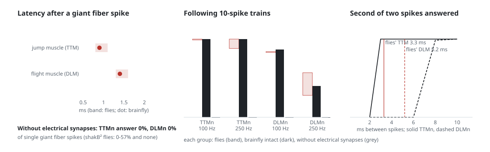

<p align="center">
  <picture>
    <source media="(prefers-color-scheme: dark)" srcset="assets/logo-dark.svg">
    
  </picture>
</p>

<p align="center"><i>Closing the loop from connectome to fly.</i></p>

brainfly is an open attempt to turn a complete fruit fly connectome into a fly that senses, decides
and moves, and to say at every layer which parts are validated, which are fitted and which are
still guesses.

It works from **MaleCNS v1.0**, the first map of a whole fly central nervous system, brain and nerve
cord in one animal: **166,700 neurons and 25.6 million connections**, traced synapse by synapse in
electron microscopy. Because the nerve cord is in the map, a simulated body can be driven through the
fly's real motor neurons rather than through a few hand-picked command neurons. Nobody has done that
yet. The best-known attempt, Eon Systems' March 2026 "embodied fly", maps brain to body
[by hand, by its own account](https://eon.systems/updates/embodied-brain-emulation), and it has no
nerve cord.

## A wiring diagram is not a working fly

A connectome records who connects to whom. It doesn't record which neurons spike and which signal in
graded steps, what sign each synapse has, where the electrical synapses are, what the neuromodulators
do, or how the muscles respond. Theory says the wiring alone
[often can't pin down a network's dynamics](https://www.nature.com/articles/s41593-025-02080-4), and
in 2026 a worm's connectome with a trained decoder
[walked a simulated fly body realistically](https://www.biorxiv.org/content/10.64898/2026.03.20.713233v1).
A simulation that looks like a fly proves little.

So brainfly adds biology one layer at a time and holds each layer to two tests, written down before
it runs: it has to match data from real flies, and it has to **stop working when the wiring is
scrambled**. The plan, the evidence behind it, and a diagnosis of what has gone wrong so far are in
the [research report](reports/Embodied%20fly%20connectome%20simulation.md).

## Where it stands (October 2026)

* **The antennal lobe's local neurons now answer odors as flies' do, but its projection neurons still don't
  accommodate (rung 9's groundwork).** Responding Kenyon cells fire about 11 spikes in 1.4 s where flies' fire about 2,
  and the cause is upstream. Flies' projection neurons open strongly and fall to about half within half a second. The
  model's climb through the odor. This round calibrated the local neurons to their measured odor response and fixed a
  bug in how the antennal lobe is built. Neither changes the projection neurons' time course.
  - **The local neurons' onset burst came from all their inputs at once** ([`odor_probe38.py`](experiments/odor_probe38.py),
    [`odor_ln_inputs.py`](experiments/odor_ln_inputs.py), [`odor_probe39.py`](experiments/odor_probe39.py)). Flies'
    GABAergic local neurons answer an odor with a brief onset: 22, 13, 8 and 6 spikes/s per cell over 0–50, 50–100,
    100–200 and 200–500 ms, from a rest of about 4 (Nagel et al. 2015). The model's fired 64 at their onset. Their input
    synapses carry rung 4's size rule, which no measurement sets. The burst came from receptor neurons, projection
    neurons and other local neurons together, so scaling only the receptor neurons' synapses left it 2.7 times flies'.
    One scale on all their inputs brings the onset to flies'.
  - **Rebuilt around those local neurons, the antennal lobe matches flies' local neurons closely**
    ([`odor_probe40.py`](experiments/odor_probe40.py), [`odor_probe42.py`](experiments/odor_probe42.py)). With every
    synapse onto the local neurons at 0.17 of its strength and the GABAergic ones resting at flies' 4 spikes/s, they
    fire 23, 16, 10 and 7.5 spikes/s in Nagel et al.'s bins (flies 22, 13, 8 and 6). But the presynaptic inhibition,
    refitted to Olsen & Wilson's EPSCs, grows as the local neurons' rates fall (threefold), so it still takes hold within
    100 ms of onset. The projection neurons barely change: 3-octanol's open at 90 spikes/s, climb to 120 at 0.3 s and
    hold 0.93 of that at 0.5 s (flies 0.48). With the inhibition refitted, what shapes the projection neurons is its time
    course and the receptor synapse's slow component, not how hard the local neurons fire. Stronger projection neurons
    with nothing to make them accommodate push the Kenyon cells further from flies' (3.6–13.4% respond; α/β cells fire
    4.8–7.3 spikes per response). The next run tests the slow component at Kazama & Wilson's unitary size together with
    projection neurons that keep their synaptic current through their spikes
    ([`odor_probe41.py`](experiments/odor_probe41.py), running).
  - **A bug: the presynaptic inhibition acted at rest** ([`odor_offset_check.py`](experiments/odor_offset_check.py)).
    Since odor_probe27 the inhibition was meant to act only on the local neurons' activity above their resting rate,
    because flies have little tonic presynaptic inhibition. The build measured that resting rate too early. It came
    right after the projection neurons' resting polish, which had just lowered them and with them the local neurons,
    and a second polish then raised the local neurons back to their targets. So in every model since odor_probe27 the
    receptor synapses rested at about two thirds of their strength (0.67 in odor_probe30's model). The polish had raised
    the projection neurons' excitability to make up for it, so odor responses barely change when the inhibition is
    fitted after the polishes (odor_probe42.py): 3-octanol's projection neurons peak at 106 spikes/s instead of 105,
    and the Kenyon cells respond at 2.6–10.5% instead of 2.1–10.1%. Earlier conclusions stand.

<picture>
  <source media="(prefers-color-scheme: dark)" srcset="assets/al_lns-dark.svg">
  
</picture>

`python assets/al_lns.py` redraws it.

* **MBON11 now answers 3-octanol as flies' does, and learning with 3-octanol paired is as specific as flies' (rung 9's
  groundwork).** MBON11 is the mushroom body output neuron that Hige et al. 2015 trained. Rung 4 divides each synapse by
  its target's size, which left MBON11 gaining a few spikes to an odor where flies' gain 110–118. Three changes, each
  from a measurement, bring it close. Its Kenyon cell synapses now come from MBON11's own measurements. It keeps its
  synaptic current through its spikes, as neurons do. And the Kenyon cell classes have their measured thresholds. Held
  at about 5 Hz, as Hige et al. held their cells, MBON11 now gains 128 spikes to 3-octanol (flies 118) and 40 to
  4-methylcyclohexanol (flies 110). What is left wrong is its input. 3-octanol reaches four times as many Kenyon cells
  as 4-methylcyclohexanol, and every responding Kenyon cell fires about 11 spikes in 1.4 s, where flies' fire about 2.
  - **Synapses from MBON11's own measurements** ([`odor_probe31.py`](experiments/odor_probe31.py),
    [notes](research_notes/Rung%209%20learning%20data/mbon11_input.md)). These are the charge a few Kenyon cells deliver
    to it (Yamada et al. 2024) and the spikes each pA of current adds (Wang et al. 2026), not Hige et al.'s counts.
    MBON11 then gained 60–91 spikes to 3-octanol but only 21–35 to 4-methylcyclohexanol. Its input was 1.5–3.3 times
    flies' for 3-octanol and 0.3–0.7 times for 4-methylcyclohexanol. It also made only 0.11–0.27 spikes per pC, where
    flies' make about 0.45.
  - **The spike rule threw half its input away** ([`odor_probe32.py`](experiments/odor_probe32.py),
    [`odor_kc_timing.py`](experiments/odor_kc_timing.py), [`odor_probe35.py`](experiments/odor_probe35.py)). MBON11's
    other inputs don't matter: cutting them changes its responses by under two spikes. The same mean drive given as a
    steady current gave twice the spikes. I first blamed coincident volleys or bursts in the Kenyon cell input, but the
    input turned out neither coincident nor bursty. The cause is the spike rule this model inherits from Shiu et al.: at
    each spike the synaptic current is set to zero, and input arriving while the neuron is refractory is dropped. So
    synaptic drive that holds a neuron at a high rate loses much of its charge, which a steady current doesn't (40 mV of
    synaptic drive gives 95 spikes/s, the same as a bias 167). brainfly can now keep a type's current through its
    spikes (`keep_current`, off by default so earlier results don't change), and with it the same drive gives 163. In
    flies, MBON11 makes about as many spikes per pC of synaptic charge as per pA of injected current. With its current
    kept, the model's MBON11 does too where its F-I curve is straight (0.35–0.41 spikes per pC). It gains 115 spikes to
    3-octanol at rest and 128 held. Every neuron driven fast through synapses loses charge the same way, the antennal
    lobe's projection neurons among them, which matters for what follows.
  - **The Kenyon cell classes' measured thresholds put the right classes first**
    ([`odor_probe33.py`](experiments/odor_probe33.py)). With Inada et al. 2017's offsets (α′/β′ cells 5.5 mV nearer
    threshold than α/β, γ 2.5 mV farther, the mean unchanged), α′/β′ cells respond at 2.9–13.8% (flies 9–14%; 0.4–3.7%
    before) and γ at 1.2–5.3% (flies about 2%; 2.6–9.3% before), while the density and the overlap between odors stay
    as they were: the α′/β′ cells gained about equal the γ cells lost. MBON11's input falls by a quarter with fewer γ
    responders. α/β cells still respond too densely to strong odors (up to 17.5%; flies 3–8%) and fire too many spikes
    (4.6–6.5; flies 2.2). Groschner's and Chen's larger offsets overshoot, as on the old antennal lobe: α′/β′ 34–66%,
    and the overlap between odors doubles. Inada's offsets are carried forward.
  - **The measured depression at MBON11's synapses needs Kenyon cells that fire fewer spikes**
    ([`odor_probe34.py`](experiments/odor_probe34.py)). The odor_probe7 model made Kenyon cell-to-MBON synapses
    undepressed without fly data. At MBON11's synapses a second flash 400 ms after the first evokes 0.38–0.68 of the
    first EPSC (Yamada et al. 2024), as rung 4's Kenyon cell depression has it. With that depression MBON11's input to
    3-octanol peaks early, as flies' EPSC does (302 pA at 0.2 s; flies about 400 pA), but falls to 21 pA by 1 s, where
    flies' holds about 170 pA. So MBON11 falls back to rest during the odor (26 spikes to 3-octanol, 8 to
    4-methylcyclohexanol). Flies' synapses depress too, yet their MBON11 keeps firing through the odor. The model's
    responding Kenyon cells fire steadily at about 8 Hz, about 11 spikes in 1.4 s, which holds their synapses at about
    0.15 of full strength. Flies' α/β cells fire about 2 spikes per response. The depression stays out of the model
    until the Kenyon cells fire as few spikes as flies'.
  - **With 3-octanol paired, the model's learning now matches flies'** ([`learning_pilot2.py`](experiments/learning_pilot2.py),
    [`learning_pilot3.py`](experiments/learning_pilot3.py)). This is Hige et al.'s experiment in the model: at each
    dopamine pulse every Kenyon cell's synapses onto MBON11 weaken by its recent spikes, with the rate set so the paired
    odor's input falls 90%. On the current model, with spikes counted as Hige et al. counted them (MBON11 held near
    6 Hz), pairing 3-octanol cuts its own response 85% (flies 80%). It cuts 4-methylcyclohexanol's 29.5% (flies 27%) and
    4-methylcyclohexanol's input 33% (flies 20% and 35% in two experiments;
    [notes](research_notes/Rung%209%20learning%20data/hige2015_specificity.md)). Backward pairing changes nothing, as in
    flies. The first pilot, on the old antennal lobe, cut the unpaired odor's input 79%. (I had earlier written that
    flies' unpaired odor didn't change; that holds only for the n = 5 experiment of Hige et al.'s Fig. 3.) The other way
    round, flies' depression is about as specific: pairing 4-methylcyclohexanol cuts its own response 76% and
    3-octanol's 38%. The model cuts 3-octanol's only 5.6%. 3-octanol drives four times as many Kenyon cells, and few of
    them answer 4-methylcyclohexanol (DoOR's data give it 4 glomeruli above 0.2, against 3-octanol's 12).

<picture>
  <source media="(prefers-color-scheme: dark)" srcset="assets/learning-dark.svg">
  
</picture>

`python assets/learning.py` redraws it.

<picture>
  <source media="(prefers-color-scheme: dark)" srcset="assets/mbon11-dark.svg">
  
</picture>

`python assets/mbon11.py` redraws it.

<picture>
  <source media="(prefers-color-scheme: dark)" srcset="assets/mbon11_depression-dark.svg">
  
</picture>

`python assets/mbon11_depression.py` redraws it.

* **Measured presynaptic inhibition gives the antennal lobe flies' lateral division, and two readings of one
  measurement bracket its gain (rung 9's groundwork).** In flies the local neurons inhibit the receptor neurons'
  terminals, so each glomerulus's output is divided by the others' input. brainfly can now divide chosen synapses by
  the inhibitors' low-passed activity ([`HybridBrain.set_presynaptic`](brainfly/hybrid.py)). I fitted its strength to
  Olsen & Wilson 2008's EPSCs during lateral odors and its time course to Nagel et al. 2015
  ([notes](research_notes/Rung%209%20learning%20data/presynaptic_inhibition.md)). Each glomerulus's response is then
  divided by the others' input, as in flies (to 0.36-0.60), and Kenyon cells respond about half as densely (10-36%;
  flies 6 ± 5%) ([`odor_probe21.py`](experiments/odor_probe21.py)). How strong the receptor synapses are at rest turns
  on how to read one measurement, Kazama & Wilson's 6.19 mV unitary EPSP, which they evoked by stimulating a cut nerve.
  Read as the synapse's strength at rest, under tonic inhibition, it gives a transform with flies' σ but twice their
  Rmax. Read as the uninhibited strength, it gives flies' Rmax but three times their σ, and odors barely reach the
  Kenyon cells ([`odor_probe25.py`](experiments/odor_probe25.py)).
  - **Why neither fits.** Inhibition proportional to the local neurons' activity can divide the synapses by no more than
    that activity rises over rest. With the receptor neurons firing spontaneously, as flies' do, the synapses rest at
    about two thirds of full strength, as Nagel et al.'s model has them. But an odor then raises the local neurons only
    2-3 times above their resting rate, as in flies (6-8 spikes/s against about 4), while flies' EPSCs fall threefold, so
    the fit fails ([`odor_probe24.py`](experiments/odor_probe24.py)). Raising the slow component to a power doesn't
    rescue it: the fit again buys the late suppression with tonic inhibition, which then silences the local neurons
    ([`odor_probe26.py`](experiments/odor_probe26.py)). Flies' glomeruli also differ about 25-fold in their sensitivity
    to it (Hong & Wilson 2015), which one global strength can't give.
  - **Inhibition evoked above rest makes the Kenyon cells odor-specific** ([`odor_probe27.py`](experiments/odor_probe27.py)).
    Flies have little tonic presynaptic inhibition, at least in VM7 (GABA antagonists don't change its gain). With the
    inhibition acting only on the local neurons' activity above rest, the spontaneous firing setting the synapses'
    resting depression, and the strengths fitted again to Olsen & Wilson's EPSCs, different odors' projection neuron
    patterns correlate only 0.22 (about 0.5 before). The Kenyon cells then respond as flies' do: 1.0–4.5% per odor, a
    mean Jaccard of 0.15 (flies' dissimilar odors about 0.22), and 45% of 4-methylcyclohexanol's responders shared with
    3-octanol (78–94% before). But the inhibition peaks with the local neurons' onset burst, where flies' takes about
    100 ms to build, so the projection neurons are suppressed at onset (32–73 Hz in the first 100 ms; flies 100–200)
    and too narrowly tuned (16–26% respond; flies 59 ± 14%), and lateral input abolishes their response.
  - **Sparing the local neurons' own input keeps the projection neurons' onsets** ([`odor_probe29.py`](experiments/odor_probe29.py)).
    Inhibition that also cut the receptor neurons' synapses onto the local neurons silenced them after their onset
    burst, so strengths fitted to the later EPSCs swamped that burst; an alpha-shaped onset didn't help
    ([`odor_probe28.py`](experiments/odor_probe28.py)). With only the receptor-to-PN synapses inhibited, which is where
    Olsen & Wilson measured it, the local neurons stay active: their burst is about 5.5 times their later rate, against
    about 6 in flies. The fit to Olsen & Wilson's EPSCs is the closest yet, projection neurons open at 130–156 Hz (flies
    100–200), and Kenyon cells respond at 3–16% with a mean Jaccard of 0.19. Still unlike flies: projection neurons rise
    through an odor instead of accommodating, so Kenyon cells fire too many spikes (α/β 6.3, flies 2.2), only 25–38% of
    projection neurons respond, and the transform stays too steep (σ about 30; flies 12–16). The synapses rest at about
    0.4 of full strength with spontaneous firing, where Kazama & Wilson measured about 0.6 at 7 Hz.
  - **With the receptor neurons' measured time course, the Kenyon cells come into flies' range**
    ([`odor_probe30.py`](experiments/odor_probe30.py)). Rising over about 30 ms with latencies set by their drive and
    adapting toward half over 0.4 s, as flies' receptor neurons do, they make the projection neurons peak at about
    375 ms and fall to 0.79 of the peak by 1 s (flies: a peak about 75 ms after the receptors start, about half by
    500 ms). This gives the closest fit yet to Olsen & Wilson's EPSCs. 2.4–10.5% of Kenyon cells respond (flies
    6 ± 5%), with a mean Jaccard of 0.16, and responding α/β cells fire 4.6–5.7 spikes (flies 2.2). Still open: the
    projection neurons' early peak and breadth (21–36% respond), α′/β′ cells responding too rarely (0.7–3.9%, flies
    9–14%), and 56% of 4-methylcyclohexanol's responders also answering 3-octanol (flies' dissimilar odors about 22%).
  - **What keeps the projection neurons from opening strongly and then accommodating**
    ([`odor_probe36.py`](experiments/odor_probe36.py), [`odor_probe37.py`](experiments/odor_probe37.py),
    [notes](research_notes/Rung%209%20learning%20data/orn_pn_depression.md)). The receptor synapse's slow component
    carries the projection neurons' sustained drive, and two measurements give it sizes ninefold apart. At Nagel et al.'s
    odor-fitted size (0.774 of the fast charge, barely depressing), 3-octanol's projection neurons climb to 105
    spikes/s at 0.3 s and hold 0.78 of that at 1 s. At Kazama & Wilson's unitary size (0.086) they peak early and
    fall to 0.48 by 1 s, as flies' do (0.48 by 0.5 s), but at half the rate: the transform's Rmax drops to 62–124
    (flies 144–170) and the Kenyon cells fall silent. An intermediate size gives a 67 spikes/s plateau. In every case
    the presynaptic inhibition takes hold within 50–150 ms, even when it builds as slowly as flies' (half at about 60 ms
    and 90% at about 150 ms of a step of local-neuron firing). That's because the model's local neurons burst at about
    57 spikes/s each just after onset and settle at 12–13, where flies' fire about 22, 13, 8 and 6
    ([notes](research_notes/Rung%209%20learning%20data/pn_ln_dynamics.md)). Flies' antennal lobe also equalizes weak and
    strong odors, and the model's doesn't. At the receptor neurons 4-methylcyclohexanol drives 0.4–0.5 of
    3-octanol's response, in flies as in the model, but flies' projection neurons answer it at 0.85–0.98
    ([notes](research_notes/Rung%209%20learning%20data/oct_mch_input.md)). The model's transform also needs twice
    flies' receptor rate to reach half its maximum (σ about 30, flies 12–16). Calibrating the local neurons to their
    measured odor response comes next ([`odor_probe38.py`](experiments/odor_probe38.py)).
  - **Ruled out on the way.** A slower rise in GABA-B's onset changes nothing
    ([`odor_probe22.py`](experiments/odor_probe22.py)). Measured receptor kinetics don't make the projection neurons
    accommodate ([`odor_receptor_course.py`](experiments/odor_receptor_course.py)). Capping projection neurons at the
    164 spikes/s flies' sustain under current bends the curve ([`odor_probe23.py`](experiments/odor_probe23.py)). That
    run does show the Kenyon cells reaching flies' sparseness (0.9-7.5%, mean Jaccard 0.24) once projection neurons
    fire about 110 Hz.
  - **Two corrections.** The slow synaptic component added in odor_probe17 made the unitary EPSP 1.11 times the
    measured 6.19 mV (fixed from odor_probe21 on). The resting antennal lobe's brief bursts of local-neuron activity
    made one calibration step vary twofold between runs (now averaged over four rest windows).

<picture>
  <source media="(prefers-color-scheme: dark)" srcset="assets/al_transform-dark.svg">
  
</picture>

`python assets/al_transform.py` redraws it.

* **Rung 5's third attempt fails too, by one run of 32.** To take the choice of drive out of the test, the third
  pre-registered attempt drove each descending neuron at five drives from 50 to 800, alike in the real nerve cord and
  in two scrambled ones ([`experiments/rung5_vnc3.py`](experiments/rung5_vnc3.py)). DNb08 now passes: the left
  VES082 neuron is rhythmic in 15 of 16 runs at 13.2 Hz (drive 200), the left VES083 in 8 of 16. DNg100, which passed
  both earlier attempts, now fails. The right one is rhythmic in 32 of 32 runs at 11.6 Hz, but the left in 23 of 32,
  one short of the 24 required. Checked afterwards, six of the left's nine misses oscillate at 13-15 Hz but score
  0.43-0.50 against the score's 0.5 cutoff; over the three attempts the left has been rhythmic in 83 of 96 runs and
  the right in 95 of 96. No scrambled network made a rhythm at any drive (0 of 1,280 runs), but that null is weak. On
  this grid the scrambled networks go from nearly silent motor neurons to runaway within one doubling of the drive,
  and for 5 of the 12 neuron-network pairs no drive met the screen's rule, so the test asked nothing there. Rung 5
  stays failed. I won't retry it with a looser cutoff or another grid; a fourth attempt would need something new from
  flies, such as the descending neurons' firing rates during walking to set the drive.

* **A review of the other rungs changes no verdict, but finds rung 5's turning on drives chosen without data.** After
  rungs 1-4 and 6, two independent reviews went through rungs 5 and 7, and I checked each finding before fixing it:
  - **Rungs 1-2's sugar route survives a stricter null.** Rewiring that keeps every neuron's input and output strength,
    the step of the report's null ladder brainfly hadn't run, never lets sugar drive MN9 (0 of 100;
    [`experiments/rung2_strength_null.py`](experiments/rung2_strength_null.py)). So the route needs the wiring, not
    just each neuron's input.
  - **Rung 5's two failures depend on the drive.** At a DNb08 drive the screen's rule also accepts (256 instead of
    its unsourced starting 128), the left VES082 neuron is rhythmic in 15-16 of 16 runs, which would pass. And with
    DNg100's scrambled networks tuned by the same rule, one of four makes a slow rhythm, which would fail the null
    ([`experiments/rung5_drive_check.py`](experiments/rung5_drive_check.py)). The recorded fails stand; a third
    attempt needs one drive policy for real and scrambled networks alike.
  - **Rung 7's muscle model is closer than it looked.** With the 10 and 40 ms activation time constants its paper
    states, instead of the shipped 0.1 and 0.4, FlyMimic's twitch rises, sums and plateaus like a fly's without
    fitting, though it relaxes four times too slowly ([`experiments/leg_twitch.py`](experiments/leg_twitch.py)).
  - **A bug and some overstatements.** The loom jump's takeoff times were 2 ms early (fixed). The jump passes 2 of its
    6 checks rather than matching flies, the optomotor null cuts DNa02's signal below its bar rather than abolishing
    it, and rung 6 passed only its gap-junction half. The entries below are corrected.

* **Odors reach the mushroom body, but not yet as a fly's do (rung 9's groundwork).** Rung 9 starts with learning:
  paired with dopamine, an odor's response in MBON-γ1pedc (MBON11) falls 80–90%, and an unpaired odor's much less
  (Hige et al. 2015; [notes](research_notes/Rung%209%20learning%20data/mushroom_body_plasticity.md)). How much the
  unpaired odor changes depends on how the two odors' Kenyon cells overlap through the real projection neuron wiring,
  so the connectome can pass or fail it. First the odor has to reach the Kenyon cells, and in the brain that passed
  rung 4 it barely did: with DoOR odors ([`brainfly/odors.py`](brainfly/odors.py)), at most 1 of 4,064 Kenyon cells
  rose by 5 Hz ([`odor_probe.py`](experiments/odor_probe.py), [`odor_probe2.py`](experiments/odor_probe2.py)).
  Exploratory probes ([`odor_probe3.py`](experiments/odor_probe3.py) to [`odor_probe6.py`](experiments/odor_probe6.py))
  then set the pathway's properties from measurements one at a time, and
  [`odor_probe7.py`](experiments/odor_probe7.py) reruns them with the corrections two reviews turned up (below):
  - **Odors:** each receptor's response above its spontaneous level, as DoOR's own tools take it.
  - **Receptor to projection neuron:** the rested unitary EPSP set to its measured 6.19 mV per same-glomerulus
    connection, 7.3 times stronger. Projection neurons now fire 163–179 Hz in an odor's first 100 ms and 86–98 Hz over
    the second (before: 76–85 and 23–30; flies: 100–200 at onset).
  - **Kenyon cells, from Turner et al. 2008:** resting 21.5 mV below threshold (they were 12–35 mV below, by type),
    EPSPs that decay in 11.5 ms (a fly Kenyon cell's dendrites make its EPSPs brief although its soma's time constant
    is over 200 ms), and unitary inputs of 1.4 mV (they were 3.4)
    ([notes](research_notes/Rung%209%20learning%20data/kenyon_cell_odor_responses.md)).
  - **Two choices without fly data, made after seeing the alternatives fail, so informed by the outcome:** synapses from
    projection neurons to Kenyon cells undepressed, as in Turner's own model and in locusts (with the projection
    neurons' depression, 1–2% of Kenyon cells respond, with under one spike each, and the output neurons don't move);
    and synapses from Kenyon cells to output neurons undepressed, since MBON-γ1pedc's input is sustained through an
    odor in vivo.

  Measured as the flies were (Turner's response criterion for Kenyon cells, Hige et al.'s spike count for MBON11),
  across six odors:
  - **Kenyon cells respond somewhat too densely:** 7–20% (4-methylcyclohexanol 7%, 3-octanol 17%), against 6 ± 5% in
    flies. The comparison is loose: Turner diluted odors 1:1000, while every receptor here is driven at 200 Hz for
    its strongest response, and no study relates either to the other.
  - **The wrong classes respond:** α′/β′ cells least (1–3%) and γ cells a lot (11–22%), where flies' α′/β′ respond
    most (about 9–14%) and their γ about 2%. α/β cells fire 1.6–3.7 spikes per response (flies 2.2) and α′/β′ ones
    0.9–1.4 (flies 4.9).
  - **MBON11 hears 36 to 92 times too little:** it gains 3.3 spikes to 3-octanol and 1.2 to 4-methylcyclohexanol in
    the 1.4 s after onset, where Hige et al.'s flies gained 118 and 110. Its Kenyon cell input is weak by construction:
    rung 4 divides every synapse by its target's size, and MBON11's two cells are 29 and 40 times the median neuron's,
    so each Kenyon cell synapse onto it counts 3% as much. No measurement sets that for MBON11; the one measured Kenyon
    cell to MBON unitary EPSP, onto MBON-α2sc, the model matches.

  Different odors' responding cells overlap by a Jaccard index of 0.19–0.62 (3-octanol and 4-methylcyclohexanol: 0.32),
  and the resting brain is undisturbed (about 0.97 Hz, nothing over 100 Hz).

  A first, exploratory run of the learning experiment shows why the overlap matters
  ([`learning_pilot.py`](experiments/learning_pilot.py)). Hige et al. paired an odor with four pulses of the dopamine
  neuron PPL1-γ1pedc. Here a rule weakens each Kenyon cell's synapses onto MBON11 by its recent spikes at each pulse,
  with its one rate fitted so the paired odor's synaptic charge falls 90%, as in the flies. Pairing 3-octanol then cuts
  4-methylcyclohexanol's charge by 79%, and pairing 4-methylcyclohexanol cuts 3-octanol's by 51%, where the flies'
  unpaired odor's charge didn't change significantly. In spikes the unpaired odor loses 73% either way (flies: about
  25%). The two odors share too many Kenyon cells. Backward pairing barely changes anything, as in flies, but that only
  checks the rule's timing.

  Checks on the current model, each from a measurement:
  - **APL does too little** ([`odor_probe8.py`](experiments/odor_probe8.py)). Silencing it makes 1.4–1.6 times as many
    Kenyon cells respond. Blocking flies' APL lowers their population sparseness as much as about four times as many
    active cells would (derived from Lin et al. 2014's calcium imaging; a bound, not a count).
  - **The classes' measured thresholds move the pattern partway** (odor_probe8). With Inada et al.'s offsets (α′/β′
    5.5 mV nearer threshold than α/β, γ 2.5 mV farther), α′/β′ cells respond at 8–19% and γ at 7–16%. With Groschner's
    and Chen's larger ones, γ falls to 0.4–1.5%, near flies' 2%, but 59–80% of α′/β′ cells respond (flies: 9–14%).
  - **Odor strength sets the density** (odor_probe8). With receptor neurons at 50 Hz for DoOR's strongest response
    instead of 200, 3–9% of Kenyon cells respond, within flies' range, and projection neurons still fire 124–137 Hz at
    onset. No measurement fixes that rate, and MBON11 then gains only 0.6–2.1 spikes to the two test odors.
  - **APL's slow inhibition doesn't fix the density** ([`odor_probe9.py`](experiments/odor_probe9.py)). With 47% of
    its weight (its GABA_B share, 35 of the 75% that GABA_A and GABA_B carry in Inada et al.) moved onto a 0.5 s
    current, 1.00–1.16 times as many Kenyon cells respond. Most responses are spikes at the odor's onset, before any
    inhibition arrives, which in flies lags excitation by hundreds of ms too.
  - **Realistic receptor neurons don't fix it either** ([`odor_probe10.py`](experiments/odor_probe10.py); measured
    dynamics in the [notes](research_notes/Rung%209%20learning%20data/orn_dynamics.md)). Rising over tens of ms with
    latencies that grow as their drive weakens, and adapting, they leave 6.5–18.6% of Kenyon cells responding. Adding
    their spontaneous firing (6–19 Hz by receptor class) makes only 1.6–5.0% respond, but for the wrong reason. The
    receptor synapses' measured depression (fitted to nerve trains) holds them at about half strength at rest, so
    projection neurons answer odors with only 65–80 Hz at onset (flies 100–200). Responding Kenyon cells then fire
    under 1.5 spikes and APL is hardly recruited. Projection neurons also rest at 5.3 Hz after recalibration, above the
    3 Hz aimed at. The notes flag that this depression fit over-depresses single fibres at low rates.
  - **Why the responding cells overlap** ([`odor_probe11.py`](experiments/odor_probe11.py),
    [`odor_probe12.py`](experiments/odor_probe12.py)). The projection neurons respond as broadly as flies' (49–71% of
    them to each odor by Turner's criterion, flies 59 ± 14%) and, as Bhandawat et al. found in flies, separate odors
    farther than the receptors do early on. But input that broad reaches most of each Kenyon cell's claws, so the
    cells with the most projection neuron input answer nearly every odor. 113 cells answer all six odors, where
    independent cells would leave none, and the fifth of cells with the most input respond to 43% of odors, against
    0.9% for the fifth with the least. α′/β′ cells get about 60% of the other classes' input, which is why they
    respond least here. The cells' rest is already even (within 0.2 mV), so evening it changes nothing; Turner's
    measured ±5.6 mV spread, drawn independently of input, makes the overlap worse; and evening out each cell's
    input helps only a little (mean Jaccard 0.43 to 0.37). Flies keep odor responses distinct with input this broad,
    through what the model lacks or has too weakly: excitability matched to input (Abdelrahman et al. 2021) and
    APL's normalizing inhibition (Prisco et al. 2021, Lin et al. 2014). In flies, dissimilar odors share about a
    fifth of their responding cells (Campbell et al. 2013); here 80% of 4-methylcyclohexanol's also answer
    3-octanol.
  - **Matching each Kenyon cell's excitability to its own input helps partway** ([`odor_probe13.py`](experiments/odor_probe13.py)).
    With each cell's distance below threshold set from its own drive over 30 other DoOR odors, the overlap falls
    (mean Jaccard 0.43 to 0.35; 58% of 4-methylcyclohexanol's responders also answer 3-octanol). The classes come out
    better than anything fitted: α′/β′ cells end up 9 mV nearer threshold than α/β, between the measured 5.5 and 13 mV,
    and α/β and α′/β′ respond at fly-like rates (3–9% and 9–12%). γ cells don't (12–20%, flies about 2%), and MBON11
    hears even less.
  - **The antennal lobe's cholinergic local neurons were exciting projection neurons that flies' don't**
    ([`odor_probe14.py`](experiments/odor_probe14.py)). The model took their 152,952 synapses onto projection neurons
    as chemical excitation, where in flies that link is "mainly or purely electrical" and weak (Yaksi & Wilson 2010).
    Without them, glomeruli the odor doesn't drive stop firing at its onset (+16 to +24 Hz before), projection neurons
    stay as broad as flies' (36–60% respond), and the Kenyon cells get sparser (4–16% respond) and somewhat more
    specific (mean Jaccard 0.43 to 0.35). But the cells with the most input still answer nearly every odor.
  - **Both corrections together** ([`odor_probe15.py`](experiments/odor_probe15.py)) put the Kenyon cells' density
    inside flies' range for all six odors (4.9–10.3%) and α/β and α′/β′ cells near flies' rates, but γ cells still
    respond too often, MBON11 hardly responds, and the overlap falls only to a mean Jaccard of 0.31. Even an ideal
    Kenyon cell layer couldn't do much better with these projection neuron patterns (70–77% of 4-methylcyclohexanol's
    responders would also answer 3-octanol, against 33% from DoOR's receptor patterns), so the antennal lobe's
    transformation of weak receptor input is next.
  - **The antennal lobe transforms receptor input unlike flies'** ([`odor_probe16.py`](experiments/odor_probe16.py)).
    Driven one glomerulus at a time, as Olsen et al. 2010 drove flies', the projection neurons answer weak input too
    strongly and saturate too early (fitted Rmax 56–116 spikes/s and σ 3.6–4.2, against flies' 144–170 and 12–45),
    and input from other glomeruli barely divides their response, where in flies it does. So weak and strong
    glomeruli look alike, which is what makes odors' patterns overlap. The model's receptor synapse has only the fast,
    depressing component of Nagel et al. 2015's measured fit; the slow one, which barely depresses, is missing.
  - **Adding that slow component fixes the transform's shape but doubles its gain** ([`odor_probe17.py`](experiments/odor_probe17.py)).
    σ comes out at 10–19 (flies 12–16, and 45 in one glomerulus), but Rmax at 223–352 spikes/s, and taken as never
    depressing, the slow synapses drive projection neurons to 330–350 Hz through an odor, so most Kenyon cells respond.
    Its measured depletion, small per spike, isn't small at the 100–200 Hz the model's receptor neurons fire, but
    depressing it as measured changes little ([`odor_probe18.py`](experiments/odor_probe18.py)).
  - **The missing piece looks like the receptor terminals' presynaptic inhibition** ([`odor_probe19.py`](experiments/odor_probe19.py)).
    In flies, blocking its GABA-B part doubles the projection neurons' input-output slope (Root et al. 2008). Dividing
    the receptor synapses by that measured factor brings one glomerulus to flies' Rmax (DM4: 173 against 170) but
    leaves the others 1.8 times high, and the projection neurons still don't accommodate: in flies the inhibition grows
    with the local neurons' activity, which a fixed factor can't do.
  - **Slow, activity-dependent presynaptic inhibition alone barely acts within half a second**
    ([`odor_probe20.py`](experiments/odor_probe20.py)). The model can now divide chosen synapses by
    1 + k × the inhibitors' low-passed rate ([`HybridBrain.set_presynaptic`](brainfly/hybrid.py)). With the receptor
    synapses divided that way by the GABAergic local neurons' rate over 1 s, as GABA-B acts, and k set so that a typical
    odor's rate halves them, lateral input starts to divide three of four glomeruli (to 0.79–0.91), but Rmax stays at
    211–344 spikes/s and 22–56% of Kenyon cells respond: over a 0.5 s stimulus the slow rate climbs only part of the
    way. The early, ionotropic (GABA-A) phase is next.
  - **Presynaptic inhibition set from measurements** ([`odor_probe21.py`](experiments/odor_probe21.py) to
    [`odor_probe25.py`](experiments/odor_probe25.py)): flies' lateral division, and a gain bracketed by two readings of
    the unitary EPSP; see the entry at the top.

  **Corrections.** Two reviews of this work, my own and an independent one, found these errors, now fixed and rerun:
  - **DoOR's spontaneous level was counted as a response.** DoOR's table includes each receptor's spontaneous firing,
    which its own reset_sfr subtracts. Left in, it drove every glomerulus harder than its odor does (19–33% of each
    odor's total drive) and drove receptors at or below their spontaneous rate. With it subtracted, Kenyon cell density
    fell from 11–30% to 7–20%.
  - **The receptor synapse factor was 8.8 instead of 7.3.** Kazama & Wilson's EPSP is between neurons of one
    glomerulus, and a quarter of the connections averaged join different glomeruli with few synapses (median 2).
  - **The flies' MBON11 response:** I compared against "about 20 Hz", which is the late plateau of 15 s odors. Hige et
    al. counted 118 and 110 spikes above spontaneous in 1.4 s. Later shortfall ranges also set ethyl acetate against
    the flies' 3-octanol count, though they measured only 3-octanol and 4-methylcyclohexanol.
  - **The ring's offsets were added twice** (three times in one condition) in odor_probe8's, odor_probe9's and
    odor_probe10's recalibrated conditions. Mushroom body numbers barely moved, but those conditions weren't "the
    current model otherwise".
  - **Interpretation:**
    - An overlap reported as "odor-specific" for the 150 ms membrane version was computed over almost no cells.
    - "Without fitting anything to the responses" overstated it; see the two choices above.
    - "About four times as many Kenyon cells active without APL" is derived, not measured.
    - A calibration said to set Kenyon cells 21.5 mV below threshold left them 10.6–19.9 mV below in odor_probe4's
      slow-membrane conditions.
    - Smaller counts were wrong: 2 Kenyon cells, not "2 to 4"; 3.4 mV, not 3.3; connections reported as synapses.

  <picture>
    <source media="(prefers-color-scheme: dark)" srcset="assets/olfaction-dark.svg">
    
  </picture>

* **Rung 3's eye is now brainfly's default, and the behaviors downstream of it still work.** The fine-tuned model that
  passed rung 3 ships with brainfly. Its 49 KB checkpoint lives in [`brainfly/models`](brainfly/models), and
  `optic.ensure_model` rebuilds its flyvis folder from model 001 on first use. It is now `FlyvisNative`'s default
  (`optic.EYE`); the experiments that ran on the old default are pinned to it. Rerun with the new eye:
  - **optomotor, open loop:** a rotating drum still drives the HS cells (39.6 Hz between directions, t = 302) and the
    steering neuron DNa02 with the biological signs, both sides alike. DNa02's signal is somewhat weaker (3.3 Hz
    against 5.3). HS cells no longer fire to a stationary drum (0 against 14.5 Hz).
  - **closed loop:** the walking fly still turns with the drum (24.2 deg/s between directions, t = 18.5), and not at
    all with the brain's link cut (by construction: the cut fixes the drives). But it turns much less with a clockwise
    drum (−3.1 deg/s against +21.1 counterclockwise; with model 000, −14.1 and +19.6): 3 of the 8 flies turned against
    the clockwise drum and one barely turned (+0.35 deg/s). With
    the drum still, the fly drifts leftward at +3.3 deg/s, and that drift is the brain's: with its link cut, the
    controller alone averages −0.1 deg/s. The weaker steering signal may not overcome it.
  - **the loom jump:** every fly's giant fiber fires and every fly jumps, for looms from the left, the right and
    head-on, as before.

* **Rung 5's retry fails too, on DNb08, though the drive decides it.** With DNb08 asked for a rhythm at any
  frequency, on fresh seeds, its one rhythmic neuron fired rhythmically in only 4 of 16 runs; DNg100 and the
  scrambled-wiring controls held ([`experiments/rung5_vnc2.py`](experiments/rung5_vnc2.py)). A later review found
  that both attempts turn on drives chosen without data. The screen's rule kept DNb08's starting drive of 128, which
  has no source, and at 256, which the rule also accepts, the same neuron is rhythmic in 15 and 16 of 16 runs. And
  tuned by the same rule, one of four scrambled networks makes a slow rhythm, which would fail the null
  ([`experiments/rung5_drive_check.py`](experiments/rung5_drive_check.py); details in the nerve cord entry below).

* **FlyMimic's twitch is far too fast as shipped, but the time constants its paper states nearly fix it (rung 7).**
  Rung 7 asks a musculoskeletal leg for flies' force per spike and twitch time. Scaled so that full activation pushes
  flies' force probe with 100 µN (607 times its forces, mostly to overcome its extensor's scaled passive tension) and
  a motor neuron spike with 9 µN, FlyMimic's tibia flexor as FlyGym ships it reaches half its peak 20 times sooner
  than a fly's (0.4 ms against 7.7–9.7) and peaks 5–7 times sooner (3.3 ms against 17–23, read from example traces).
  Its muscles' activation and deactivation time constants are 0.1 and 0.4 ms, though FlyMimic's paper says it used
  OpenSim's defaults, 10 and 40 ms. With those, the twitch reaches half its peak at 6.1 ms and peaks at 17.1 ms, two
  spikes sum to 1.61 times one (flies: 1.4–1.6), and 80 Hz trains level off at 27 µN (28–30), none of which was
  fitted (only the full force and the spike's size were). But it relaxes about four times too slowly: half of it is
  gone 58 ms after the peak, against 12–16 ([`experiments/leg_twitch.py`](experiments/leg_twitch.py)). A rung 7
  criterion on the twitch's rise and summation would test a prediction; its relaxation fails as it stands.

* **Rung 3 passes: an eye whose T2 answers darkening, with flies' motion directions and polarities.** Rung 3 asks
  the eye for at least 30 of 32 known contrast polarities, the right direction in all 16 of the T4/T5 motion detector
  subtypes across both eyes, and looming responses of tens of Hz in LC4 and LPLC2. A real T2 answers light turning
  off as well as on (Keleş et al. 2020), and with flyvis's model 001, whose T2 does, looming reaches LC4. But 001 got
  29 polarities, and its T5a preferred the wrong direction, weakly (upward). Fine-tuning 001 on flyvis's own flow task, with rung 3's direction
  test and the known polarities in the loss, passes all three criteria on a fresh seed
  ([`experiments/rung3_001.py`](experiments/rung3_001.py), pre-registered):
  - **polarity:** 31 of 32, R3 and Tm2 crossing over; L2, left out of the loss, is still wrong;
  - **direction:** 16 of 16 in both eyes, T5a now preferring front-to-back (DSI 0.21; model 001's preferred up);
  - **looming:** a loom on either side drives the loomed side's LC4 and LPLC2 to peaks of 25–29 Hz, and the giant fiber
    up by 8 Hz, while the other side stays put and they rest near silence (looming protocol confirmed at gain 1).

  T2 still answers both flashes (1.4 and 3.0). flyvis's validation error rose from 5.20 to 5.27, giving up about 14%
  of model 001's advantage over predicting no flow at all (5.77). None of the three criteria is a prediction.
  Polarity and direction were in the loss, so passing them shows that the fitting carried over to a new seed and to
  rung 3's exact measures. Looming played no part in training, but model 001 already met it: its 20 Hz bar was set
  82 seconds after model 001's looming result came in, just under that model's lowest peak (21.5 Hz). The fine-tune
  changed no parameter by more than 0.005, and it protected T2's response to darkening, which is what carries a loom
  to LC4. So looming checks that the fine-tune didn't break something, rather than testing the model. The direction test is the difficult part. Rung 3 measures directions with flyvis's network tiled
  onto the male eye's irregular columns (`FlyvisNative`), and T5a there didn't follow flyvis's own regular lattice.
  Two pilots that protected directions on the lattice got T5a right in the eye by a hair in one and wrong in the
  other ([`experiments/rung3_001_pilot.py`](experiments/rung3_001_pilot.py),
  [`experiments/rung3_001_pilot2.py`](experiments/rung3_001_pilot2.py)). So brainfly now runs the tiled eye in
  PyTorch with flyvis's own parameters ([`brainfly/eyetorch.py`](brainfly/eyetorch.py); its test finds T5 responses
  within 0.002 of `FlyvisNative`'s), and the direction test itself went into the loss
  ([`experiments/rung3_001_pilot3.py`](experiments/rung3_001_pilot3.py), the pilot this test repeats on a new seed).
  The direction result is weak, though, in two ways:
  - **T5a is nearly disconnected.** Its best response is 7–11% of the other T5s' best, and its preferred response
    fell to 0.4 of model 001's; it won by having its other directions suppressed more. Its input from Tm1, Tm2, Tm4 and
    Tm9 together is about 3% of T5b's (model 001 had none from Tm1, Tm4 or Tm9).
  - **The test only asks which direction is largest.** T5b–d's direction selectivity in the eye is 0.13–0.22, against
    0.73–0.94 with model 000, so this default eye trades most of the OFF pathway's direction selectivity for T2's
    answer to darkening and the polarities.

<picture>
  <source media="(prefers-color-scheme: dark)" srcset="assets/rung3-dark.svg">
  
</picture>

Model 001 against the fine-tuned eye on rung 3's three measures. `python assets/rung3.py` redraws it.

* **Rung 4 passes: the brain that tastes and escapes also rests like a fly, compass included.** A fly's
  head-direction cells (EPGs) carry a bump of activity that marks its heading and persists in darkness. No published
  model gets that bump from synapse counts times one weight. Rung 4's fifth attempt, pre-registered and run from the
  start on fresh seeds, passes all 13 of its tests
  ([`experiments/rung4_scaling.py`](experiments/rung4_scaling.py)):
  - **the compass:** the bump's strength is 0.67 and 0.66 on the bridge's two sides, against 0.37 and 0.36 for
    shuffled labels (flies' "about 0.7" is derived from bump width, not measured). It settles in different places in
    different runs (resultants 0.38 and 0.47, under the 0.6 limit), visits every heading (position entropy 0.96), and
    drifts at D = 0.019 rad²/s, inside the 0.003–0.04 derived for flies in darkness (no measured value is published).
    It still leans: 32% of its time is in three of the sixteen wedges (11–13), against 19% if it were even;
  - **rest:** a mean of 1.66 Hz with nothing over 100 Hz, and each of the 8 cell types given measured targets within 2%
    of its rate except PEN_a in the ring (4.7 Hz, against 3.9). Other measured rates weren't targeted and aren't met:
    four PPL1 types fire 9–15 Hz in flies (held at the 2 Hz default), EPGs 0.5–2 Hz (2.4 here), ER1 and ER3a 4.5–5.2 Hz
    (the ER group 2.2), and DM4's receptor neurons 3.4 Hz (silent here). 99.97% of calibrated groups were within a
    factor of 2 of their targets in the calibration before the ring's synaptic scaling;
  - **the looming escape:** the loomed side's giant fiber rises 28 Hz while the other side stays put;
  - **rung 1's taste:** sugar raises the proboscis motor neuron MN9 by 20 Hz (t = 18), bitter and Ir94e veto it
    (cutting the rise by 113% and 89%), and MN9 rests quietly with no spontaneous extensions;
  - **scrambled wiring:** two degree-preserving rewirings of the whole brain put through the same procedure rest just
    as well (1.62 and 1.63 Hz) but carry no bump: its strength (0.08–0.10) stays below shuffled labels' (0.12–0.14), and
    what pattern there is stays pinned in one place, within about 10° across all 8 runs (resultants 0.998–1.000; their
    large D values, 0.7–1.2 rad²/s, come from tracking noise, not drift). In them the ring's synaptic scaling
    collapsed (median factors 0.06–0.20).

  What made the difference is how each ring neuron adapts to the rest of the brain. The ring was fitted on its own:
  CMA-ES over per-class gains in its 460-neuron circuit, including the ring neurons that give the EPGs 75% of their
  input as flat inhibition ([notes](research_notes/Rung%204%20resting%20state%20data/head_direction_models.md)), and
  slow homeostasis on each neuron's excitability (Renart et al. 2003). Alone it held a fly-like bump
  ([`experiments/ring_fit3.py`](experiments/ring_fit3.py)), but inside the whole brain the bump leaned toward part of
  the ring. Attempts 3 and 4 ran the homeostasis in place, with constant and then shrinking steps
  ([`experiments/rung4_rest.py`](experiments/rung4_rest.py), [`experiments/rung4_anneal.py`](experiments/rung4_anneal.py)).
  Both failed on the compass (attempt 4's scrambled-wiring null never ran, since nulls run only after a pass): their
  bumps favored one region (position entropy 0.79 and resultants 0.91;
  then 0.92, with resultants 0.64 and 0.71). Measuring over runs as long as the test's pinned the bump in one place
  instead ([`experiments/ring_longruns.py`](experiments/ring_longruns.py)), and loops through the rest of the brain
  turned out not to cause the lean ([`experiments/ring_loops.py`](experiments/ring_loops.py)). An attribution
  experiment traced it to the ring's input from outside the ring
  ([`experiments/ring_attribution.py`](experiments/ring_attribution.py)). With none of that input, the ring inside
  the whole brain is even; with any substantial share, it leans, even with the input's mean cancelled
  ([`experiments/ring_quiet.py`](experiments/ring_quiet.py)). An offset on each neuron cancels the mean of its outside
  input but not its fluctuations, which differ from neuron to neuron. Synaptic scaling (Turrigiano 2008) changes
  both: a neuron firing too much scales its excitatory synapses down and its inhibitory ones up. Each ring neuron did
  that to its synapses from outside the ring over 40 rounds, with shrinking steps and the factors averaged. In an
  exploratory run the bump evened out by the widest margins yet
  ([`experiments/ring_scaling.py`](experiments/ring_scaling.py)), and the fifth attempt passed on fresh seeds, though
  less evenly: its bump leans toward the same wedges as attempt 4's did (32% of its time in wedges 11–13, attempt 4's
  35%, the exploratory run's 24%, against 19% if even).
  The EPGs ended up scaling their outside excitatory input by a median of 1.9 (0.5–2.7 across EPGs), and their
  inhibitory input by the inverse.

  The ring's evenness is tuned for rather than predicted, since the homeostasis steers each ring neuron toward its
  type's rate. What the test shows is that the procedure gives a compass that passes these criteria from new seeds,
  keeps rung 1's taste and the looming escape working, and fails when the whole brain's wiring is scrambled (the null
  rewires everything, not only the ring). The rungs below aren't all inside it: this brain's eyes are flyvis's model
  001, before rung 3's fine-tune, and it lacks rung 2's 260 sign corrections. Resting functional connectivity is
  reported, not tested (r = 0.45 with flies' imaging, against 0.42 for independent firing), and both scrambled brains
  score higher (0.475 and 0.458), so it would fail rung 4's original FC criterion. FC was moved to rung 9 after
  attempts 1 and 2 had failed it ([below](#the-ladder)).

<picture>
  <source media="(prefers-color-scheme: dark)" srcset="assets/compass-dark.svg">
  
</picture>

The brain that passed rung 4, resting with no cue, at 5 times real time. Left: the ellipsoid body's 16 wedges, lit by
their EPGs. Right: the same run over two minutes. Below: where the bump sat in rung 4's three pre-registered attempts
on fresh seeds; the fifth is the brain above. `python assets/compass.py` redraws it.

<picture>
  <source media="(prefers-color-scheme: dark)" srcset="assets/compass_attempts-dark.svg">
  
</picture>

Where the bump sat in each run on the way, from the saved results: passing runs in red, failing ones in grey.
`python assets/compass_attempts.py` redraws it.

* **Training flyvis from scratch didn't work, so rung 3 went through fine-tuning instead.** Before the fine-tune above,
  brainfly tried to train a flyvis network from scratch with T2's response to darkening as a constraint
  ([`experiments/flyvis_t2_scratch.py`](experiments/flyvis_t2_scratch.py)). Nothing learned optic flow:
  - **The constrained run:** 118,000 iterations stayed at the error of predicting no flow (5.77; flyvis's trained model
    000 reaches 5.14). So did a control without the constraint, a run without data augmentation, and flyvis's own
    trainer from scratch on a rented GPU. flyvis's own models
    [generalized only after about 250,000 iterations](https://pmc.ncbi.nlm.nih.gov/articles/PMC11525180/).
  - **A trained decoder:** a fresh network learns one batch through model 000's trained decoder but not through
    flyvis's initial one ([`experiments/flyvis_learning.py`](experiments/flyvis_learning.py)). Held fixed, though,
    that decoder normalized the new network's activity by model 000's statistics. 81% of its softplus units sat
    where the softplus is flat, and it passed back a ninth of the gradient
    ([`experiments/flyvis_readout.py`](experiments/flyvis_readout.py)).
  - **Per-batch statistics:** fixing that didn't make the full task learnable either (10,000 iterations).
  - **The T2 constraint:** in the long run it had stopped working. T2's own drift satisfied a penalty that read
    responses after only 0.1 s of grey ([`experiments/t2_penalty_check.py`](experiments/t2_penalty_check.py)).

  A rented RTX 4090 trained no faster than the Mac's GPU: it took 60–200 µs to start each tiny GPU operation, where the
  Mac takes 3.

* **Rung 6 passes: the giant fiber relays to the jump and flight muscles like a fly's.** A connectome can't show
  electrical synapses, so brainfly adds the giant fiber's from the literature. They are one-way junctions onto its own
  jump motor neuron (TTMn) and onto PSI, whose fast synapse drives the flight motor neurons (DLMn). In
  taste_escape.py's resting brain (before rung 4's ring was added) the relay then matches a fly's, mostly by
  construction:
  - muscle latencies of 0.9 and 1.4 ms in every response (flies: 0.8-1.1 and 1.3-1.6 ms). These are the model's
    assumed conduction and synaptic delays plus one 0.1 ms step, and the notes predicted both from those constants;
  - the jump branch follows 250 Hz trains, while the flight branch answers 40% of their spikes, exactly 4 of 10 in
    every train (flies: 28-57%). PSI's depression was fitted at 100 Hz and to flies' 5.2 ms twin-pulse refractory
    period, which sets what happens at 4 ms intervals, so this follows from the fit;
  - no spontaneous spikes at rest;
  - the jump motor neuron fires within 0.5 ms of each loom's first giant fiber spike.

  Without the electrical synapses, as in *shakB²* mutants, neither branch answers at all. Flies keep a slow, weak
  jump response through the chemical synapse, and their flight branch still follows 10–26% of spikes at 100 Hz; here
  nothing can reach threshold. Scrambled wiring cuts looms' reach: the giant fiber fired in 5–23 of 80 looms per side,
  against 80 of 80 ([`experiments/rung6_relay.py`](experiments/rung6_relay.py), pre-registered, passed). Most of this is
  true by construction. The resting nerve cord drives these motor neurons so hard that they had to sit 29-58 mV below
  their usual rest to stay quiet, and the junctions were sized from that distance
  ([`experiments/escape_relay.py`](experiments/escape_relay.py)). That distance guarantees the silence without the
  junctions, and the fitted depression sets the 250 Hz following, so neither is a test of the model.

<picture>
  <source media="(prefers-color-scheme: dark)" srcset="assets/relay-dark.svg">
  
</picture>

The giant fiber relay against flies. `python assets/relay.py` redraws it.

* **The fly sees a looming disk and jumps, from its eyes to its legs.** A dark disk looms at the simulated fly.
  flyvis's eyes carry it to the brain's looming detectors (LC4, LPLC2) and the giant fibers. Each giant fiber spike
  crosses a curated electrical synapse to its own jump motor neuron (TTMn), and the TTMn's spikes drive
  NeuroMechFly's jump muscles. In every one of 24 runs the giant fibers fired and the fly left the ground. But
  few of these are good escapes. A loom on one side fires only that side's giant fiber, so the fly pushes off
  with one middle leg and tumbles sideways at 0.2 m/s. The loom-evoked spikes come late, mostly 2-52 ms before
  contact, so the fly leaves between 45 ms before contact and 5 ms after it. And the resting giant fiber fires at
  about 0.1 Hz, where a fly's is silent, so 6 of the 24 jumps were set off 0.2-1.2 s before contact, while the disk
  was still small ([`experiments/loom_jump.py`](experiments/loom_jump.py), exploratory).

<picture>
  <source media="(prefers-color-scheme: dark)" srcset="assets/loom_jump-dark.svg">
  
</picture>

One fly's escape from a loom on its right, the loom-evoked escape that left earliest, with the brain slowed 20 times
and the jump 600 times.
`python assets/loom_jump.py` redraws it.

  In isolation, one spike in each TTMn launches the fly 5.8 ms after the giant fiber spike (flies: about 7 ms),
  its legs extending in 4.1 ms (flies: 3.3 ms), with the jump muscle's strength set once from flies' 0.48 m/s
  launch. Those are the only 2 of its 6 checks that pass: it jumps too steeply and slightly backward (79°, against
  flies' roughly 45° from the horizontal), head-down, 1.7 times too hard upward and 2.7 times too weakly
  horizontally. Why is untested: perhaps its walking pose, but without the scripted tibia extension it still leaves
  at 81°. And the timing passes only with the coxa braced; unbraced, it takes off 4.3 ms after the giant fiber
  spike, too soon ([`experiments/jump_calibration.py`](experiments/jump_calibration.py), exploratory;
  [`assets/jump.py`](assets/jump.py) draws [the two-legged jump](assets/jump-light.svg)).

* **The nerve cord makes a rhythm at stepping frequency, and it moves the legs.** Driving the descending neuron
  DNg100, which makes decapitated flies walk, sets the front legs' motor neurons oscillating at 11.6-13.7 Hz, inside
  the 7-15 Hz at which intact flies step (as Pugliese et al. cite). It does so in 61 of 64 runs with fresh parameters,
  and in none of 128 once the wiring is scrambled, though that null isn't matched: at the same drive the scrambled
  network runs away (about 100 of 130 motor neurons active, against a median of 4-9). The rhythm is weak, too: its
  motor neurons peak at 12 Hz or less, under one spike a cycle, and DNg100 itself fires 14-21 Hz, far short of the
  plan's 100-200 Hz descending drive. The network is Pugliese et al.'s front-leg neuromere network (4,309 neurons)
  with brainfly's own synapse counts from MaleCNS (99.8% of their connections, counts correlating at r = 0.96). The
  neurons, their volumes, the rate model, its parameters, the drive and the score are all theirs, and it runs on its
  own, outside brainfly's whole-CNS model, so this replicates their result rather than predicting one. With
  brainfly's synapse-count proxy for size in place of the volumes, at the same drive, hardly any motor neuron is
  active ([`experiments/vnc_own.py`](experiments/vnc_own.py)). The pre-registered test failed on its second half.
  DNb08, which makes flies flail rhythmically, drove a rhythm through only one of its four neurons, and at 18 Hz,
  above a band borrowed from walking ([`experiments/rung5_vnc.py`](experiments/rung5_vnc.py)). A second
  pre-registered attempt dropped the band for DNb08, since Pugliese et al. give no DNb08 frequency for flies, and
  added a scrambled-wiring control for it. On fresh seeds it failed again: the same neuron was rhythmic in 4 of 16
  runs (attempt 1: 10 of 16), the other three in none. DNg100 passed again (30 and 32 of 32, at 13.1 and 11.6 Hz),
  and rewired networks produced one rhythmic run in 256 ([`experiments/rung5_vnc2.py`](experiments/rung5_vnc2.py)).
  A review then found that drives chosen without data decide both attempts
  ([`experiments/rung5_drive_check.py`](experiments/rung5_drive_check.py)):
  - DNb08's drive came from Pugliese et al.'s screen rule, which halves or doubles a drive until the network is
    neither silent nor saturated. It kept the starting value of 128 throughout, and nothing sources 128 (Pugliese et
    al. drove DNb08 at 65 in MANC and 180 in FANC). At 256, which the rule also keeps, the left VES082 neuron is
    rhythmic in 16 and 15 of 16 runs, at 13.6 and 13.3 Hz, which would pass both attempts' DNb08 test. The other
    three stay weak (0-6 of 16).
  - Tuned by the same rule, as attempt 2 tuned DNb08's, DNg100's scrambled networks settle at drives of 137-250,
    where they barely reach the motor neurons. Seven of eight stay arrhythmic, but one is rhythmic in 13 of 32 runs,
    slowly (5.8 Hz), which would fail the null.

  The recorded verdicts stand, since neither variant was pre-registered; a third attempt needs one drive policy for
  real and scrambled networks alike. The third attempt used one: every descending neuron at 50, 100, 200, 400 and
  800, in the real network and in two fresh scrambled ones ([`experiments/rung5_vnc3.py`](experiments/rung5_vnc3.py)).
  It failed on DNg100, by one run. 400 is the only drive at which the screen's rule accepts either DNg100 (below it
  one to four neurons are active, above it about half the network). There the left one was rhythmic in 23 of 32 runs,
  where 24 were required, and the right in 32 of 32. Checked afterwards, six of the left's misses oscillate at
  13-15 Hz but score just under the cutoff (0.43-0.50). DNb08 passed (left VES082: 15 of 16 runs at 200, 13.2 Hz), and
  no scrambled network was rhythmic at any drive. But for 5 of the 12 neuron-network pairs no drive met the rule,
  and where one did, their motor neurons barely responded. Pugliese et al. simulated a single DNb08 neuron; rerun here, the left two drive
  rhythms in 9-10 of 16 runs and the right two in 1-4. In flies DNb08 moves the middle legs as well as the front, and
  this network holds only the front legs' neuromere. The promotors fire with the femur's flexors and the remotors a
  quarter cycle (76-109°) away, rather than swing and stance alternating, and the legs aren't coordinated with each
  other, as in Pugliese et al.'s own simulations. The report's plan also asked that silencing the oscillator's E1 or
  E2 neurons kill the rhythm, and for a promotor-remotor phase offset; the ladder kept only the rhythm test, before
  any run.

<picture>
  <source media="(prefers-color-scheme: dark)" srcset="assets/rhythm-dark.svg">
  
</picture>

The front legs' motor neurons while DNg100 is driven (left), in a rewired network at the same drive (middle), and
the rhythmic runs' frequencies against flies' stepping range (right). `python assets/rhythm.py` redraws it.

  The rhythm now moves the body's legs. brainfly turns each front-leg motor neuron's rate into torque on the
  joint its muscle works, with one gain set from a fly's step. In a tethered NeuroMechFly the front legs then swing
  at the motor neurons' 11-15 Hz ([`brainfly/legs.py`](brainfly/legs.py),
  [`experiments/vnc_legs.py`](experiments/vnc_legs.py), exploratory). They twitch rather than step: the swing and
  stance motor neurons fire together, so the foot bobs up and down instead of tracing a loop. Each DNg100 moves
  only the opposite leg.

<picture>
  <source media="(prefers-color-scheme: dark)" srcset="assets/legs-dark.svg">
  
</picture>

The nerve cord's rhythm moving the front legs, 25 times slower. `python assets/legs.py` redraws it.

* **One brain now rests, escapes a looming threat, and tastes.** Rung 4's resting brain, given flyvis's
  eyes, passes rung 1's taste tests and a looming escape test at once. The test was pre-registered, run on
  fresh seeds, and gated on scrambled wiring, which abolishes both behaviors
  ([`experiments/taste_escape.py`](experiments/taste_escape.py)):
  - **Taste:** sugar on the left taste neurons raises the proboscis motor neuron MN9 by 21 Hz (t = 30), a
    tenth of the drive barely moves it, and bitter or Ir94e neurons veto it. Water does nothing, and MN9
    rests quietly at 3 Hz with no spontaneous extensions.
  - **Escape:** a looming disk raises the loomed side's giant fiber, the neuron that fires the escape jump,
    by 26 Hz, while the other side stays put.
  - **Rest:** the rest of the brain stays at its measured rates, with 99.96% of calibrated cell types within
    a factor of 2 of their targets.

  Three changes to the resting brain made this possible, each traced by an experiment:
  1. **Depression by synapse class.** Short-term depression now follows the literature by synapse class,
     instead of the ORN-to-PN value at every cholinergic synapse, which capped fast inputs
     ([`experiments/depression_rules.py`](experiments/depression_rules.py)).
  2. **No same-type synapses between visual projection neurons.** Most of these join axon terminals in the
     neurons' optic glomerulus, but a point neuron counts them as input to the cell. On the left, where the
     reconstruction gives them a larger share, they made the LPLC2s ignite at rest in about half the flies
     ([`experiments/vpn_axoaxonic.py`](experiments/vpn_axoaxonic.py)).
  3. **Rung 1's taste route keeps rung 1's settings.** Its 129 cholinergic neurons go undepressed, since no
     depression has been measured at any taste synapse. Its 42 descending neurons rest at 2 Hz instead of
     0.1. The 0.1 Hz came from walking and escape neurons, while the gnathal descending neurons with
     measured rates fire tonically (DSOG1 at about 17 Hz, the octopaminergic VUMd neurons at 4). A literature review
     ([notes](research_notes/Rung%204%20resting%20state%20data/taste_at_rest.md)) traced the lost taste to
     exactly these two settings, and pilots ruled out broader versions that set off spontaneous MN9 bouts
     ([`experiments/taste_route.py`](experiments/taste_route.py)).

<picture>
  <source media="(prefers-color-scheme: dark)" srcset="assets/tastes-dark.svg">
  
</picture>

One simulated fly at rest until sugar reaches its left taste neurons (left). Sugar's route through the
brain lights up, and MN9 is ringed when it fires. Right, the mean of 8 flies: the second-order taste neurons
answer sugar with or without bitter. Bitter's veto acts further down, on the premotor loop and MN9.
`python assets/tastes.py` redraws it.

<picture>
  <source media="(prefers-color-scheme: dark)" srcset="assets/sees-dark.svg">
  
</picture>

The escape, in escape_at_rest2.py's brain, before the taste route's change (after it, the giant fiber rises 26 Hz, against 25):
one fly with flyvis's eyes, at rest until a dark disk looms at its left eye. The left eye's looming
detectors light up over the resting activity, and the left giant fiber, silent at rest, fires as the
disk arrives (ringed). Right: the loomed side's LC4, LPLC2 and giant fiber, mean of the 8 flies of that
test's confirmation run. `python assets/sees.py` redraws it.

* **Rung 2 passes: the transmitter signs hold up.** Neurons born from one hemilineage share their fast
  transmitter, so a neuron whose consensus transmitter disagrees with its hemilineage's may be mislabeled. In 191
  hemilineages with a clear majority, 260 neurons disagree in sign
  ([`experiments/hemilineage_audit.py`](experiments/hemilineage_audit.py)). With their signs set to the
  hemilineage majority, rung 1 still passes on fresh seeds. This is a consistency check rather than a correction:
  for 253 of the 260 neurons their cell type's own prediction agrees with their consensus, and 6 have MaleCNS ground
  truth agreeing with it and should have been left alone (their effect on MN9 is under 1 Hz). In 200 networks with
  scrambled wiring, sugar drives the proboscis motor neuron in only 1 (0.5%), and in none of 100 added later whose
  rewiring keeps every neuron's input and output strength
  ([`experiments/rung2_strength_null.py`](experiments/rung2_strength_null.py)). Making glutamate excitatory runs
  95,000 neurons away; that variant was built from the already-audited matrix and leaves 169 neurons inhibitory,
  which wouldn't change its conclusion ([`experiments/rung2_signs.py`](experiments/rung2_signs.py)).

* **Looming now reaches the escape neuron through the eyes, LC4 included.** brainfly tiles flyvis's
  fitted optic lobe onto the male eye's 1,771 columns (`FlyvisNative`, `brainfly/optic.py`). All 16
  T4/T5 motion detector types, in both eyes, prefer their biologically correct direction, with the
  lattice orientation taken from dendrite anatomy alone. A looming disk (`brainfly/eye2d.py`) drives
  LPLC2 and the giant fiber, the neuron that fires the escape jump, on the loomed side only; the giant
  fiber first fires about 80 ms before contact. The other looming detector, LC4, stayed silent. In
  flyvis's best model its main input, T2, answers only light turning on, while a real T2 answers
  darkening too (Keleş et al. 2020), and a looming disk is darkening. With the best flyvis model
  whose T2 does that, LC4 on the loomed side rises by 9.4–9.7 Hz, with peaks of 26 Hz, and the other
  side's doesn't move. That passed its pre-registered test on a fresh seed
  ([`experiments/eyepath_native_t2.py`](experiments/eyepath_native_t2.py)). Rung 3 isn't passed yet:
  that model gets 29 of the 32 known contrast polarities right, one short of the bar, and one of the
  16 motion directions wrong. No pretrained flyvis model gets both, so brainfly now trains flyvis itself,
  on the Mac's GPU at 7 times its CPU's speed ([`brainfly/vistrain.py`](brainfly/vistrain.py)). A first
  attempt fine-tuned model 006, the one flyvis model with all 32 polarities right, until its T2 answered
  darkening. It kept 31 polarities, but only 6 of the 16 motion directions, and looms barely moved LC4
  ([`experiments/rung3_t2.py`](experiments/rung3_t2.py), pre-registered, failed). A second changed only
  model 000's T2. Every direction held and LC4 began to answer looms, but two polarities flipped (28 of 32)
  and LPLC2 lost its looming response
  ([`experiments/rung3_t2_local.py`](experiments/rung3_t2_local.py), pre-registered, failed). In flyvis,
  giving T2 an OFF response trades one looming detector for the other.

<picture>
  <source media="(prefers-color-scheme: dark)" srcset="assets/looming-dark.svg">
  
</picture>

A dark disk looms at the fly's left eye. With flyvis's model 001 (red), whose T2 answers darkening,
LC4 on that side climbs to 29 Hz; with model 000 (dashed) it doesn't move. LPLC2 and the giant fiber
respond to both, more strongly with 001. Each line is the mean of 6 flies at the same gain and seed
(the two experiments' sweeps). `python assets/looming.py` redraws it from the saved results.

* **The brain now steers a body, and the body turns with a rotating drum: the project's first
  pre-registered passes.** Seen through `FlyvisNative`, a drum turning counterclockwise sweeps
  front-to-back across the left eye. The left HS cells fire 29 Hz, against 10 Hz when it turns the
  other way, the right ones the reverse, and the steering neuron DNa02 follows on the same side (3.3
  against 0.8 Hz), confirmed on a fresh seed. Rewiring the connectome at random, with every neuron
  keeping as much input as before, abolishes the HS signal and cuts DNa02's to 0.6–1.2 Hz (from 5.3), below
  its 2 Hz bar, in all three rewirings, though the rewired brains rest at a tenth of the intact one's rate (0.8
  against 8.6 Hz). Then the loop is closed: NeuroMechFly (FlyGym) walks inside the drum while
  DNa02 sets the drive to each side of its body (`brainfly/body.py`), and all 8 flies turn with the
  drum, at about 0.4 times its speed. The link from DNa02 to the legs is an assumption: the nerve cord
  isn't simulated, and a walking controller stands in for it.

<picture>
  <source media="(prefers-color-scheme: dark)" srcset="assets/optomotor-dark.svg">
  
</picture>

The optomotor pathway, open loop (left; `experiments/optomotor.py`) and closed loop (right;
`experiments/closed_loop.py`). `python assets/optomotor.py` redraws it from the saved results.

* **Rung 1 passes, on the sixth attempt.** Shiu et al.'s whole-brain recipe, the best-validated model
  of the fly brain, runs away on MaleCNS as it stands. A test against Brian2, an idea borrowed from
  doomfly, found brainfly's implementation of it three steps out of line, and the first three
  attempts were rerun on the corrected kernel. The pass runs on `HybridBrain`, brainfly's own
  engine, with Shiu's neuron model and four changes, each from the report or the literature: each
  synapse divided by its target's size, fast transmission only from neurons with a known fast
  transmitter, no Kenyon-to-Kenyon excitation, and no synapses onto sensory neurons. The network stays
  stable, sugar drives the proboscis motor neuron above a threshold (0 Hz at 10 Hz of sugar, 41 at 100 Hz),
  bitter and Ir94e suppress it, and scrambling the wiring abolishes the route. Shuffling the synapses' strengths
  among each neuron's inputs cuts the response to a median of 3 Hz without abolishing it, so how strongly neurons
  connect matters as well as which ([details](#rung-1-in-detail)).
* **The brain now rests at the rates real neurons do, though not yet with their rhythm (rung 4).**
  Rung 4 asks the brain to rest like a fly: a mean rate of 4 Hz or less, resting functional
  connectivity (FC) that matches whole-brain imaging of real flies (Turner et al. 2021, 20 flies), and
  a head-direction bump. [`brainfly/imaging.py`](brainfly/imaging.py) reproduces the flies' FC
  exactly and takes the same measurement of a simulation. Attempt 1 fitted one bias per cell type to
  measured resting rates, and failed: a few central-complex neurons burst, and the fit didn't carry
  over to fresh starts. Attempt 2 added the short-term depression measured at the fly's cholinergic
  synapses, a reset below rest and measured thresholds. On fresh starts, 99.99% of the 11,770 cell
  types now rest within a factor of 2 of their targets, nothing runs away, and every type measured in
  real flies fires at its measured rate (MBON11 37.1 Hz, against 37.2). The resting FC still misses.
  It correlates with the flies' at r = 0.38, no better than the same neurons firing independently
  (0.40), and randomly rewired networks calibrated the same way do better (0.50). The model's
  correlations run along a few strong pathways, while the flies' are broad and diffuse, and the bump
  doesn't move. Fitting per-type gains to the imaging itself, rung 4's original plan, comes next
  ([`experiments/rest_calibration2.py`](experiments/rest_calibration2.py)).

<picture>
  <source media="(prefers-color-scheme: dark)" srcset="assets/rest-dark.svg">
  
</picture>

One simulated fly at rest in the current brain, the one that escapes and tastes (left; 1 s of brain
time per loop, each red speck a neuron firing in that 100 ms). The types measured in real flies sit at
their literature rates in the current brain (red) and were far off in attempt 1 (grey). The flies'
resting FC is broad and diffuse, and the model's runs along a few strong pairs (bottom): r = 0.36 with
the flies, against 0.40 for the same neurons firing independently
([`experiments/rest_current.py`](experiments/rest_current.py)). FC is now the ladder's final hurdle, so
it is reported rather than tested. `python assets/rest.py` redraws it.
* **The model brainfly inherited fails in three places, each traced to a modelling choice**
  ([below](#where-it-started)). Light dies at the first synapse after the eye, commands from the
  brain never reach the motor neurons, and scrambled wiring signals as well as the real wiring.

## The ladder

Each rung adds the kind of model neuron and the data the biology calls for. A rung passes only if it
meets a benchmark from real flies, fixed in advance, and the effect goes away under scrambled wiring.
From the [report's plan](reports/Embodied%20fly%20connectome%20simulation.md#nine-rungs-to-an-embodied-fly-each-gated-by-real-fly-data-and-a-null-control):

<picture>
  <source media="(prefers-color-scheme: dark)" srcset="assets/ladder-dark.svg">
  
</picture>

`python assets/ladder.py` redraws it from the experiments' saved verdicts.

| Rung | What it adds | Passes when | Status |
|---|---|---|---|
| 1. Validated baseline | Shiu et al.'s neuron model on MaleCNS, one weight per synapse divided by the target's size, with monoamine, unknown-transmitter, Kenyon-to-Kenyon and onto-sensory synapses removed; silent at rest, 0.1 ms steps | sugar drives the proboscis motor neuron MN9, the network stays stable, and scrambled wiring abolishes it (weight shuffles were the null until attempt 5 failed them; bitter and Ir94e are reported, not gated) | **passed** on the sixth attempt (pre-registered, fresh seeds, null gated on scrambled wiring), which reran attempt 5's network with a null chosen after attempt 5 failed its own: stable, MN9 L responds to sugar above a threshold, bitter and Ir94e suppress it, and rewiring abolishes the route. Weight shuffles within each neuron cut MN9's response from 41 Hz to a median of 3 Hz without abolishing it, so how strongly neurons connect matters too. It rests on one route (water fails) |
| 2. Signs and modulators | MaleCNS's consensus transmitters; dopamine, octopamine and serotonin taken out of fast excitation (already part of rung 1's pass) | rung 1 still passes and false positives stay near Shiu's 1% | **passed** (pre-registered, fresh seeds): rung 1 still passes with 260 transmitter signs set to their hemilineage's majority (6 of them against MaleCNS's ground truth, which should have been exempt), and scrambled wiring lets sugar drive MN9 in 1 of 100 degree-preserving and 0 of 100 class-preserving rewirings (and, checked later, 0 of 100 that keep each neuron's input and output strength). That compares with the 1 of 100 of Shiu's weight-shuffled null; the report's "Shiu's 1%" was their optogenetic screen's false-positive rate, which was never mapped onto MaleCNS. Making glutamate excitatory runs the network away; the monoamines' removal from fast excitation changes nothing |
| 3. Eye and optic lobe | a graded optic lobe with per-type parameters; the missing photoreceptor input filled in | contrast polarity for at least 30 of 32 cell types; T4/T5 direction selectivity; looming responses of tens of Hz | **passed** (pre-registered, fresh seed): flyvis's model 001, fine-tuned on its flow task with rung 3's direction test and the known polarities in the loss, gets 31 of 32 polarities and all 16 T4/T5 directions in both eyes, and a loom drives the loomed side's LC4 and LPLC2 to 25-29 Hz peaks. Its T2 answers light decrements as a real T2 does. Nothing here was predicted: polarity and direction were fitted, and model 001 already met the looming bar, which was set after its result. The direction pass is weak: T5a is nearly disconnected, and T5b–d's direction selectivity is 0.13–0.22 against model 000's 0.73–0.94 |
| 4. Central brain | per-type properties and gains that let the whole brain rest like a fly's; homeostasis in the head-direction ring | a mean rate of 4 Hz or less with nothing running away; a head-direction bump like a fly's (above shuffled labels, settling in different places in different runs, visiting every heading, and drifting as slowly as a fly's in darkness); the rungs below still passing at rest | **passed** on the fifth attempt (pre-registered, fresh seeds, null gated on scrambled wiring): it rests at its 8 targeted rates (other measured rates aren't targeted or met) with nothing running away, keeps rung 1's taste and the looming escape, and holds a bump that passes the criteria (strength 0.67 against shuffles' 0.37, position entropy 0.96, resultants 0.38 and 0.47, D = 0.019 rad²/s, though still leaning toward three wedges) once each ring neuron scales its synapses from outside the ring; the bump is tuned for, not predicted. Two rewired brains rest as well, with a pinned pattern and no bump. Its eyes are model 001 and it lacks rung 2's sign corrections. FC moved to the ladder's final hurdle after attempts 1 and 2 failed it (below), and both rewired brains' FC beats this brain's |
| 5. Nerve cord | Pugliese et al.'s recipe: raw counts, excitability scaled by size, graded premotor neurons, strong descending drive | DNg100 and DNb08 produce 7–15 Hz leg rhythms | failed three times: on Pugliese et al.'s front-leg network with brainfly's synapse counts, DNg100 (firing 14-21 Hz, not the plan's 100-200) drives 11.6-13.7 Hz leg rhythms that scrambled wiring at the same drive abolishes, but DNb08 didn't reliably at the drive the screen's rule kept, an unsourced 128. In attempt 1 its one rhythmic neuron ran at 18 Hz, outside a band borrowed from walking; in attempt 2, with any frequency allowed, it was rhythmic in only 4 of 16 runs on fresh seeds. Checked afterwards, the drives decide both: at 256, which the rule also accepts, that neuron is rhythmic in 15-16 of 16 at about 13.5 Hz, and with its drive tuned by the same rule one of four scrambled networks makes a slow rhythm (13 of 32 runs at 5.8 Hz). Attempt 3 drove every neuron at one grid of drives (50-800) in real and scrambled networks alike. DNb08 passed (15 of 16 runs) and no scrambled run was rhythmic (0 of 1,280, though for 5 of 12 neuron-network pairs no drive met the rule), but DNg100 missed by one run: the left was rhythmic in 23 of 32, with 24 required (six misses oscillate at 13-15 Hz just under the score's cutoff) |
| 6. Electrical synapses and proprioception | a curated layer of gap junctions; leg sensors driven by the body | giant fiber to jump muscle in 0.7–1.2 ms, slowing without the gap junctions as in *shakB* mutants | passed on its gap-junction half, mostly by construction: 0.9 ms to the jump muscle and 1.4 to the flight muscle (the model's assumed delays); the flight branch answers 40% of the spikes in 250 Hz trains, as flies' does, which follows from fitting PSI's depression to flies' twin-pulse refractory period; without the gap junctions neither branch answers, as the motor neurons' distance below threshold guarantees (flies keep a weak response). It ran on taste_escape.py's brain, before rung 4's ring. Leg sensors aren't in yet, and no criterion tests them |
| 7. Body and muscles | a FlyGym body stepped with the brain: motor neurons drive torques, then a musculoskeletal foreleg | force per spike and twitch time match; the fly falls when its motor neurons are silenced | started: NeuroMechFly walks under a walking controller that the brain steers through DNa02, and jumps from spikes of its jump motor neurons through an assumed twitch-shaped torque (strength calibrated, tibia extension scripted). No muscle model yet: FlyGym's musculoskeletal front leg (FlyMimic) pushes a fly's force probe 40 times more weakly than a fly's tibia flexor does. Scaled to flies' force per spike, it reaches half its peak 20 times sooner than a fly's (its activation and deactivation time constants are 0.1 and 0.4 ms); with the 10 and 40 ms its paper states, it rises and sums like a fly's but relaxes four times too slowly |
| 8. Flight, neck and song | wing power and steering, head pose, courtship song | saccades within about 10 wingbeats; song pulses about 35 ms apart | not started |
| 9. State and learning | arousal, hunger, the mushroom body's dopamine learning rule | 80–90% depression after 1 s of odour paired with dopamine; and, as the final hurdle, held-out resting FC that beats independent firing and scrambled wiring once arousal gives the brain its brain-wide state | not started; groundwork: the plasticity data are in the notes. The antennal lobe has flies' two-component receptor synapse, measured presynaptic inhibition (glomeruli divide each other as in flies) and the receptor neurons' time course, and 2.4–10.5% of Kenyon cells respond to an odor (flies 6 ± 5%), though the wrong classes most. With its synapses set from its own measurements and its synaptic current kept through its spikes (Shiu's spike rule throws half of it away), MBON11 held as Hige et al. held their cells gains 128 spikes to 3-octanol (flies 118) but 40 to 4-methylcyclohexanol (110): the two odors' Kenyon cell input differs fourfold, and every responding Kenyon cell fires about 11 spikes where flies' fire about 2. A learning pilot now matches flies' specificity with 3-octanol paired (the unpaired odor's input falls 38%, flies 20–35%; its spikes 30%, flies 27%) but not the other way round (3-octanol's spikes fall 5.5%, flies 38%), the two odors' Kenyon cells being unbalanced |

Resting FC moved from rung 4 to the end of the ladder on 27 September 2026. Shared neurons plus one brain-wide signal explain the flies' resting FC at r = 0.69 with no network at all ([`experiments/rest_measurement.py`](experiments/rest_measurement.py)). FC therefore mostly tests whether a model has the flies' brain-wide state, and a hand-added signal would pass it without testing the wiring. It becomes a real test once arousal, modeled from the connectome's own neuromodulatory neurons (rung 9), produces that state, and it is still compared with scrambled wiring. The move came after attempts 1 and 2 had failed FC (in attempt 2 the rewired brains beat the intact one, 0.50 and 0.49 against 0.38), and rest_measurement.py, its justification, was run after that failure. Since then every rung 4 attempt reports FC but doesn't pass or fail on it; in the passing attempt both rewired brains again beat the intact one (0.475 and 0.458 against 0.45). On the same day, rung 4's bump test gained position entropy (at least 0.9) and a drift rate within flies' range (D of 0.003–0.04 rad²/s; `rest_calibration.bump_motion`), after a bump pinned in two places passed the old test ([`experiments/ring_heldout.py`](experiments/ring_heldout.py)).

## Rung 1 in detail

<picture>
  <source media="(prefers-color-scheme: dark)" srcset="assets/taste-dark.svg">
  
</picture>

The pass, on fresh seeds ([`experiments/shiu_rewiring.py`](experiments/shiu_rewiring.py)): sugar drives
the proboscis motor neuron above a threshold, bitter and Ir94e taste neurons suppress it, and in 40 networks
with scrambled wiring sugar never reaches it. The readout is MN9 L, on the same side as the left taste neurons
driven; Shiu read the opposite side's MN9, but MaleCNS's MN9 R is incompletely reconstructed (556 input synapses
against MN9 L's 6,012), and its responses here lean on a per-synapse weight 6.3 times larger after size scaling.
`python assets/taste.py` redraws it.

[Shiu et al. (2024)](https://pmc.ncbi.nlm.nih.gov/articles/PMC11446845/) simulated the FlyWire brain
as leaky integrate-and-fire neurons sharing one set of parameters, with a single free parameter: how
much one synapse moves its target. 91% of its 164 testable predictions held, nearly all of them in taste and grooming circuits.
[`brainfly/shiu.py`](brainfly/shiu.py) runs the same recipe on MaleCNS, and
[`experiments/shiu_baseline.py`](experiments/shiu_baseline.py) tests it against the criteria in its docstring
(committed together with its first results, so the history can't show that they came first):

| Test | Result |
|---|---|
| Sugar taste neurons drive MN9, the motor neuron that extends the proboscis | 65 Hz. This is the calibration target, not an independent test. |
| Water taste neurons drive MN9 | **No**: 1.5 Hz. |
| Bitter and Ir94e taste neurons cut sugar's drive by at least 25% | By 90% and 87%, but inside a network that was running away, so unreliable. |
| The network stays stable | **No**: 4,226 undriven neurons pass 100 Hz, and the activity outlasts the drive. |
| Scrambled wiring abolishes sugar → MN9 | 0 of 20 weight shuffles and 0 of 20 degree-preserving rewirings activate MN9. |

The verdict is a **fail**. These numbers come from a rerun.
[`tests/test_shiu_brian2.py`](tests/test_shiu_brian2.py) runs brainfly's kernel side by side with
Brian2, the simulator Shiu's results come from (an idea taken from
[doomfly](https://github.com/nftechie/doomfly)). The first version of the kernel failed it three ways.
It kept input that reached a neuron during its refractory period, which Brian2 drops. It delivered
input before applying the threshold instead of after, which shortened the synaptic delay by a step.
And it held neurons refractory one step too long. On a small random network it ran 27% hot. The
corrected kernel matches Brian2 spike for spike, and all four rung-1 experiments were rerun on it (the
first runs are in git history). The runaway shrank, from 7,443 hot neurons to 4,226, but every verdict
stood. A follow-up that was not pre-registered,
[`experiments/shiu_runaway.py`](experiments/shiu_runaway.py), found the runaway in the central brain,
mostly among the mushroom body's Kenyon cells, igniting within about 100 ms. Removing the nerve cord,
the synapses onto sensory neurons, the monoamine synapses (by a rule that, as the third attempt
revealed, also silenced most Kenyon-cell output) or the Kenyon-cell-to-Kenyon-cell synapses shrinks
it, to between 1,134 and 3,811 neurons above 100 Hz, and none of them stops it. At 0.20 mV per
synapse and above, the activity outlasts the drive. At 0.20 mV itself no neuron passes 100 Hz, but
13,511 are active, and the network fires 2.5 times harder after the drive than during it. At 0.18 mV
and below, it stays quiet, but sugar moves MN9 by 1.8 Hz at most. So no single global weight
carries Shiu's recipe over to MaleCNS, which counts more synapses per connection than FlyWire. (The
calibration grid also only searched down from Shiu's 0.275 mV, and hitting Shiu's own calibration
target would have needed a higher weight.)

The second attempt, [`experiments/shiu_scaled.py`](experiments/shiu_scaled.py), also pre-registered,
divides every synapse onto a neuron by that neuron's size, the scaling that the few recordings
comparing synapse counts with synaptic strength favour, or by the square root of its size. Total
synapse count stands in for size, since MaleCNS's tables carry no volumes, and both recipes calibrate
to 1.1 mV per synapse, the top of the grid. Both fail. Dividing by size comes closest of any attempt.
Only 20 undriven neurons pass 100 Hz, the most STABLE allows. MN9 follows the sugar rate: silent at 10
and 25 Hz, 68 Hz at 100 Hz. And bitter and Ir94e silence it. But activity outlasts the drive, at 23%
of its level, and 11 of 20 weight shuffles drive MN9 as well, although no degree-preserving rewiring
does. So the route depends on which neurons connect, but not enough on how strongly. The square root
runs away, with 10,278 neurons above 100 Hz. No recipe tried so far gives Shiu's MN9 response without
lasting activity or a loss of specificity.

The third attempt, [`experiments/shiu_mb.py`](experiments/shiu_mb.py), pre-registered, follows the
wiring. An average Kenyon cell gets about 284 synapses from other Kenyon cells and 55 from dopamine
neurons, both counted as fast excitation, against about 93 from uniglomerular projection neurons and 48
inhibitory ones from APL. Neither is fast excitation in the fly: acetylcholine acts on Kenyon cells
partly through inhibitory muscarinic receptors, and dopamine, octopamine and serotonin are slow
modulators. Taking both out of the fast network (4.2 million monoamine and 1.2 million
Kenyon-to-Kenyon synapses) fails too, and it removed more than intended. Its rule for monoamine
neurons, a consensus *or predicted* transmitter of dopamine, octopamine or serotonin, also caught
4,058 of the 4,064 Kenyon cells. MaleCNS's machine prediction calls them dopaminergic, while their
consensus transmitter, like the literature, is acetylcholine. So most of the synapses removed as
monoamine synapses were Kenyon-cell outputs, and the mushroom body's output was all but silenced.
Calibration lands on 0.55 mV, where every taste test passes on paper: sugar drives MN9 at 167 Hz,
water at 80 Hz, and bitter and Ir94e cut sugar's drive by 99% and 89%. But there MN9 fires 128 Hz
when sugar arrives at only 10 Hz. The runaway drives MN9, not
the sugar, and all 20 weight shuffles and all 20 rewirings drive it as well. The network runs away
(4,764 undriven neurons above 100 Hz), and APL fires at 290 Hz with Kenyon cells averaging 68 Hz. The
first run, on the old kernel, reported every taste test passing at 0.385 mV. There too MN9 fired as
fast at 10 Hz sugar (99 Hz) as at 100 Hz (77 Hz), so that pass was no sugar response either. Taste
tests alone can't tell a response from a runaway, which is why the criteria include STABLE and
NULL.

The fourth attempt, [`experiments/shiu_signs.py`](experiments/shiu_signs.py), pre-registered,
builds on the density recipe. A diagnostic that wasn't pre-registered had traced that recipe's lasting
activity to pars intercerebralis neurosecretory cells and prow and SMP interneurons. Most of them
have no transmitter MaleCNS could call, which the sign rule counts as fast excitation by default. So
this attempt keeps in the fast network only synapses from neurons with a known fast transmitter. It
removes synapses from the 541 neurons whose consensus transmitter is a monoamine and from the 2,352
with no consensus transmitter (sensory neurons exempted), as well as Kenyon-to-Kenyon synapses. It
runs on `HybridBrain` with Shiu's neuron model, and it adds a criterion: MN9 must follow the sugar
rate. It fails.

What it gets right: MN9 follows the sugar rate (0 Hz at 10 Hz sugar, 62 Hz at 100 Hz), only 8
undriven neurons pass 100 Hz, and bitter and Ir94e cut sugar's drive by 99.8% and 84%. What fails:
activity still outlasts the drive, at 14% of its level. It sits in the Ir94e taste neurons, which
input onto their axon terminals keeps firing, and in nerve-cord circuits. And 18 of 20 weight
shuffles drive MN9, while no degree-preserving rewiring does. A check afterwards showed why that
weight shuffle can't be passed. Shuffling the counts runs these networks away, with 77,000–85,000
neurons above 100 Hz in shiu_signs.py's shuffles. Even shuffling the final synaptic strengths leaves 9,000–27,000 there. A
network that runs away drives MN9 whatever its routing.

The fifth attempt, [`experiments/shiu_sensory.py`](experiments/shiu_sensory.py), pre-registered,
adds what the report's rung-1 recipe specifies and the first four left out: no synapses onto
sensory neurons. It is the first network on MaleCNS to pass STABLE. Activity stops with the drive,
apart from the proboscis motor program winding down over about 250 ms, and only 2 undriven neurons
pass 100 Hz. MN9 follows the sugar rate (0 Hz at 10 Hz sugar, 43 Hz at 100 Hz), and bitter and Ir94e
cut sugar's drive by 99.9% and 84%.

It still fails, on its null. The global weight shuffle runs these networks away (61,000–79,000
neurons above 100 Hz), so this attempt instead shuffled strengths among each neuron's inputs of one
sign. That keeps every neuron's partners and its total excitation and inhibition. Sugar still drives
MN9 in 15 of 20 such networks, which stay quiet. Degree-preserving rewiring, which scrambles who
connects to whom, abolishes the route in all 20 and leaves the network quiet too. So in this model,
the route from sugar to MN9 depends on which neurons connect, not on which of a neuron's partners
carries which strength.

So the sixth attempt, [`experiments/shiu_rewiring.py`](experiments/shiu_rewiring.py),
pre-registered, gates on the report's rule that a rung passes only if its effect degrades under
scrambled wiring, and reports the weight shuffles without gating on them. It tests the fifth
attempt's network unchanged, calibrated weight included, on seeds no earlier run used. The null has
two parts: degree-preserving rewiring, and rewiring that keeps each synapse's target superclass (so
each neuron keeps its number of synapses into each of the 27 superclasses). **It passes.** Activity
stops with the drive, and only 2 undriven neurons pass 100 Hz. MN9 is silent at 10 Hz sugar and
fires 41 Hz at 100 Hz. Bitter and Ir94e cut sugar's drive by 100% and 81%. And both kinds of
rewiring abolish the route in 20 of 20 networks, which stay quiet. As reported but not gated,
shuffling the strengths among each neuron's inputs leaves some response in 16 of 20, though MN9 falls from
41 Hz to a median of 3 (4 of 20 reach 10 Hz, and 2 partly run away), and global shuffles run 18 of 20
networks away. Degree-preserving rewiring also leaves MN9 L about a quarter of its excitatory input, so its
silence there is partly starvation; the class-preserving rewiring keeps most of that input and silences it too. So
does a later, stricter null on rung 2's network, rewiring that keeps every neuron's input and output strength (MN9 L
within 2% of its excitatory input): sugar activated MN9 L in 0 of 100
([`experiments/rung2_strength_null.py`](experiments/rung2_strength_null.py), exploratory).

What the pass means: on MaleCNS, Shiu's neuron model gives a stable network in which sugar drives the
proboscis motor neuron above a threshold (0 Hz at 10 Hz of sugar, 41 at 100 Hz), and bitter and Ir94e
suppress it, through a route that depends on which neurons connect and, as the weight shuffles show, on how
strongly. Getting there took four changes, each from the report or the
literature:
- each synapse divided by its target's size
- fast transmission only from neurons with a known fast transmitter, with the monoamines moved out
- no Kenyon-to-Kenyon excitation
- no synapses onto sensory neurons
It also took a choice of null, made after the fifth attempt had failed its own: the sixth attempt reran the
fifth's network unchanged with the new null. What it doesn't show: that weight shuffles abolish the route, as
Shiu found on FlyWire (here they weaken it); the water response, which never appears; Shiu's grooming test,
which MaleCNS can't run; and Shiu's other predictions, which weren't mapped onto MaleCNS. It rests on one
route.

Two limits apply throughout. The taste-neuron labels are provisional: LB3a as water and LB3b–c as
sugar come from an unreviewed MaleCNS port, and LB1a–d as bitter and LB1e as Ir94e-like from summaries
of the gustatory connectome papers. And Shiu's grooming test (JO-CE neurons drive aBN1, JO-F neurons
don't) can't run here, because MaleCNS has no aBN1 annotation.

## Where it started

brainfly began from a simple whole-CNS model, still here as `brainfly.FlyBrain`. It runs each of MaleCNS's 166,700 neurons as the same leaky
integrate-and-fire unit, following [Fly64](https://github.com/ornata/fly): a 100 ms membrane stepped
every 20 ms, a constant drive plus noise, and each neuron's inputs scaled to add up to 1. It is fast,
about 6 ms per 20 ms step on an Apple M4 Pro CPU, and it gets short routes right. Drive the looming
detectors on one side, and that side's giant fiber, the neuron that fires the escape jump, fires:

<picture>
  <source media="(prefers-color-scheme: dark)" srcset="assets/loom-dark.svg">
  
</picture>

In 8 simulated flies, driving the 165 LC4 and LPLC2 looming detectors on the fly's left for one
second takes the left giant fiber from 0.2 to 25 spikes a second in every fly. The right one stays
silent, and 162 of the 187 other neurons that speed up by 5 Hz or more are on the left
(`python assets/loom.py` redraws it). That is real but weak evidence. It's a short, heavily weighted
feedforward route that simple graph traversal also predicts, and it hasn't been run against scrambled
wiring yet.

Past shortcuts like this one, the inherited model fails. The report traces each failure to a choice
that no validated fly model makes:

| Symptom | Measured | Likely causes | What the evidence points to |
|---|---|---|---|
| Light stops at the first synapse after the eye | L1 +0.1 Hz; LC4 and LPLC2 unmoved | Photoreceptors inhibit the lamina, and a spiking neuron that is silent at rest can't be inhibited further. | A graded retina and lamina. Done: right signs, too weak. |
| Looming is too weak even with a graded eye | LPLC2 +1.2–1.5 Hz, against tens of Hz in real flies | MaleCNS has 3,377 of about 10,650 expected photoreceptors, and 962 of its 1,769 lamina columns get no photoreceptor input. Normalisation dilutes the rest; one gain for every type; a 100 ms membrane. | Fill in the missing input, model the eye in 2-D, and give the optic lobe flyvis's fitted per-type time constants, resting levels and synapse strengths. All done: with a realistic looming disk, LPLC2 +3.4–5.1 Hz, LC4 +0.7 Hz and the giant fiber +1.4–1.7 Hz. A fast loom doesn't help LC4: on MaleCNS wiring, flyvis's OFF pathway rests below threshold. flyvis on its own terms (`FlyvisNative`) drives LPLC2 at tens of Hz and the giant fiber in every fly; LC4 waits on T2's polarity. |
| Commands never reach the motor neurons | Under 0.6 Hz in every motor group | Sum-to-one normalisation dilutes a command roughly 100–1,000× per synapse; no size-scaled excitability; a slow membrane; weak drive; no electrical synapses. | Raw counts × one scale; excitability scaled by size; graded premotor neurons; test DNg100 and DNb08. |
| Scrambled wiring signals as well as the real wiring | 0.87 vs 0.83 bits at 2 ms steps | Under normalisation a rewiring leaves every neuron's total input unchanged, and the test only measured loudness. | Tests of routing, against a ladder of null models. |
| Resting activity runs hot | About 12 Hz in the central brain, against a metabolic ceiling of about 4 Hz | Constant drive; no presynaptic gain control. | A zero or fitted baseline. |

In the report's words, "the failures are a map of which refinements the evidence requires rather than
a sign that the approach is broken."

<details>
<summary><b>Every experiment on the inherited model</b></summary>

<br>

| Script | Question | Answer |
|---|---|---|
| `experiments/motor_readout.py` | Does what the fly sees reach its command neurons, with Fly64's settings or brainfly's? | No, with either. Under Fly64's settings every neuron rests at threshold, and the command neurons fire at 3–4 Hz (forward 0.8 Hz) whatever the scene, darkness included; no scene moves any of them by 3 Hz. Under brainfly's defaults they are nearly silent, and just as blind. |
| `experiments/inject.py` | Past the eye, do the detectors drive the right outputs? | Yes, on the same side only: driving the left looming detectors raises the left giant fiber by 17 Hz (at 0.3 V a step) to 46 Hz (at 0.8 V), and courtship-tracking LC10a raises the left steering neuron DNa02 by 1.9–4.2 Hz; the right side's stay within 0.2 Hz. |
| `FlyBrain(sensory_input=False)` | Why do the smell neurons sit at the rate ceiling? | Olfactory receptor neurons get 0.43 of their 0.45 net input from each other. Removing synapses onto sensory neurons ends the runaway. |
| a two-fly song test (since removed) | Can two brains signal to each other through song and hearing? | Yes, but only through loudness, and at 2 ms steps scrambled wiring carries as much (0.87 vs 0.83 bits). |
| `experiments/eyepath.py` | Does a graded retina and lamina let looming through? | With the right signs along the whole pathway, but LPLC2 rises only 1.2–1.5 Hz: a fail against its 3 Hz bar. Its all-spiking reference run shows the original model's failure: a loom drops the photoreceptors by 7 Hz, but L1 moves 0.1 Hz and LC4, LPLC2 and the giant fiber not at all. |
| `experiments/eyepath_filled.py` | With the missing photoreceptor input filled in, does looming reach the escape neuron through the eyes? | Only with an unrealistic stimulus: on the 1-D eye, a band darkening up to 90% of one eye raised the same side's giant fiber by 2.4–3.2 Hz. LC4's 2.7 Hz missed its 3 Hz bar, so the test failed anyway. |
| `experiments/eyepath_2d.py` | With a 2-D eye from a micro-CT map and a proper looming disk, does looming reach the escape neuron? | No. At settings that keep the resting network healthy, LPLC2 on the correct side rises about 1 Hz and LC4 0.5 Hz, and the giant fiber doesn't reliably respond. With the fill, blind parts of the eye respond like intact ones, but every response stays under 0.7 Hz. |
| `experiments/eyepath_flyvis.py` | With flyvis's fitted optic lobe on MaleCNS wiring? | All four T4 subtypes prefer the correct direction (DSI 0.21–0.49; T5 only two of four). At the strongest coupling tried, looming raises LPLC2 by 3.4–5.1 Hz, but LC4 only 0.7 Hz and the giant fiber 1.4–1.7 Hz. A fail. |
| `experiments/eyepath_fast.py` | Is LC4 only held back by the slow loom? A loom ten times faster, at 2 ms steps. | No. The fast loom raises LC4 no more than the slow one (+0.0–0.8 Hz at every coupling), while LPLC2 rises 1.1–8.4 Hz on average and peaks at 15–29 Hz. At the strongest coupling the loomed side's giant fiber fires two spikes in every fly and the other side's none, within 0.2 s after the projected contact, when a real fly would already be escaping. The test fails. (Its secondary ESCAPE test is also recorded as failed, only because the pre-registered t-test scores a response identical in every fly as t = 0.) The slow loom at 2 ms repeats the 20 ms result, and T4 direction selectivity is unchanged. |
| `experiments/flyvis_port.py` | How faithful is the port of flyvis to MaleCNS wiring? | Faithful in the input layers (photoreceptors, lamina, Tm9), not deeper. On grey, T4a/b rest at +2.1 instead of 0, T2 at +7.7 instead of +3.5, and OFF cells so far below zero that an OFF step barely changes their output. The port lacks the resting inhibition of CT1 (left out), Mi12 (not in MaleCNS) and R7/R8 (absent from the filled columns), and recurrent loops amplify the shift. flyvis's own T2 responds to ON steps only. |
| `experiments/flyvis_native.py` | Is `FlyvisNative` flyvis, and is it oriented right on the male eye? | Yes. Tiled onto flyvis's own lattice it rebuilds flyvis's 45,669 cells and 1,513,231 synapses (weights within 1e-7) and reproduces a flash within 3e-6. The orientation, from T4/T5 dendrite anatomy alone, picks one lattice symmetry on both sides, and under it all 16 T4/T5 types, in both eyes, prefer their biological direction (DSI 0.73–0.94). |
| `experiments/eyepath_native.py` | With flyvis on its own terms, does looming reach LC4, LPLC2 and the giant fiber? | LPLC2 and the giant fiber, yes; LC4, no, so the test fails. At gain 3 the fast loom raises LPLC2 8.3–9.2 Hz on average (peaks 28 Hz) and the loomed side's giant fiber fires in every fly, the other side's never, first about 80 ms before contact; at gain 10, 21–23 Hz and 8–10 Hz. LC4 rises at most 0.4 Hz. |
| `experiments/eyepath_native_t2.py` | Pre-registered: does LC4 respond to looming when flyvis's T2 responds to light decrements, as a real T2 does? eyepath_native.py again, with only the model changed: flyvis's flow/0000/001, the best of the 8 of its 50 models whose T2 depolarises to both full-field flashes (+1.3 to an increment, +2.8 to a decrement, against +2.9 and 0.00 in model 000) | **Pass**, confirmed on a fresh seed with 8 flies at the lowest passing gain (1). The fast loom raises LC4 on the loomed side by 9.7 and 9.4 Hz (peaks of 26–27 Hz, the other side under 1 Hz) and LPLC2 by 7.1 and 6.1 Hz (peaks 21–29 Hz). The loomed side's giant fiber rises 6.8–7.8 Hz and the other side's not at all. At gain 3, LC4 rises 21 Hz, and at gain 10, 40 Hz. With model 000, LC4 rose at most 0.16 Hz at any gain, so T2's missing OFF response was the block. |
| `experiments/rung3_verdict.py` | Pre-registered: does that model, flyvis flow/0000/001, meet all of rung 3's criteria? | **Fail**, on two of three. Looming passes (loomed-side peaks of 26–27 Hz in LC4 and 21–29 Hz in LPLC2). But its flash responses give 29 of flyvis's 32 known contrast polarities (R3, L2 and Tm2 wrong), against the 30 required. Model 000 gives 30, as flyvis's authors report, which confirms the method. And on the male eye its T5a prefers upward motion instead of front-to-back, weakly (DSI 0.07), in both eyes; the other 14 subtypes are right. |
| `experiments/flyvis_screen.py` | Exploratory, not pre-registered: which of flyvis's 50 models match what is known of the optic lobe, before any drives the brain? | None has a T2 that responds to both light increments and decrements and also gets at least 30 of the 32 known contrast polarities right. 8 models have such a T2, and they get 21–29 polarities right (001 and 032: 29). Among flyvis's pretrained models, getting T2 right costs other cell types, so a model that meets rung 3 would have to be trained with T2's response to decrements as a constraint. |
| `experiments/flyvis_t2_pilot.py`, `2`, `3` | Exploratory, not pre-registered: can fine-tuning give a flyvis model a T2 that answers decrements, and at what cost? | Fine-tuning model 000 only shrinks T2's ON response: its OFF input rests below threshold, and the penalty on the OFF peak has no gradient while the response is negative throughout. Model 006, whose T2 already rises a little to darkening, answers both within 150 iterations, with flyvis's validation error rising from 5.27 to 5.50. |
| `experiments/rung3_t2.py` | Pre-registered: does model 006, fine-tuned so its T2 answers decrements, meet rung 3's criteria? | **Fail.** 31 of 32 polarities (pass), but only 6 of the 16 T4/T5 directions, and looms raise LC4 by under 1 Hz. The fine-tune reached far beyond T2, and 006 itself gets only 12 directions right. |
| `experiments/flyvis_t2_pilot4.py`, `5`, `6` | Exploratory, not pre-registered: can fine-tuning only T2's own parameters and inputs give model 000's T2 a decrement response? | Yes, once T2's synapse onto itself stays fixed: freed, it lets T2 run away to flash responses in the hundreds. T2 then answers both flashes (1.9 and 0.9) and stays bounded. Because T2 is one of the flow decoder's inputs, the decoder has to be retrained with it; flyvis's validation error goes from 5.13 to 5.70. |
| `experiments/rung3_t2_local.py` | Pre-registered: does model 000, with only its T2 fine-tuned, meet rung 3's criteria? | **Fail.** All 16 directions hold, and LC4 now answers looms (+8.2 Hz at gain 10, where 000's LC4 stays silent). But T5a and T5b flip polarity (28 of 32; 000 had 30, no margin), and LPLC2 loses the looming response it has with 000 (+0.7 Hz at gain 10, against +22.6), so no gain passes. Changing T2 trades LPLC2's looming response for LC4's. |
| `experiments/rung3_001_pilot.py` | Exploratory, not pre-registered: can fine-tuning model 001 fix T5a's direction and a polarity while keeping its T2? Penalties protecting every polarity, every T4/T5 direction on flyvis's lattice, and T2 against a grey run | Closer, not robust: 30 of 32 polarities (Tm2 at -0.007 by flyvis's index) and 16 of 16 directions in the eye (T5a's DSI 0.02); validation error 5.31. |
| `experiments/rung3_001_pilot2.py` | Exploratory, not pre-registered: the same with flyvis's polarity index matched exactly, edges at two speeds and a harder T5 margin | Worse: 30 of 32 (Tm2 wrong again) and 14 of 16, T5a wrong in the eye though right on the lattice (86% of its interior eye cells prefer back-to-front); validation error 5.62. No lattice stand-in tried predicts T5a in the eye. |
| `experiments/rung3_001_pilot3.py` | Exploratory, not pre-registered: the same with the eye's own direction test in the loss (brainfly.eyetorch) and L2 left out of the polarity penalty | Works: 31 of 32 polarities, 16 of 16 directions (T5a's DSI 0.30), T2 answering both flashes, validation error 5.24. One seed; looming not measured. |
| `experiments/rung3_001.py` | Rung 3, pre-registered: does model 001, fine-tuned by rung3_001_pilot3.py's procedure on a fresh seed, meet all of rung 3's criteria? | **Pass**, all three. POLARITY 31 of 32 (L2 wrong); DIRECTION 16 of 16 in both eyes (T5a 0.21, T5b-d 0.13-0.22, T4 0.70-0.93); LOOMING confirmed at gain 1: the loomed side's LC4 and LPLC2 peak at 25.4-28.9 Hz, the giant fiber rises 8 Hz, the far side stays put. T2 answers light (1.4) and dark (3.0); validation error 5.27 (model 001: 5.20). Polarity and direction were in the loss; looming wasn't. |
| `experiments/vnc_rhythm.py` | Exploratory, not pre-registered: does Pugliese et al.'s male CNS nerve cord model, rerun in brainfly, give leg rhythms? | Yes for DNg100: rhythmic leg motor neurons at 11.6-13.3 Hz in 30 of 32 replicates, and none in a rewired network, where 96 motor neurons run away instead. At DNg100's drive, the left DNb08s are rhythmic in 9-10 of 16 replicates (VES082 at 13.0 Hz, VES083 at 17.9, over the rhythmic ones) and the right ones in 1-4; at gentler drives DNb08 hardly drives rhythm, one neuron at 16 Hz (`vnc_rhythm_dnb08.py`). |
| `experiments/vnc_own.py` | Exploratory, not pre-registered: does the rhythm survive on brainfly's own copy of the network? | Yes: brainfly's counts keep 99.8% of their connections, all with the same sign, and DNg100 is rhythmic in 16 of 16 replicates on each side (13.4 and 11.6 Hz). With brainfly's synapse-count size proxy in place of neuron volumes, at the same drive, hardly any motor neuron is active and there is no rhythm: the proxy leaves the network under-driven, which doesn't show whether size scaling is needed. |
| `experiments/escape_relay.py` | Exploratory, not pre-registered: the constants rung 6's test fixes: quieting the jump and flight motor neurons at rest, the junction sizes, PSI's depression | The motor neurons had to be lowered 29-58 mV to stay silent against the resting nerve cord. Each now resets 5 mV below its own lowered rest; with the usual reset, the flight branch followed every spike whatever the depression. PSI's depression (0.22 left per spike, 20 ms recovery) gives 87% following at 100 Hz. |
| `experiments/rung6_relay.py` | Pre-registered: does the resting brain relay giant fiber spikes like a fly, and does removing the electrical synapses act like *shakB²*? | **Pass**, all ten criteria. Latencies 0.9 and 1.4 ms; 100% and 40% following at 250 Hz; no spontaneous spikes; without junctions, no response at all; rewired, looms rarely reach the relay. |
| `experiments/loom_jump.py` | Exploratory, not pre-registered: the whole chain from a looming disk to NeuroMechFly's jump | Every fly takes off, but a side loom drives one giant fiber and one leg (a 0.2 m/s sideways tumble), loom-evoked spikes come 2-52 ms before contact (takeoff from 45 ms before contact to 5 ms after), and a spontaneously firing giant fiber sets off 6 of the 24 jumps 0.2-1.2 s before contact. With rung 3's eye (`rung3eye`): again 8 of 8 giant fibers fire and 8 of 8 flies jump for each loom; a side loom now fires only that side's jump motor neuron in all 16. |
| `experiments/vnc_legs.py` | Exploratory, not pre-registered: does the nerve cord's rhythm move NeuroMechFly's front legs? | Yes, at 11-15 Hz, but they twitch rather than step: the promotors (swing) fire with the femur's flexors and the remotors (stance) a quarter cycle away, rather than alternating. Each DNg100 moves the opposite leg. |
| `experiments/flyvis_t2_scratch.py` | Exploratory, not pre-registered: a flyvis model trained from scratch with T2's response to darkening as a constraint | Not learning so far. The main run, paused at 118,000 of 250,000 iterations, never predicted flow better than predicting none (validation error 5.768-5.775 from 80,000 to 110,000; predicting none, 5.774; model 000, 5.137), though T2 answered both flashes from iteration 2,500. Neither did `control` (no T2 penalty, paused at 24,000), `noaug` (no data augmentation; even the training loss stayed flat for 5,000), `decoder000` (model 000's decoder as a trainable start; 5.76-5.79 through 27,500), nor flyvis's own trainer from scratch on a rented RTX 4090 (`flow/9200/000`: validation loss 1,212.6 to 1,206.2 in 3,612 iterations). `fast` (model 000's decoder held fixed, batches of 16 for 62,500 iterations, learning rate 1e-4 to 1e-5) stayed at 5.777 at 2,500, 5,000 and 7,500 iterations (training loss flat at 1,286-1,311), stopped there: its decoder was saturated (flyvis_readout.py). `fastbn` (the same, with the decoder's batch norm on each batch's own statistics) stayed at 5.772-5.795 through 10,000 iterations and stopped there. The main run, resumed on the Mac at 118,000, was stopped at 120,000 (5.780): its T2 had stopped answering flashes, and the T2 penalty, reading 0.1 s after grey, had been satisfied by T2's own wander (t2_penalty_check.py). |
| `experiments/flyvis_learning.py` | Exploratory, not pre-registered: which part learns when flyvis trains from scratch here? Six 600-iteration runs of Adam on one fixed batch, augmentation off, from flyvis_t2_scratch.py's fresh network | The network learns through a trained decoder but not through flyvis's initial one. The network alone, read by the initial decoder (constant weights of 0.001), lowers the loss 0.9%; read by model 000's trained decoder, held fixed, 5.0% and still speeding up. The decoder alone lowers it 2.8%. Network and decoder together, which can fit one batch: 9.7% at learning rate 1e-5, 2.9% at 5e-5, 15.4% at 5e-5 with flyvis's activity penalty. Read by that fixed decoder with its batch norm on each batch's own statistics, the network lowers the loss 13.0% (a different random batch). |
| `experiments/flyvis_readout.py` | Exploratory, not pre-registered: why didn't `fast` learn through model 000's fixed decoder? Activity and readout on 4 validation clips; the decoder's softplus inputs and the gradient on the network | The network is alive; the decoder starved it. Training made the fresh network answer the stimulus (median temporal SD 0.0004 fresh, 0.18 in fast, 0.19 in main, 0.29 in model 000), with 97% of nodes active half the time. Normalizing by model 000's statistics, the decoder held 81% of its softplus inputs below -4 (mean -128) and read the network as almost nothing (0.009, against 2.2 for model 000). Normalized by the clip's own statistics, none, and the gradient on the network is 9 times larger. |
| `experiments/t2_penalty_check.py` | Exploratory, not pre-registered: does flyvis_t2_scratch.py's T2 penalty still measure T2's flash responses in the network it trains? T2's responses after 0.1 s and 1.0 s of grey, and its activity at grey alone, in model 000 and the main run at 120,000 | No. In model 000, T2 rests steadily at 3.5 and answers light by 3.0 and dark by nothing, after either wait. In the main run it rests at about 48 and wanders (44.9-50.1 within a second). After 0.1 s of grey the wander reads as equal answers to light and dark (peaks 3.2 and 3.5), satisfying the penalty; after 1.0 s, T2 barely answers either (0.20 and -0.05). |
| `experiments/rung5_vnc.py` | Pre-registered: does brainfly's nerve cord, by Pugliese et al.'s recipe, turn DNg100 and DNb08 into 7-15 Hz leg rhythms, with scrambled wiring abolishing them? | **Fail**, on DNb08 only. Each DNg100 drives rhythms in 30 and 31 of 32 runs (13.7 and 11.6 Hz), and two rewired networks in none of 128. One DNb08 neuron drives a rhythm in 10 of 16 runs but at 18.2 Hz; the other three in at most 1. Checked afterwards (`rung5_drive_check.py`), DNb08's result is set by the rule's unsourced starting drive of 128: at 256 that neuron is rhythmic in 16 of 16 at 13.6 Hz, which would pass. |
| `experiments/rung5_vnc2.py` | Rung 5, attempt 2, pre-registered: attempt 1 on fresh seeds, DNb08 asked for a rhythm at any frequency (no study gives one), with a DNb08 scrambled-wiring control added | **Fail**, on DNb08's robustness. DNG100 holds (30 and 32 of 32 replicates, 13.1 and 11.6 Hz) and NULL holds (no rewired DNg100 rhythmic; one rewired DNb08 replicate of 128). But the left VES082 DNb08 is rhythmic in only 4 of 16 replicates (17 Hz; attempt 1: 10 of 16), the other three DNb08s in none. Checked afterwards (`rung5_drive_check.py`): at 256 it is rhythmic in 15 of 16 (13.3 Hz), and DNg100's nulls tuned by the rule, as DNb08's were, give one slow rhythm (13 of 32 at 5.8 Hz), which would fail NULL. |
| `experiments/rung5_drive_check.py` | Exploratory, not pre-registered: how much do rung 5's two attempts depend on the descending neurons' drive? | A lot, on both sides. DNb08 at 256, which the screen's rule accepts like the unsourced 128 it kept, is rhythmic in 16 and 15 of 16 runs (left VES082, 13.6 and 13.3 Hz), which would pass both attempts' DNb08 test; the other three stay weak. DNg100's nulls with their drive tuned by the rule (137-250, from 400) barely reach the motor neurons; seven of eight stay arrhythmic, one is rhythmic in 13 of 32 runs at 5.8 Hz, which would fail attempt 2's null. |
| `experiments/rung5_vnc3.py` | Rung 5, attempt 3, pre-registered: every descending neuron at one grid of drives (50, 100, 200, 400, 800), alike in the real network and two scrambled ones; each DNg100 rhythmic in 24 of 32 runs at 7-15 Hz, and some DNb08 neuron in 8 of 16, at a drive the screen's rule accepts, and the scrambled networks in at most 3 at any drive it accepts there | **Fail**, on DNg100 by one run. Each DNg100 is accepted only at 400, where the right is rhythmic in 32 of 32 runs (11.6 Hz) and the left in 23 of 32 (13.7 Hz). DNB08 passes (left VES082: 15 of 16 at 200, 13.2 Hz; left VES083: 8 of 16). NULL holds: no scrambled run is rhythmic at any drive (0 of 1,280), but no drive is accepted for 5 of the 12 neuron-network pairs, and where one is, the motor neurons barely respond; the scrambled networks jump from that to runaway within one doubling of the drive. Checked afterwards: six of the left DNg100's nine misses oscillate at 13-15 Hz with scores of 0.43-0.50 (the cutoff is 0.5). |
| `experiments/leg_probe.py` | Exploratory, not pre-registered: does FlyMimic's front-leg tibia flexor push a force probe as hard as a fly's? | No, by a factor of about 40. With flies' probe (0.2234 µN/µm, 417 µm from the joint; Azevedo et al. 2020), full activation gives 2.0-2.3 µN. A fly's whole muscle gives close to 100 µN, and one fast motor neuron spike about 9 µN. The muscle's 68 µN maximum acts through a 15 µm moment arm; for small deflections it would need about 3 mN, though leg_twitch.py found the flexor alone tops out near 92 µN however strong. The extensor pushes 17-28 µN. |
| `experiments/leg_twitch.py` | Exploratory, not pre-registered: with FlyMimic's muscle forces scaled to flies' maximum and a spike set to flies' 9 uN, does its tibia flexor twitch like a fly's? | As shipped, no: half its peak at 0.4 ms (flies 7.7-9.7), the peak at 3.3 ms (17-23), two spikes summing to 1.17x (1.4-1.6x); its activation and deactivation time constants are 0.1 and 0.4 ms. With the 10 and 40 ms its paper states: 6.1 ms, 17.1 ms, 1.61x, and an 80 Hz plateau of 27 uN (28-30), but half gone 58 ms after the peak (12-16). Reaching 100 uN at full activation needs 607 times its forces, mostly because scaling also scales the extensor's passive tension; the flexor alone tops out near 92 uN. |
| `experiments/odor_probe.py` | Exploratory, not pre-registered: does the brain that passed rung 4 carry an odor (four glomeruli at 100 Hz) to the mushroom body? | No: projection neurons rise 3 to 21-32 Hz, 1 of 4,064 Kenyon cells responds, MBON11 and APL don't move. Kenyon cells sit 27 mV below threshold; an odor gives them 1-5 mV. |
| `experiments/odor_probe2.py` | Exploratory, not pre-registered: the same with DoOR odors (3-octanol, 4-methylcyclohexanol) at three strengths | No: projection neurons saturate near 28 Hz whatever the drive; at most 1 Kenyon cell responds. |
| `experiments/odor_probe3.py` | Exploratory, not pre-registered: the ORN-to-PN synapses at their measured unitary EPSP (6.19 mV) and Kenyon cells at their measured distance below threshold (21.5 mV), each alone and both, with six DoOR odors | Projection neurons fire like a fly's (172–192 Hz in the first 100 ms, about 100 Hz over the second); Kenyon cells don't: 2 cells (0.05%) rise by 5 Hz, while 34–55% fire one extra spike. Its ORN-to-PN factor (8.8) should have been 7.3, and its odors include receptors' spontaneous level (odor_probe7.py). |
| `experiments/odor_probe4.py` | Exploratory, not pre-registered: plus Kenyon cells' somatic time constant (150 ms) and undepressed PN-to-KC synapses | The time constant alone makes Kenyon cells sparse (2.4–7.6% fire an extra spike) but too quiet to move MBON11, though its calibration left them 10.6–19.9 mV below threshold rather than 21.5; undepressed synapses make 56–82% respond. Odors include receptors' spontaneous level. |
| `experiments/odor_probe5.py` | Exploratory, not pre-registered: Kenyon cells from Turner et al. 2008 (11.5 ms EPSP decay, 1.4 mV unitary EPSPs, undepressed inputs) | 13–33% of Kenyon cells fire an extra spike (flies: 6 ± 5%); α/β fire too many spikes per response and α′/β′ too few; MBON11 rises 2.5–4 Hz (flies: about 84 spikes a second above baseline). With depressed inputs, under 3% respond. Odors include receptors' spontaneous level. |
| `experiments/odor_probe6.py` | Exploratory, not pre-registered: plus undepressed Kenyon cell to MBON synapses | MBON11 rises 5–17 Hz per odor (flies: about 84 spikes a second above baseline); the Kenyon cells as in odor_probe5.py. Odors include receptors' spontaneous level. |
| `experiments/odor_probe7.py` | Exploratory, not pre-registered: odor_probe3–6 rerun with corrections (DoOR's spontaneous level subtracted, ORN-to-PN factor from same-glomerulus connections, excitatory PN-to-KC only, compound DoOR glomeruli), measured with Turner's criterion and Hige's spike count | Projection neurons right; 7–20% of Kenyon cells respond (flies 6 ± 5%), α′/β′ least and γ much (flies: the reverse); MBON11 gains 3.3 and 1.2 spikes to 3-octanol and 4-methylcyclohexanol (flies 118 and 110). With depressed PN-to-KC synapses, 1–2% respond and the output neurons don't move. |
| `experiments/learning_pilot.py` | Exploratory, not pre-registered: dopamine-gated depression at Kenyon cell to MBON11 synapses in Hige et al. 2015's protocol, its rate fitted to the paired odor's 90% charge drop | Not odor-specific: the unpaired odor's charge falls 51–79% (flies: no significant change) and its spikes 73% (flies: about 25%), because the two odors' Kenyon cells overlap; backward pairing barely changes anything. |
| `experiments/learning_pilot2.py` | Exploratory, not pre-registered: learning_pilot on odor_probe30's antennal lobe with odor_probe31's MBON11 synapses (0.030 pC per synapse) | 3-octanol paired: the unpaired odor's charge falls 38% (flies 20-35%), spikes 30% (27%), paired 81% (80%); 4-methylcyclohexanol paired: 3-octanol's spikes fall 5.5% (flies 38%); backward pairing changes nothing |
| `experiments/learning_pilot3.py` | Exploratory, not pre-registered: learning_pilot2 on the current model (Inada classes, MBON11 keeping its current, undepressed), spikes counted with MBON11 held near 6 Hz as Hige et al. counted them | 3-octanol paired: own spikes -85% (flies 80%), 4-methylcyclohexanol's -29.5% (27%) and charge -33% (20-35%), backward 0; 4-methylcyclohexanol paired: 3-octanol's spikes -5.6% (flies 38%). Before pairing 132 and 41 spikes (flies 118, 110) |
| `experiments/odor_probe8.py` | Exploratory, not pre-registered: APL silenced; the Kenyon cell classes' measured threshold offsets; receptor rates of 100 and 50 Hz | APL silenced: 1.4–1.6 times as many Kenyon cells respond (flies: sparseness drops as about 4 times as many would). Inada's offsets: α′/β′ 8–19%, γ 7–16%; Groschner/Chen's: γ 0.4–1.5% as in flies but α′/β′ 59–80%. At 50 Hz, 3–9% respond (flies 6 ± 5%) but MBON11 gains 0.6–2.1 spikes. |
| `experiments/odor_probe9.py` | Exploratory, not pre-registered: APL's inhibition split into fast (GABA_A) and slow (GABA_B) parts in Inada et al.'s proportions; with and without the classes' threshold offsets | No sparser: 1.00–1.16 times as many Kenyon cells respond; APL silenced, 1.4–1.6 times. The excess is at the odor's onset, before inhibition arrives. |
| `experiments/odor_probe10.py` | Exploratory, not pre-registered: receptor neurons with measured dynamics (drive-dependent latency, rise, adaptation, offset silence) and spontaneous firing, the resting state recalibrated | Dynamics alone: 6.5–18.6% of Kenyon cells respond, barely changed. With spontaneous firing, 1.6–5.0%, but because projection neurons fall out of flies' range (65–80 Hz at onset, flies 100–200; 5.3 Hz at rest) under the receptor synapses' measured depression; APL isn't recruited. |
| `experiments/odor_probe11.py` | Exploratory, not pre-registered: why do the current model's responding Kenyon cells overlap so much across odors, and does evening out their excitability help? | Not their rest (already within 0.2 mV); their summed projection neuron input: the fifth with the most respond to 43% of odors, the fifth with the least to 0.9%, and 113 cells answer all six. Turner's ±5.6 mV spread of rest, independent of input, makes it worse (mean Jaccard 0.52); equal input within each type helps a little (0.43 to 0.37), since the odors' drives stay correlated (r = 0.71). |
| `experiments/odor_probe12.py` | Exploratory, not pre-registered: do the projection neurons make odors more alike than the receptors do, where flies' make them more separable? | No: 49-71% of them respond to each odor (flies 59 ± 14%), and early on odors lie farther apart in their space than in the receptors' (15 of 15 pairs), as in flies. Their broad responses reach most of each Kenyon cell's claws, so the odors' drives correlate (r = 0.80, against 0.50 for DoOR's responses through the same wiring) and follow each cell's summed input. |
| `experiments/odor_probe13.py` | Exploratory, not pre-registered: if each Kenyon cell's excitability is matched to its own input (set from its drive over 30 other DoOR odors), do its responses become odor-specific? | Partway: mean Jaccard 0.43 to 0.34-0.35, 58-64% of 4-methylcyclohexanol's responders also answering 3-octanol (77% before; flies' dissimilar odors about 22%). Matched across all cells, α′/β′ cells land 9 mV nearer threshold than α/β (measured: 5.5-13) and both respond at fly-like rates; γ cells respond too often, and MBON11 gains 0.1-1.4 spikes. |
| `experiments/odor_probe14.py` | Exploratory, not pre-registered: do the antennal lobe's cholinergic local neurons, which the model lets excite projection neurons chemically, cause the onset spillover? | Yes: without their 152,952 synapses onto projection neurons (electrical and weak in flies, Yaksi & Wilson 2010), undriven glomeruli stop rising at odor onset (from +16-24 Hz to about 0), projection neurons stay fly-like (36-60% respond), and 4-16% of Kenyon cells respond (mean Jaccard 0.35, from 0.43); the odors' drives stay correlated (0.77). |
| `experiments/odor_probe15.py` | Exploratory, not pre-registered: the antennal lobe correction (no cholinergic local neuron to projection neuron synapses) and matched Kenyon cell excitability together | Density inside flies' 6 ± 5% for all six odors (4.9-10.3%), α/β and α′/β′ near flies' rates, γ too high; mean Jaccard 0.31 and MBON11 at -0.2-2.2 spikes. The projection neurons' patterns now set most of the overlap. |
| `experiments/odor_probe16.py` | Exploratory, not pre-registered: does the model's antennal lobe turn receptor input into projection neuron output as flies' does (Olsen et al. 2010)? | No: one glomerulus driven alone saturates early (Rmax 56-116 spikes/s, flies 144-170) and answers weak input too strongly (σ 3.6-4.2, flies 12-45), collapsing after onset as its receptor synapses depress; lateral input barely divides it. The cholinergic local neurons' removal doesn't change that. |
| `experiments/odor_probe17.py` | Exploratory, not pre-registered: Nagel et al. 2015's slow receptor-synapse component added (undepressed) | The transform's shape now matches (σ 10-19, flies 12-16) but its gain doubles (Rmax 223-352, flies 144-170); in odors projection neurons reach 330-350 Hz and 28-63% of Kenyon cells respond. The slow synapses need their own measured depression. |
| `experiments/odor_probe18.py` | Exploratory, not pre-registered: the slow receptor component depressing as measured | Changes little over 0.5 s: Rmax 214-348, σ 10-18; Kenyon cells still flooded. |
| `experiments/odor_probe19.py` | Exploratory, not pre-registered: the receptor synapses divided by Root et al. 2008's GABA-B slope factor (2.05) | Halfway: DM4 at flies' Rmax (173), the others 1.8 times high (286-307); projection neurons still rise through an odor instead of accommodating, and 15-48% of Kenyon cells respond. The presynaptic inhibition needs to depend on activity. |
| `experiments/odor_probe20.py` | Exploratory, not pre-registered: the receptor synapses divided by 1 + k × the GABAergic local neurons' rate low-passed over 1 s (GABA-B-like presynaptic inhibition), k from Root et al. 2008's factor at the mean odor rate | Barely acts within 0.5 s: Rmax 211-344, σ 11-18; lateral input divides three of four glomeruli a little (0.79-0.91); PNs 239-258 Hz at onset and 287-315 Hz over 1 s, still rising; 22-56% of Kenyon cells respond. Over a 0.5 s odor the gain falls only to about 0.7 (derived), not the 0.49 k was set for |
| `experiments/odor_probe21.py` | Exploratory, not pre-registered: presynaptic inhibition of every receptor-neuron output by the GABAergic LNs, GABA-A (alpha-like, ~25 ms) and GABA-B (1 s), its strengths fitted to Olsen & Wilson 2008's EPSCs during lateral odors; the inhibited synapses times the resting divisor | Lateral input now divides every glomerulus (0.36-0.60); fit k_A 0.00086, k_B 0.0164, resting divisor 4.5. Alone the glomeruli still saturate at 200-331 (flies 144-170), PNs fire 195-214 Hz at onset and still climb; 10-36% of Kenyon cells respond (base: 25-61%), mean Jaccard 0.40 |
| `experiments/odor_presynaptic_sweep.py` | Exploratory check: GABA-A-like inhibition at five strengths; DL5 alone and with lateral input, 3-octanol's time course | Lateral division grows to 0.22, but DL5 alone barely changes (at 160 Hz 351 to 275); the synapses are weakest just after onset (the LNs' burst), so PNs never accommodate |
| `experiments/odor_receptor_course.py` | Exploratory check: odor_probe10's measured receptor time course in odor_probe21's base | The LNs' onset burst moves ~50 ms but keeps its size; PNs peak at 300-450 ms and are still at 0.99-1.0 of peak at 0.5 s (flies ~0.5) |
| `experiments/odor_probe22.py` | Exploratory, not pre-registered: odor_probe21's inhibition with GABA-B rising over 40 ms | Almost no change: the GABA-A part, scaling with the LNs' onset burst, still clamps the synapses within 100 ms; Rmax 201-331, KCs 10-37% |
| `experiments/odor_probe23.py` | Exploratory, not pre-registered: PNs capped at Kazama & Wilson's 164 spikes/s (a 6.1 ms refractory period) | Bends the transform (Rmax 88-133, σ 5-8) but the Kenyon cells come into flies' range (0.9-7.5%, mean Jaccard 0.24) with PNs at ~110 Hz; α′/β′ cells nearly silent, MBONs ~0 |
| `experiments/odor_probe24.py` | Exploratory, not pre-registered: spontaneous receptor firing (6-19 spikes/s by sensillum class), presynaptic inhibition lowering depletion, the weights at their uninhibited strength, the rest recalibrated | The synapses rest at 0.66 and 0.62 of full strength (Nagel's model ~0.68); PNs rest at 11 Hz after the polish. The presynaptic fit fails at its bound: the LNs' odor rate is only 2-3 times their resting rate, so linear inhibition can't reach flies' threefold suppression. Stopped there by design |
| `experiments/odor_probe25.py` | Exploratory, not pre-registered: odor_probe24's control, weights at their uninhibited strength without spontaneous firing | Fit k_B 0.063, resting divisor 14.5: Rmax 157-177 in DL5, VM7d, DM1 (flies 144-167), DM1's σ 43 (flies 45), but the others' σ 37-49 (flies 12-16); in odors PNs only 67-85 Hz and 0.1-0.4% of Kenyon cells respond |
| `experiments/odor_probe26.py` | Exploratory, not pre-registered: odor_probe24's model with the slow (GABA-B) trace raised to a fitted power | Fails: round 1 fits flies' EPSCs only with a tonic GABA-B divisor of 48 (n 1.4), which silences the LNs' odor responses; round 2 degenerates. Stopped there by design |
| `experiments/odor_probe27.py` | Exploratory, not pre-registered: inhibition acting only on the LNs' activity above rest (no tonic part), spontaneous receptor firing, the weights as calibrated (the strength at rest), PNs polished one by one to 1-5 Hz | Fit works (EPSCs 0.23-0.42); Kenyon cells as sparse and specific as flies' (1.0-4.5%, mean Jaccard 0.15, PN patterns correlating 0.22, 45% of MCH's responders in OCT's), but PNs suppressed at onset (32-73 Hz) and too narrow (16-26% by Turner's criterion); transform too steep (σ 30-40), lateral input abolishes responses; α′/β′ 0-1.3%, MBONs far short |
| `experiments/odor_probe28.py` | Exploratory, not pre-registered: odor_probe27 with alpha-shaped (two-stage) GABA-A and GABA-B onsets | Almost no change: the LNs' onset burst is ~45x their later activity above rest (flies ~6x), so the inhibition fitted to the later EPSCs still swamps the onset; KCs 1-4.5%, mean Jaccard 0.15 |
| `experiments/odor_probe29.py` | Exploratory, not pre-registered: odor_probe28 with only the receptor-to-PN synapses inhibited | Closest fit to flies' EPSCs (0.32-0.33; GABA-B blocked 0.61-0.71); LNs stay active (burst ~5.5x later rate); PNs open at 130-156 Hz but rise rather than accommodate; KCs 3.4-16%, mean Jaccard 0.19, α/β 6.3 spikes per response; PN breadth 25-38%; σ 28-39 |
| `experiments/odor_probe30.py` | Exploratory, not pre-registered: odor_probe29 with odor_probe10's measured receptor time course in every odor | Closest EPSC fit (control 0.30-0.33, GABA-B blocked 0.53-0.76); PNs peak ~375 ms and fall to 0.79 of peak by 1 s; KCs 2.4-10.5%, mean Jaccard 0.16, α/β 4.6-5.7 spikes per response; α′/β′ 0.7-3.9%; PN breadth 21-36%; MBONs still far short |
| `experiments/odor_probe31.py` | Exploratory, not pre-registered: Kenyon cell-to-MBON11 synapses set from Yamada et al. 2024's EPSC charge (0.019-0.042 pC per synapse) and Wang et al. 2026's MBON11 gain (0.41 Hz/pA), on odor_probe30's model | MBON11 gains 60-91 spikes to 3-octanol and 21-35 to 4-methylcyclohexanol (flies 118, 110); input per cell 1.5-3.3x flies' for 3-octanol, 0.3-0.7x for 4-methylcyclohexanol (γ cells over-recruited); 0.11-0.27 spikes per pC (flies ~0.45) |
| `experiments/odor_probe32.py` | Exploratory, not pre-registered: why MBON11 turns its Kenyon cell input into few spikes: its F-I curve, its input over time, the same input given evenly, its other inputs cut, held at 6 Hz as Hige et al. held their cells | Other inputs don't matter (75 vs 76 spikes); the even drive gives twice the spikes (163/50 vs 72/27), which turned out to be the model's spike rule (Shiu's reset zeroes the synaptic current; see odor_kc_timing); held at 6 Hz it gains 91 and 36 (flies 118, 110) |
| `experiments/odor_probe33.py` | Exploratory, not pre-registered: the Kenyon cell classes' measured threshold offsets (Inada; Groschner/Chen) on odor_probe30's antennal lobe, MBON11 from its measurements | Inada's: α′/β′ 2.9-13.8% (flies 9-14%), γ 1.2-5.3% (~2%), density and overlap unchanged, MBON11's input a quarter lower; Groschner/Chen's overshoot (α′/β′ 34-66%, mean Jaccard 0.35). Inada's carried forward |
| `experiments/odor_probe34.py` | Exploratory, not pre-registered: Kenyon cell-to-MBON synapses depressing as Yamada et al. 2024 measured (0.5 left per spike, 1.5 s recovery) against undepressed, on the Inada model | Depressing, MBON11's input peaks early like flies' EPSC (302 pA at 0.2 s) but falls to 21 pA by 1 s (flies ~170), so MBON11 returns to rest (26/8 spikes; flies 118/110); flies' sustained response needs temporally sparse Kenyon cells. Held out of the model for now |
| `experiments/odor_kc_timing.py` | Exploratory check: is the Kenyon cell input to MBON11 coincident across cells or bursty within them? | Neither (coincidence ratio 0.98-1.01; no intervals under 10 ms): responding cells fire about 11 spikes over 1.4 s at about 8 Hz (flies' α/β about 2). MBON11's lost input is Shiu's reset, which zeroes the synaptic current at each spike |
| `experiments/odor_probe35.py` | Exploratory, not pre-registered: MBON11 keeping its synaptic current through spikes (`keep_current`), on the Inada model, undepressed and with Yamada's depression, also held at ~6 Hz as Hige et al. held their cells | Undepressed: 115 spikes to 3-octanol, 35 to 4-methylcyclohexanol (with Shiu's rule 64, 22); held 128 and 40 (flies 118, 110); 0.26-0.41 spikes per pC (flies ~0.45). Carried forward for MBON11; what stays wrong is the input (1.8x and 0.4x flies') |
| `experiments/odor_probe36.py` | Exploratory, not pre-registered: the receptor synapse's slow component at Kazama & Wilson 2008's unitary size (0.086 of the fast charge) against Nagel et al. 2015's odor fit (0.774), the antennal lobe rebuilt | At 0.086 PNs peak early (51 Hz at 75 ms) and fall to 0.48 by 0.95 s like flies', but Rmax drops to 62-124 and Kenyon cells fall silent; at 0.774 PNs climb to 105 Hz at 0.33 s and hold 0.78 |
| `experiments/odor_probe37.py` | Exploratory, not pre-registered: GABA-A building as flies' does (half at ~60 ms, 90% at ~150 ms of an LN step), with the slow component at 0.774 and at 0.30 | Barely lifts PN onsets (76 vs 71 Hz at 50-100 ms); 0.30 gives a 67 Hz plateau, Rmax 116-260, KCs 0.3-2.1%. The LNs' onset burst (~57 Hz per LN; flies 13-22) still swamps the onset |
| `experiments/odor_probe38.py` | Exploratory, not pre-registered: the receptor-to-LN synapses scaled (1 to 0.25) to give the GABAergic LNs Nagel et al. 2015's odor response (22/13/8/6 spikes/s), on the built model | Scaling them alone can't: the onset burst barely moves (66 to 53 spikes/s per LN at 50-100 ms) while the later firing falls with the synapses (best at half strength: later firing flies', onset 2.7 times theirs) |
| `experiments/odor_ln_inputs.py` | Exploratory check: what drives the GABAergic LNs' onset burst? Each presynaptic group's synapses onto them cut in turn | All their inputs at once (receptor neurons, uniglomerular and other PNs, the LNs' own excitation at onset), each from its synapses' rested strength; no one input carries it |
| `experiments/odor_probe39.py` | Exploratory, not pre-registered: one scale (1 to 0.25) on every synapse onto the antennal lobe's LNs, fitted (criterion stated first) to Nagel et al.'s LN PSTH, on the built model | Onset reaches flies' at 0.25 (23/19/13/9 spikes/s against 22/13/8/6; the sweep's best and lowest); the later firing stays about 1.5 times flies'. With the rest at flies' 4 spikes/s the best scale extrapolates to about 0.17 |
| `experiments/odor_probe40.py` | Exploratory, not pre-registered: the antennal lobe rebuilt around LNs whose inputs are scaled to 0.25 and 0.17, the GABAergic LNs resting at flies' 4 spikes/s, the inhibition refitted | At 0.17 the LNs fit best (24/20/14/10 spikes/s against 22/13/8/6): flies' onset, 1.5-1.7 times their later firing. The PNs are as before (3-octanol: 73 spikes/s at 50-100 ms, a peak of 96 at 0.25-0.3 s, 0.88 of it at 0.5 s): the refitted inhibition grows as the LNs' rates fall. Built with the inhibition acting at rest (odor_offset_check.py) |
| `experiments/odor_offset_check.py` | Exploratory check: does the built antennal lobe's presynaptic inhibition act at rest? | Yes: the build sets its offset before the second polishes raise the LNs, so the receptor-to-PN synapses rest at 0.67 of their strength (odor_probe30.py's model) and 0.54 (odor_probe40.py's). Raising the offset alone frees the PNs, which drive the LNs harder (0.73) |
| `experiments/odor_probe42.py` | Exploratory, not pre-registered: the antennal lobe built with its presynaptic inhibition fitted after the resting polishes (the bug undone), at s = 1 and with the LNs' inputs at 0.17 | Synapses rest at full strength (0.99). At s = 1 odor responses barely change (3-octanol's PNs peak at 106 instead of 105; Kenyon cells 2.6-10.5%). At 0.17 the LNs match flies' (23/16/10/7.5 spikes/s against 22/13/8/6) and the PNs open harder (90 spikes/s at 50-100 ms) but still climb (peak 120 at 0.3 s, 0.93 at 0.5 s); Kenyon cells denser (3.6-13.4%) |
| `experiments/jump_calibration.py` | Exploratory, not pre-registered: does one spike in each jump motor neuron launch NeuroMechFly like a fly? | Takeoff 5.8 ms after the giant fiber spike and a 4.1 ms leg extension fall inside the pre-set windows (flies: about 7 and 3.3 ms), the only 2 of 6 checks that pass, and the timing only with the coxa braced; the launch is steep and slightly backward (79°), head-down, 1.7 times too hard upward and 2.7 times too weak horizontally. One TTMn alone gives a weak, tumbling launch. |
| `experiments/optomotor.py` | Does a rotating drum reach the HS cells and the steering neuron DNa02 with the biological signs? | Yes, confirmed on a fresh seed at the lowest gain: under a counterclockwise drum the left HS cells fire 29 Hz and the right 10 Hz, and the reverse under a clockwise drum (difference 37.6 Hz, t = 632); DNa02's left-minus-right rate is 5.3 Hz higher (t = 21). DNa01, the secondary test, carries no signal. 65 of 455 descending neuron types carry the direction. No scrambled-wiring control yet. With rung 3's eye (`rung3eye`): confirmed at gain 1 again, HS 39.6 Hz (t = 302), DNa02 3.3 Hz (t = 12), both sides alike; HS silent to a stationary drum. |
| `experiments/optomotor_null.py` | Does the optomotor signal need the connectome's wiring? | Yes. On three random rewirings (every neuron keeping its total input, 0.6% of the original pairs still connected), the HS signal falls from 37.6 Hz to -0.1 to +0.2 Hz and DNa02's from 5.3 Hz to 0.6-1.2 Hz (t up to 5 in one rewiring, still under its 2 Hz bar); 8-13 descending neuron types keep a direction signal, against 65. HS cells stay active but stop responding to the grating. The rewired brains rest quieter (0.8 Hz against 8.6). |
| `experiments/closed_loop.py` | With the brain steering NeuroMechFly through DNa02, does the fly turn with a rotating drum? | Yes: all 8 flies turn with it, +19.6 deg/s on average under a counterclockwise drum and -14.1 under a clockwise one (difference 33.7 deg/s, t = 8.7), against +4.7 with the drum still; about 0.4 times the drum's 40 deg/s. With the link cut, both directions give identical paths. With rung 3's eye (`rung3eye`): passes (24.2 deg/s, t = 18.5; link cut 0), but turns weakly with a clockwise drum (-3.1 against +21.1 deg/s). |
| `experiments/optomotor_hybrid.py` | Does the brain that passed rung 1 (`HybridBrain`, nothing changed for vision) carry the drum's signal from flyvis to DNa02? | No, pre-registered, at every gain tried (1-100). The signal gets through: HS swings by 74-210 Hz between the two directions, and at gains 3 and 10 DNa02 steers the right way. But the network runs away: 600-20,000 neurons pass 100 Hz. A check afterwards (not pre-registered) found the brain still firing at 75% of its drum-time level a second after the drum stopped, once flyvis itself had settled. The persistent activity is in the central complex (PFN cells), the anterior visual pathway (TuBu cells) and the nerve cord. Stable under a taste, rung 1's network is not stable under full-field vision. |
| `experiments/optomotor_hybrid2.py` | Is there a lower gain where vision reaches DNa02 in that brain without igniting it? | No, pre-registered, with stability now measured after flyvis settles and the hot count leaving out the visual system. At gain 0.03 nothing gets through. At 0.1 HS carries the direction (11.6 Hz) but DNa02 stays silent, and at 0.3 the central circuits ignite again. A brain silent at rest, like Shiu's, has no window where a visual signal is strong enough to reach DNa02 yet too weak to set its recurrent circuits running. FlyBrain, whose neurons idle near threshold, has one. |
| `experiments/rest_probe.py` | Exploratory, not pre-registered: can uniform background give that brain a resting state? | No. With the same Poisson background for every neuron, the network is either silent or, just above a threshold, holds a stable state in which half the brain is silent and a few thousand neurons run over 100 Hz (mean 7-9 Hz, never the report's 4 Hz or less with few hot neurons). The hot neurons are the mushroom body (Kenyon cells averaging 42 Hz, where real ones fire under 1 Hz; MBONs 91 Hz; APL pinned at 179 Hz) and the central complex's PFN cells. The mushroom body's measured properties calm it: a graded APL, with Kenyon cells resting at -61 mV, brings Kenyon cells to 12 Hz (3 over 100 Hz) and MBONs to 40 Hz. But 2,100 other neurons stay over 100 Hz, in visual projection neurons driven by the optic lobe's own activity, the central complex and antennal-lobe local neurons. A resting state needs per-type properties throughout, which is rung 4's fitting. |
| `experiments/rest_fc.py` | Exploratory, not pre-registered: before any fitting, how close is that brain's resting functional connectivity to real flies'? | Not close. Imaged as Turner et al.'s 20 flies were (66 central regions, a calcium kernel, 1.2 Hz frames and their FC recipe, which [`brainfly/imaging.py`](brainfly/imaging.py) reproduces exactly), the best resting brain from rest_probe.py (mean 8.5 Hz, 1.3% of neurons over 100 Hz) correlates at r = 0.25 with the flies' mean FC over the 2,145 region pairs. Two halves of the flies agree at 0.92, and the number of neurons two regions share predicts the flies' FC at 0.65. Neurons firing independently would give 0.38 through shared neurites alone, so the network's own correlations make the match worse: its hot circuits tie AOTU to the bulb, the fan-shaped body to the noduli and the two sides' ATL and CAN together far more than in flies, and leave the GNG less correlated with VES, CAN and PVLP than in flies. |
| `experiments/rest_calibration.py` | Rung 4, attempt 1, pre-registered: with one bias per cell type fitted to measured resting rates (MBONs, PPL101, PEN_a, projection neurons, Kenyon cells, descending neurons; 2 Hz elsewhere), does the brain rest like a fly? | **Fail** on FC and the bump; the rate passes. The fit converges (92% of the 11,770 groups within a factor of 2 of their targets), and fresh runs rest at 2.1 Hz with 0.03% of neurons over 100 Hz. But their FC correlates with the flies' at r = 0.20. The same neurons firing independently would give 0.41, and near-silent rewired networks 0.34-0.36. The bump is 0.17-0.20 strong, barely above shuffled labels (0.14-0.15), and in the same place in all 8 runs. With every unmeasured target at 1 or 4 Hz instead of 2, r is 0.25 or 0.26. Two things went wrong. The calibration ran without restarting and settled in a different state from the one a fresh start reaches: in fresh runs only 60% of groups are within a factor of 2, and MBON11 fires 0.02 Hz against its 37. And the network's slow fluctuations come from a few central-complex neurons that switch between silence and bursts (1-s Fano factors of 24-128 in FR1, LNO1 and PFNv), which tie the two sides' regions together far more than in flies. Degree-preserving rewirings, calibrated the same way, never rest: they swing between silence and runaway at 60 Hz and end silent. |
| `experiments/rest_calibration2.py` | Rung 4, attempt 2, pre-registered: attempt 1 plus the per-type properties that stop recurrent loops from running away (a reset 5 mV below rest, thresholds of 10 mV for projection and lateral-horn neurons and 16 for Kenyon cells, and short-term depression at every cholinergic synapse, from ORN-to-PN measurements), calibrated from a fresh start every round | **Fail** on FC and the bump; the rate passes. The calibration now carries over: in fresh runs 99.99% of groups are within a factor of 2 of their targets, the mean is 1.7 Hz, no neuron passes 100 Hz, and every measured type is within 3% of its literature rate. FC improves from attempt 1's 0.20 to r = 0.38, but the same neurons firing independently would give 0.40, and two degree-preserving rewirings, which now rest too, give 0.50 and 0.49. The largest errors are pairs the model ties together far more than flies do: the antennal lobe and lateral horn with the mushroom-body calyx (projection neurons), and the ellipsoid body with the gall and bridge. The bump is 0.25-0.27 strong, above shuffled labels (0.18-0.19), but in the same place in all 8 runs. With every unmeasured target at 1 or 4 Hz, r is 0.44 or 0.39. |
| `experiments/rung4_rest.py` | Rung 4, attempt 3, pre-registered: with the head-direction ring fitted and each ring neuron's slow homeostasis run in place (ring_insitu.py's procedure, from the start on fresh seeds), does the brain that tastes and escapes rest like a fly's? | **Fail** on BUMP; the other twelve criteria pass. RATE holds: a mean of 1.66 Hz, nothing over 100 Hz, 99.98% of calibrated groups within a factor of 2. The bump is strong (0.73, against shuffles' 0.41) and drifts at D = 0.0095 rad²/s. But all 8 runs settle within about 45° of one heading (resultants 0.91), and the position entropy is 0.79. Taste and the looming escape pass at rest: MN9 +22 Hz under sugar (t = 30), bitter and Ir94e cut that by 107% and 92%, no spontaneous bouts, the giant fiber +26-28 Hz. Two degree-preserving rewirings through the same procedure rest at 1.6 Hz with no bump (strength 0.12, shuffles 0.12). Resting FC r = 0.45, against 0.42 for independent firing and 0.46-0.47 for the rewirings (reported). It ran in two stretches, about 14 hours in all with battery pauses, resuming exactly where it stopped. |
| `experiments/rung4_anneal.py` | Rung 4, attempt 4, pre-registered: attempt 3's procedure plus 40 annealed rounds of homeostasis (step 0.2 to 0.02 mV) with the offsets averaged over them, from the start on new seeds | **Fail** on BUMP. The intact brain's other eleven tests pass, so the rewired brains didn't run, as registered. RATE holds (1.66 Hz, nothing over 100 Hz). The bump's strength is 0.70 and 0.71 (shuffles 0.38), its position entropy 0.92 and D = 0.018 rad²/s, but the resultants are 0.64 and 0.71. Taste passes (MN9 +21 Hz, bitter and Ir94e veto it, no spontaneous bouts), and so does the looming escape (giant fiber +26-28 Hz). |
| `experiments/rung4_scaling.py` | Rung 4, attempt 5, pre-registered: attempt 3's procedure with each ring neuron's synapses from outside the ring under homeostatic synaptic scaling (40 annealed rounds, the factors averaged), from the start on new seeds | **Pass**, all thirteen criteria. RATE holds: 1.66 Hz, nothing over 100 Hz, 99.97% of calibrated groups within a factor of 2. BUMP: strength 0.67 and 0.66 (shuffles 0.37 and 0.36), resultants 0.38 and 0.47, position entropy 0.96, D = 0.019 rad²/s. Taste: MN9 +20 Hz under sugar (t = 18), bitter and Ir94e cut that by 113% and 89%, no spontaneous bouts. Escape: the loomed side's giant fiber +28 Hz. NULL: two degree-preserving rewirings through the same procedure rest at 1.62-1.63 Hz with no bump (strength 0.08-0.10, shuffles 0.12-0.14). The EPGs scaled their outside excitatory input by a median of 1.9 (0.5-2.7). Resting FC r = 0.45, against 0.42 for independent firing (reported). The rewired brains ran in two stretches, resuming where they stopped. |
| `experiments/rest_measurement.py` | Exploratory, not pre-registered: how much of the flies' resting FC does the measurement explain before any dynamics? | Most of it. Weighting each neuron's activity by its synapses in a region, as brainfly.imaging does, independent firing matches the flies at r = 0.38; weighting neurons more evenly raises that to 0.50–0.56, and adding one slow signal that every neuron shares, sized to the flies' overall correlation, to 0.69 (presence weighting). That beats the count of shared neurons (0.65), with no network and no wiring beyond which regions each neuron reaches. What it leaves barely follows how strongly regions are wired together (partial r 0.13 once shared neurons are accounted for), and attempt 2's network-made correlations don't follow it at all (−0.02). At 66 regions and 1.2 Hz, the flies' resting FC mostly shows which regions share neurons plus a brain-wide signal, so it can say little about the wiring's dynamics. |
| `experiments/eyes_at_rest.py` | Pre-registered: does the resting brain see? rest_calibration2.py's brain with flyvis's eyes (model 001), recalibrated with the eyes open at grey, under eyepath_native.py's looms | **Fail**, on the escape neuron alone. The brain stays at rest (1.6 Hz, nothing over 100 Hz) and at every gain a loom drives the loomed side's LC4 by 17–61 Hz and LPLC2 by 14–51 Hz, with the other side unmoved (t up to 400). But the giant fiber rises only 2–4 Hz, short of 3 Hz for the right-side loom, and doesn't grow with the gain. An exploratory rerun without the short-term depression on LC4's and LPLC2's outputs, the rest unchanged, gives the loomed side's giant fiber 48–61 Hz at gain 1 and passes every test: depression taken from one synapse (ORN to PN) and applied to every cholinergic synapse caps what a fast input can pass on at about 5 spikes a second. A drum drives the HS cells with the right direction selectivity but never the steering neuron DNa02, calibrated to a standing fly's near silence. |
| `experiments/escape_at_rest.py` | Pre-registered: does the resting brain escape with short-term depression set by synapse class from the literature (measured values on ORNs, projection neurons and Kenyon cells; mild, 0.5-s depression on other central cholinergic neurons; none on sensory relays, visual projection neurons or descending neurons)? | **Fail**, on the resting state. The escape relay works: at gain 3 a loom raises the loomed side's giant fiber 78–83 Hz, at gain 10 by 98–111 Hz, with the other side unmoved. But on a grey screen the left LPLC2 (28 Hz), LC4 (8 Hz) and giant fiber (28 Hz) already run while the right ones stay silent: freed from depression, the LPLC2 cells' excitation of one another ignites by itself, in some flies, so REST fails at every gain. Sugar still barely moves MN9 (+1.9 Hz). |
| `experiments/escape_at_rest2.py` | Pre-registered: does the resting brain escape without synapses between visual projection neurons of the same type? | **Pass.** On the fresh seed at gain 1 the brain stays at rest: 1.6 Hz, nothing over 100 Hz, LC4 and LPLC2 at their 2 Hz targets, the giant fiber silent. A looming disk then raises the loomed side's LC4 by 15 Hz, LPLC2 by 8 and the giant fiber by 25 (t ≥ 35), and the other side's don't move. In both rewired brains the giant fiber doesn't respond (within 0.25 Hz). Every gain of the sweep passed, with the giant fiber rising 25, 49 and 77 Hz at gains 1, 3 and 10. The calibration put 99.94% of groups within a factor of 2 of their targets. Reported: sugar moves MN9 by 1.5 Hz, so taste stays lost. A rotating drum gives the HS cells a direction signal of 136–268 Hz, but the steering neuron DNa02 doesn't respond. |
| `experiments/hemilineage_audit.py` | Exploratory, not pre-registered: which neurons' fast transmitters conflict with their hemilineage's? | 51,364 neurons carry a hemilineage label, 4,738 of them placeholders (putative_primary, TBD). Of the 219 real hemilineages with at least 10 neurons of known fast transmitter, 191 are clear, with 90% or more on one transmitter. 348 neurons disagree with a clear majority, 260 of them in sign (acetylcholine against GABA or glutamate); 6 of those have MaleCNS ground truth agreeing with their consensus and should have been exempt. The commonest case is glutamate in an acetylcholine hemilineage (128). 5 of the conflicts lie on rung 1's sugar route, 4 of them in sign. |
| `experiments/rung2_signs.py` | Rung 2, pre-registered: does rung 1 still pass with transmitter signs audited by hemilineage, with false positives near Shiu's 1%? | **Pass.** With the 260 signs corrected, rung 1 passes on fresh seeds: sugar drives MN9 at 41 Hz, and 10 Hz of sugar gives 0. Bitter and Ir94e cut it by 100% and 85%, and only 2 undriven neurons pass 100 Hz. Sugar drives MN9 in 1 of 100 degree-preserving and 0 of 100 class-preserving rewirings, and none of them runs away. Reported: without the audit rung 1 passes the same way (43 Hz). With every glutamatergic synapse excitatory, 94,950 neurons pass 100 Hz and bitter's veto is gone. With the monoamines back as fast excitation, nothing changes (45 Hz, stable). |
| `experiments/rung2_strength_null.py` | Exploratory, not pre-registered: does rung 2's sugar route need its wiring once the scrambled wiring keeps every neuron's input and output strength (the report's degree- and weight-matched null)? | Yes: sugar activates MN9 L in 0 of 100 such rewirings (rung 2's degree-preserving 1 of 100, class-preserving 0 of 100), with MN9 L keeping its input from new partners and nothing running away. |
| `experiments/taste_escape.py` | Pre-registered: does the resting brain taste as well as escape, with rung 1's sugar route keeping rung 1's settings? | **Pass**, all eleven tests. The escape passes on a fresh seed at gain 1: the brain rests at 1.65 Hz with nothing hot, the loomed side's LC4 and LPLC2 rise 15 and 7.5 Hz, and its giant fiber 26–27 Hz (t ≥ 51). MN9 rests at 3.2 Hz with no spontaneous bouts in 300 fly-seconds (QUIET). Rung 1's taste tests pass with 30 flies. Sugar raises MN9 by 20.8 Hz (t = 30), at a tenth of the rate by 0.5 Hz, and adding bitter or Ir94e cuts it by 114% and 82% (t = 25, 17.5). Nothing runs away, and the brain returns to rest. In both rewired brains, with the route found again in the scrambled wiring, sugar doesn't move MN9 (−0.75 and 0 Hz) and the giant fiber doesn't answer the loom. Reported: water +0.4 Hz; MN9 R rises too (+19 Hz); driving the premotor loop raises MN9 by 31 Hz. |
| `experiments/rest_current.py` | Reported, not a test: the current resting brain's resting-state measures, as rung 4 now reports them | Every type measured in real flies rests at its target: MBON11 37.1 Hz (target 37.2), PPL101 20.1 (20.1), PEN_a 3.7 (3.9). The brain's mean is 1.65 Hz, with nothing over 100 Hz. Its resting FC correlates with the flies' at r = 0.36, below the same neurons firing independently (0.40), about where attempt 2 was (0.38). The head-direction ring in this brain is the resting brain's own, not the fitted one, and it holds no real bump: strength 0.25 against shuffles' 0.19, the same position in every run, and fast, noisy drift. |
| `experiments/taste_at_rest.py` | Pre-registered: does rung 1's taste pathway survive in the resting brain? | **Fail**. Sugar, which drives MN9 to 40 Hz in rung 1's silent brain, doesn't move it from its resting 4.9 Hz (−1.1 Hz), and so neither bitter nor Ir94e has anything to cut. The brain stays calm and returns to rest. The same generalized depression is the likely cause: rung 1's route has to pass 100 Hz of taste input through several cholinergic synapses. |
| `experiments/depression_rules.py` | Exploratory, not pre-registered: which short-term depression rule keeps the resting brain calm and still lets sensory signals through? | Four rules keep it calm, and none brings taste back. With the ORN-to-PN depression at every cholinergic synapse (attempt 2), the loomed side's giant fiber rises 1.5–3 Hz. Without it on LC4's and LPLC2's outputs, 47–60 Hz, though 204 neurons then burst. With faster recovery (0.1 s), 17–22 Hz with 135 bursting. With a milder depression (0.9 of the strength left per spike), 8–12 Hz with 3 bursting, the cleanest rest of all. Limiting depression to central-brain interneurons leaves 7 neurons hot and 387 bursting. Under every rule, sugar moves MN9 by 2 Hz at most. |
| `experiments/depression_classes.py` | Exploratory, not pre-registered: depression by synapse class in the resting brain | Each fly's resting rates show escape_at_rest.py's failure is stochastic: with central recovery at 0.2 s, one fly in 8 had its left LPLC2, LC4 and giant fiber running at rest (93, 22 and 100 Hz) and the other 7 were quiet. At 0.5 s all 8 were quiet here, so the formal run caught one or two flies that ignite. Mild, fast depression on the visual projection neurons (0.95 / 0.3 s, which the notes allow) keeps every fly quiet, calibrates best (99.7% of groups within a factor of 2, 65 neurons bursting) and still passes every looming test (giant fiber 31–43 Hz). Exempting the neurons that take 20% or more of their input from taste neurons doesn't bring taste back: sugar moves MN9 by 6 Hz at most under any class rule. |
| `experiments/ignition.py` | Exploratory, not pre-registered: does calibrating longer make the resting brain's left looming loop ignite? | Yes. The left LPLC2s are either quiet (0.2–0.9 Hz) or running at about 93 Hz, with the giant fiber at about 100. The calibration pushes them to that edge: their quiet state sits below the 2 Hz target, so each round raises their bias until some flies tip over. With escape_at_rest.py's model, 2 of 32 flies ignite after 10 rounds and 17 after the 12 it used (its pilots had used 10, by accident). The mild, fast depression on visual projection neurons that looked safe in depression_classes.py's 8 flies caps the runaway at 11–32 Hz but doesn't remove it: 3 of 32 flies ignite after 10 rounds, 8 after 12. The right side never ignites. Its LPLC2s take 11% of their input from each other, against 16% on the left. |
| `experiments/vpn_axoaxonic.py` | Exploratory, not pre-registered: do the looming loop's ignitions come from a point neuron counting axo-axonic contacts as input? | Apparently. Most synapses between visual projection neurons of the same type join axon terminals in their optic glomerulus, and a point neuron takes those as input to the cell. Removing every such synapse removes 6.8% of those neurons' input: 15.6% of a left LPLC2's and 11.4% of a right one's. That stops the ignition: no fly of 32 ignites after 12 calibration rounds, with or without depression on the visual projection neurons. The calibration is the best yet (99.94% of groups within a factor of 2), and the looming tests pass at gain 1, now symmetric: the giant fiber rises 25 Hz for a loom on either side (18 Hz with the depression). |
| `experiments/taste_depression.py` | Exploratory, not pre-registered: why does the taste pathway fail in the resting brain? | Short-term depression alone abolishes it, even in rung 1's silent brain. Without depression, 100 Hz of sugar drives MN9 to 40 Hz through 343 active neurons, ramping up over about 200 ms. With the ORN-to-PN depression at every cholinergic synapse, at a milder strength, on the sensory neurons' outputs alone, or everywhere but there, MN9 stays at 0 from the first millisecond. Making every inhibitory synapse stronger instead, the other usual way to calm a network, does the same: 1.6 Hz at 1.5 times, 0 at twice. Rung 1's route runs on sustained recurrent amplification at exactly the balance its synaptic weight was tuned to, the same strength of excitation that makes a resting brain run away. |
| `experiments/taste_hunger.py` | Exploratory, not pre-registered: does hunger's gain on sugar neurons' output bring taste back to the resting brain? | No. Hunger raises sugar neurons' output 1.3–3 times (Inagaki et al. 2012), so every synapse from them was scaled by 1 to 10. As the gain climbs, MN9's rise under sugar falls from 1.9 Hz to −2.6 Hz. The route is blocked downstream, and a stronger input recruits more inhibition than excitation onto MN9. |
| `experiments/taste_trace.py` | Exploratory, not pre-registered: where does sugar's signal die in the resting brain? | A little at every synapse. Driven at 100 Hz, the sugar neurons fire as hard in both brains, but each synapse passes less on in the resting one. One synapse on, 44 of the 70 neurons rung 1's route recruits rise at least 5 Hz (all 70 in the silent brain; median 7.5 Hz against 25). Two synapses on it's 14 of 160 (median 1.2 Hz against 17), and three on, none of 79. MN9's strongest excitatory inputs rise 17–25 Hz in the silent brain but barely respond here (−0.2 to +1.6 Hz), and its inhibitory inputs fall rather than rise. Rung 1's route needs gain at every layer, and the resting brain has less of it. |
| `experiments/taste_wsyn.py` | Exploratory, not pre-registered: does a stronger synapse, absorbed at rest by the biases, bring taste back? | No. Every synapse was set to 1, 1.5, 2 or 3 times rung 1's weight, with the biases recalibrated each time (20 rounds, on a Hetzner box). The brain still rests at up to twice the weight (98.9% of groups calibrated), and the looming tests pass at every weight, the giant fiber rising 27 to 53 Hz. But sugar moves MN9 by −1.8 to +2.8 Hz, and at 3 times the weight the left looming loop ignites in 25 of 32 flies. The resting brain's taste block isn't a matter of gain. |
| `experiments/taste_route.py` | Exploratory, not pre-registered: do the SEZ's own settings bring taste back to the resting brain that escapes? | Yes, by one rule. In the first round, leaving the cholinergic SEZ types undepressed (827 neurons, by type name) raises sugar's effect on MN9 from +2 to +6.4 Hz. Giving the 856 gnathal descending neurons the 2 Hz default, with DSOG1 at its measured 17 Hz, does nothing alone. Together they give +20.5 Hz, but MN9 rests at 11 Hz in spontaneous bouts of about 50 Hz, and 262 neurons burst. Retargeting only the descending neurons of rung 1's taste route keeps the taste (+15.6 Hz) but not the calm: the bouts come from a cluster off the route (GNG117 and partners, jumping from 1 to 100 Hz), freed by the type rule. Quieting MN9 and its 16 major inputs stops the bouts but also the taste (+3.4 Hz). The rule that works: rung 1's sugar route (343 neurons) keeps rung 1's settings, meaning its 129 cholinergic neurons go undepressed and its 42 descending neurons rest at 2 Hz. Then sugar raises MN9 by 19.6 ± 1.5 Hz, bitter and Ir94e cut that (to −0.6 and +3.3), water does nothing, and MN9 rests at 3.3 Hz with no spontaneous bouts. The rest of the brain stays calm (99.96% of groups calibrated, 15 neurons bursting, no fly ignites), and the escape still passes (giant fiber +26 Hz). |
| `experiments/ring_alone.py` | Exploratory, not pre-registered: does the connectome's head-direction ring hold a bump on its own? | No. The resting brain has no bump at all (every EPG fires near 2 Hz, with or without depression on the ring's synapses). Taken alone, the 152 neurons of the ring's types run away at their wired strengths (EPGs at 170–320 Hz), and across a sweep of excitatory and inhibitory gains they either run away, fire broadly, or idle; the best bump measures 0.29, against about 0.7 for a real one. In MaleCNS an EPG gets 13% of its input from the ring's own recurrence and 2% from Delta7, so the rest of the circuit (the ellipsoid body's ring neurons above all) and per-connection strengths have to be part of a bump. |
| `experiments/ring_er.py` | Exploratory, not pre-registered: does the head-direction ring hold a bump once its ring neurons are in? | Yes, though it sticks to a few wedges. The recipe from [the head-direction notes](research_notes/Rung%204%20resting%20state%20data/head_direction_models.md) has four parts: add the 282 ring neurons and 26 extrinsic ring neurons (75% of the EPGs' input), route the ring's excitation through a 100 ms current, depress the ring's excitatory outputs, and scale gains by 3 and 1.5. With all four, in the 460-neuron sub-network, a bump forms from noise (strength 0.99, against 0.78–0.81 for shuffled labels) and holds a seeded heading for 10 s in 10 of 16 runs. It fails rung 4's BUMP test only because runs settle on the same few wedges (resultant 0.66 and 0.76, over 0.6), and it's too narrow (45°, against flies' 80–120°). Take away any one part and the bump is gone. Without the slow current it's weak and fixed in place. Without depression, or without the ring neurons, the ring runs away at 230–410 Hz. At unit gains there's no bump. |
| `experiments/ring_calibrated.py` | Exploratory, not pre-registered: does letting each ring neuron set its own excitability (Renart, Song & Wang 2003) free ring_er.py's bump from preferred wedges? | Not with rung 4's calibration. The ring is bistable: some runs hold a hot bump and others go quiet. So fitting mean rates swings between the two, whether it fits one bias per type or one per neuron. No calibrated condition passes BUMP. Bumps still pin (resultants 0.59–0.90), run hot (busiest wedge up to 241 Hz), or vanish at rest while seeded ones persist. |
| `experiments/ring_fit.py` | Exploratory, not pre-registered: which class gains and biases give the head-direction ring a bump like a fly's at rest? | CMA-ES over 18 parameters in ring_er.py's sub-network, on one seed, finds a ring that passes rung 4's BUMP test at flies' resting rates. The bump forms in every run (strength 0.89–0.90, weakest run 0.84, against shuffles' 0.58–0.61), and runs settle in different places (resultant 0.36–0.43). EPGs average 1.6 Hz, the busiest wedge fires 9.9 Hz, PEN_a 3.6 Hz, and seeded headings hold in 8 of 8 runs. It's still narrow, at 67°. The fit echoes what published models needed: Delta7's output ×5.8, strong EPG input to the ring neurons (×3.8), weak EPG-to-EPG excitation (×0.27), and the slow current at its 300 ms limit. |
| `experiments/ring_heldout.py` | Exploratory, not pre-registered: does ring_fit.py's ring hold its bump on unseen seeds over rung 4's full runs? | By rung 4's letter, yes. On 4 new seeds of 8 runs of 300 s, BUMP holds every time: strength about 0.91 against shuffles' 0.63–0.67, resultants 0.08–0.54, EPGs 1.7–1.9 Hz. But every run's bump sits in one of two places about 170° apart, and the resultant is low only because the two cancel. That's a pinned bump, not a fly's compass, and it shows the resultant test can't tell the two apart. |
| `experiments/ring_fit2.py` | Exploratory, not pre-registered: can the ring's bump be fitted without preferred places? | Partly. The score now includes where the bump sits (the entropy of its positions over the 16 wedges), and the fit can even out each wedge's EPG output. The best ring's bump has a fly's shape: 112° wide (flies 80–120°), strength 0.67 (flies about 0.7), EPGs at 1.9 Hz, the busiest wedge at 6.4 Hz. It still favors wedges 1–2 (entropy 0.87), and four parameters end at their bounds. Run on unseen seeds (`ring_heldout.py --fit ring_fit2`, 300-s runs), it keeps that shape but fails BUMP on all 4: the bump spends about 40% of its time near wedges 1–2, so each run's mean position lands there (resultant 0.58–0.93). |
| `experiments/ring_wedges.py` | Exploratory, not pre-registered: does evening out each wedge's EPG output free that bump from its favored place? | No, it makes it worse. Position entropy falls from 0.86 to 0.70 as the wedges are evened out. Wedges 1–2 hold only 2 EPGs each, so evening out strengthens them, and the pull must come from the ring's wiring beyond EPG counts. |
| `experiments/ring_homeostasis.py` | Exploratory, not pre-registered: does each ring neuron's own homeostasis (Renart, Song & Wang 2003) free the bump from its favored place? | When the homeostasis is slow, yes. With coarse steps (up to 1 mV a round, 20-s runs) it overshoots, and the bump moves from wedges 1–2 to 11–12 (resultant 0.997). Slow homeostasis (80 rounds of 40-s runs, steps of at most 0.2 mV, rates averaged over rounds) flattens the ring. On unseen seeds' 300-s runs the bump visits every wedge (position entropy 0.96–0.97) at a fly-like strength (0.66–0.69), with EPGs at 2.7 Hz. BUMP then passes on 2 of 4 seeds. On the other two the resultant fails, because a bump that crosses the whole ring within a run leaves each run's mean position to chance. |
| `experiments/ring_drift.py` | Exploratory, not pre-registered: how fast does the fitted ring's bump drift? | Too fast. D is 0.11 rad²/s with the slow homeostasis (0.16 without), and the bump moves 87° in 10 s. Flies' bumps in darkness diffuse at about 0.003–0.04 rad²/s. The ring now has a fly's bump shape, rates and freedom from favored places, but not yet its stability. |
| `experiments/ring_fit3.py` | Exploratory, not pre-registered: can the ring's bump be fitted to hold still like a fly's? | Yes. The score now includes how far a seeded bump wanders in 10 s, allowing at most 30° RMS, about what a fly's bump at D ≈ 0.014 rad²/s does. That cuts the wander from 81° to 30° and keeps a fly-like shape: 90° wide, strength 0.72, busiest wedge 7.6 Hz, EPGs 2.2 Hz, PEN_a 4.5 Hz. The slow current ends at its new 500 ms limit and the wedge normalization at 0. |
| `experiments/ring_homeostasis.py --slow --fit ring_fit3`, `experiments/ring_drift.py --fit ring_fit3` | Exploratory, not pre-registered: with slow homeostasis, does ring_fit3.py's ring behave like a fly's compass? | In the sub-network, yes. On 4 unseen seeds of 300-s runs it passes rung 4's BUMP every time: strength 0.76–0.78 against shuffles' 0.40–0.43, resultants 0.02–0.44, and the bump visits every wedge (position entropy 0.93–0.95). It drifts at D = 0.011 rad²/s (28° in 10 s), inside flies' 0.003–0.04 in darkness. EPGs fire 2.9 Hz, a little above flies' 0.5–2, and ring neurons 2.2 Hz, below the 4.5–5.2 measured for ER1 and ER3a. These results come from the 460 ring neurons alone. |
| `experiments/ring_whole.py --fit ring_fit3 --homeostasis` | Exploratory, not pre-registered: does the fitted ring keep its bump inside the whole resting brain? | Partly. The ring's fitted settings go into escape_at_rest2.py's brain. Its biases are corrected, neuron by neuron, for the input it gets from outside the ring (small: 0.1–0.9 mV), and the ring is left out of the rate calibration. The bump survives: strength 0.62–0.63 against shuffles' 0.36, 112° wide, the busiest wedge at 6.7 Hz, EPGs 2.2 Hz, PEN_a 4.5 Hz, and the rest of the brain still calibrates (99.95% of groups, nothing over 100 Hz). It drifts at D = 0.04 rad²/s, the top of flies' range. But it now favors half the ring, rarely visiting wedges 7–12, so BUMP fails on the resultant (0.74, 0.81). Loops through the rest of the brain probably carry where the bump sits back to the ring. |
| `experiments/ring_whole.py --fit ring_fit3 --homeostasis --insitu 30` | Exploratory, not pre-registered: does the ring neurons' slow homeostasis, run inside the whole brain, remove that favored half? | Not in 30 rounds. After 30 rounds of 8 runs of 30 s, the bump clusters more: position entropy falls from 0.87 to 0.76, with half its time at wedges 1–2, and the resultants are 0.78 and 0.69. It keeps a fly-like strength (0.68), width (112°) and drift (D = 0.014 rad²/s). At that drift the bump takes about 20 minutes to diffuse around the ring, so homeostasis that averages over 30-s runs can't see the whole landscape. In the sub-network it worked because fresh starts nucleated all over the ring, with 7 times the sampling. |
| `experiments/ring_insitu.py` | Exploratory, not pre-registered: does the ring neurons' slow homeostasis, run in place on the sub-network's schedule, give the whole resting brain a fly-like bump? | Yes, on its one measurement. The procedure first calibrates the rest of the brain and corrects the ring for its outside input. Then come 80 rounds, each of 16 fresh runs of 40 s, with every ring neuron's offset moving at most 0.2 mV a round toward its type's rate. In rung 4's protocol (8 runs of 300 s) BUMP and RATE then hold. The bump's strength is 0.70 and 0.68, against shuffles' 0.37 and 0.38. The resultants are 0.31 and 0.16, the position entropy 0.96, and D = 0.019 rad²/s. The brain's own mean is 1.65 Hz, with nothing over 100 Hz. Every measured type is within 1% of its rate except PEN_a, at 4.45 Hz against 3.9. Resting FC is r = 0.45, against 0.42 for independent firing. The run took 8.6 hours, sharing the machine. |
| `experiments/ring_anneal.py` | Exploratory, not pre-registered: does annealing the ring neurons' homeostasis even out the bump that rung 4's third attempt left favoring one side? From that brain's end state: 40 more rounds with the step falling from 0.2 to 0.02 mV, then rung 4's measurement with the final and with the round-averaged offsets | Yes, with the offsets averaged. They give a bump of strength 0.71 and 0.70 (shuffles 0.38), resultants 0.42 and 0.40, position entropy 0.93 (from 0.79) and D = 0.015 rad²/s: BUMP passes. With the final round's offsets the entropy is also 0.93, but one resultant is 0.78, so BUMP misses. One measurement from one brain. |
| `experiments/ring_landscape.py` | Exploratory, not pre-registered: why does attempt 4's bump still favor one region? | Its homeostasis never evened out the long-run landscape. Over 300-s runs, the bump spends 2.5 times longer than average at wedges 11-13, and their EPGs fire twice as fast as elsewhere (4.2 against 2.1 Hz; wedge rates' CV 0.27). The bump is no weaker where it lingers (2.7-3.1 Hz wherever it sits). On this measurement's seed the same brain scores position entropy 0.96 and resultants 0.42 and 0.61, at the edge of BUMP. |
| `experiments/ring_longruns.py` | Exploratory, not pre-registered: does homeostasis that measures rates over runs as long as the test's (10 rounds of 8 runs of 300 s) even out the bump's long-run landscape? | No, it pinned the bump. From round 5 the position entropy was 0.39-0.56 and the wedge rates' CV about 1. In the final measurement every run holds the bump within about 10° of one heading (resultants 0.998, entropy 0.37), and it barely drifts (D = 0.002 rad²/s). With full 0.2 mV steps and no smoothing, wherever the bump settled, the next round's corrections deepened the pin. |
| `experiments/ring_longruns.py gentle` | Exploratory, not pre-registered: the same with quarter-size steps (0.05 mV) and rates smoothed over rounds, against the windup that pinned the bump | Stable, but no better: each round's position entropy 0.84-0.96, and in the final measurement 0.94 with D = 0.015 rad²/s. The runs still lean toward wedges 7-8 and 11-12 (resultants 0.67 and 0.69), so BUMP misses as in attempt 4. |
| `experiments/ring_loops.py` | Exploratory, not pre-registered: is the whole-brain bump's favored region carried by loops through the rest of the brain? Attempt 4's brain with every synapse from a ring neuron onto the rest removed | No. The bump still spends 44% of its time at wedges 11-13 (wedge rates' CV 0.42), with position entropy 0.895 and resultants 0.50 and 0.56. |
| `experiments/ring_inputs.py` | Exploratory analysis: does the ring's input from outside explain where the bump lingers? | No. Across wedges, the mean and variance of the EPGs' outside input correlate weakly with occupancy (r = 0.14 and 0.12). |
| `experiments/ring_isolated.py` | Exploratory, not pre-registered: does the bump even out when the ring's outside input is replaced by its mean, as a constant? | No. It favors wedges 0-2 and 11-12 and almost never visits 3-7 (position entropy 0.88, resultants 0.38 and 0.53). The offsets attempt 4's homeostasis settled on, tuned to the ring's real input, are part of the landscape. |
| `experiments/ring_attribution.py` | Exploratory, not pre-registered: which ring cell type's input from outside the ring makes the whole-brain bump lean? The ring with the ring alone's offsets, given back its real outside input one type at a time (the rest removed, offsets corrected for the mean of what remains) | The EPGs'. With no outside input the bump passes BUMP (entropy 0.92; resultants 0.41, 0.43); with all of it, it fails (0.85; 0.72, 0.78); with only the EPGs', it fails as badly (0.83; 0.93, 0.82). PEN_b, PEG, ER and ExR alone pass; PEN_a and Delta7 alone miss narrowly on the resultants. Without the two LPsP and two LAL184 neurons, 80% of the EPGs' outside input, nothing changes (0.86; 0.82, 0.86). The ring's inhibitory outside input alone gives the whole lean (0.84; 0.74, 0.81); its excitatory input alone a weaker one (0.89; 0.69, 0.58). One measurement per condition. |
| `experiments/ring_quiet.py` | Exploratory, not pre-registered: does the lean come from the EPGs' inhibitory outside input, or from the 2 Hz default target of the unmeasured neurons that give it? | Neither. Without the EPGs' inhibitory outside input the lean stays (entropy 0.85; resultants 0.97, 0.94). With the 76 types that inhibit the EPGs quieted to 1.07 Hz, it barely eases (0.89; 0.70, 0.72). |
| `experiments/ring_scaling.py` | Exploratory, not pre-registered: can homeostatic synaptic scaling of the ring neurons' outside input even out the whole-brain bump? Each ring neuron scales its excitatory synapses from outside the ring down, and its inhibitory ones up, when it fires above its type's rate, over 40 rounds with steps falling from 0.2 to 0.02 (log units) | Yes, with the averaged factors, by the widest margins yet: position entropy 0.98, resultants 0.27 and 0.36, wedge rates' CV 0.09 (from 0.53), D = 0.030 rad²/s. With the final round's factors one resultant misses (0.73). The EPGs scaled their outside excitatory input by a median of 2.0. One measurement. |
| `experiments/rest_hot.py` | Exploratory, not pre-registered: which neurons does that calibration leave over 100 Hz, and why? | On a fresh start, 44 neurons, all but one in the central brain: lateral-horn, SLP and antennal-lobe loops, three-quarters of whose excitatory drive comes from each other. None of their groups has its bias at the floor. Several were silent while the calibration ran, so it raised their biases, even to the +20 mV ceiling. |
| `experiments/vnc/relay.py` | Do commands from the brain reach the motor neurons? | No. Walking, steering, escape and backward commands, each driven at 26 Hz, move no pool of motor neurons (neck, front, middle or hind segment, either side) by more than 0.17 Hz. Earlier calibrations with the inherited code, since retired, found the same: raising the nerve cord's gain and drive, or amplifying just the relay, let commands through only by driving the motor neurons at rest, and 2–5 ms steps didn't help. |

Every eye experiment before `eyepath_2d.py` used the one-dimensional eye in `brainfly/eyes.py`, whose
"azimuth" turned out to follow elevation (r = 0.93), so its looms were bands sweeping across most of
one eye. The sides were right; the geometry wasn't.

</details>

## How the work is done

Four habits from the report keep every rung honest:

* **Biological timescales.** Spiking neurons step at 0.1 ms, as in Shiu's model, so that 1.8 ms
  synaptic delays and 2.2 ms refractory periods mean something.
* **Score routing, not gross activity.** Criteria test the correct side, the correct target against
  matched decoys, dose-response, latency order and silence after the stimulus.
* **Climb a ladder of null models.** Weight shuffles first, then degree-preserving rewiring, then
  ensembles matched for degree and weight (planned; not built yet), then rewiring that keeps cell classes.
  Degree-preserving rewiring keeps each neuron's number of connections but not its input strength (MN9 L keeps
  about a quarter of its excitatory synapses), so a result it abolishes may only have lost its input; the
  class-preserving null keeps most of it. Anything with a trained decoder must also fail with a non-fly
  connectome and with noise as input.
* **Check robustness to wiring variation** (planned; no experiment does this yet). Key results are to be
  repeated with only the conserved connections (more than 10 synapses, or more than 1% of a neuron's input) and
  with the matching FlyWire or BANC wiring.

Parameters should be shared within a cell type and fitted as ensembles, not hand-tuned to a single point.
Pass criteria go into an experiment before its first run, post hoc analyses say so, and failed results
stay in the record.

## Use it

Three models share the package:

* **`brainfly.FlyBrain`** is the inherited whole-CNS model: 20 ms steps (2 ms optional), faster than real
  time on a recent CPU or an NVIDIA GPU, with opt-in graded neurons, per-type parameters, an
  imputed retina, a 2-D eye (`brainfly.eye2d`), flyvis's fitted optic lobe (`brainfly.optic`) and a
  walking body (`brainfly.body`). It is not validated, and its failures are listed above.
* **`brainfly.shiu.ShiuBrain`** is Shiu et al.'s plain recipe on MaleCNS, in 0.1 ms steps, with many
  trials run in parallel, any neurons silenced, or any synapse matrix (a shuffled one, say) swapped in. On
  MaleCNS it runs away; rung 1 passed on `HybridBrain` with four changes to the network (above). It matches
  Brian2 spike for spike on a six-neuron test circuit with deterministic drive; under Poisson drive the tests
  compare rates.
* **`brainfly.hybrid.HybridBrain`** is brainfly's own model, under construction: Shiu's kernel with
  each cell type free to differ, as the report's biophysics calls for. A type can be graded instead of
  spiking, with no rate ceiling, and can have its own membrane time constant, threshold, reset,
  refractory period, resting drive, synaptic scale, background activity, short-term depression and
  spike-frequency adaptation. Chosen edges can act through a slow current. Parameters can also go to
  named sets of neurons (every cholinergic neuron, say), and each neuron can carry its own bias,
  which `set_bias` changes mid-run for calibration. Its state carries over between calls, so it can
  be stepped in a loop with a body. With nothing changed, it is Shiu's model exactly. On rung 1's
  network, silent at rest, it simulates one fly faster than real time on one core of an Apple M4 Pro
  (0.67 s per simulated second), and 8 flies in 0.72 s on 8 cores. The current resting brain, with
  background in every neuron, takes 2.2 s per simulated second for 8 flies on 8 cores, or 1.7 s with
  flyvis's eyes attached, since it skips the neurons flyvis drives.
  `set_release` lets an optic lobe simulated elsewhere drive it: `FlyvisNative` sets the release
  of its 69,917 neurons every 2 ms, in about 1 ms.

```sh
pip install "brainfly[build] @ git+https://github.com/joshuabradley012/brainfly"
```

`[build]` adds pandas, pyarrow and openpyxl, which read the raw MaleCNS tables that `ShiuBrain`,
`brainfly.eye2d` and `brainfly.optic` run on, and rdata, which reads the eye map behind
`brainfly.eye2d`. The first of them to run downloads the tables (~1.1 GB) and caches the synapse
counts. `[flyvis]` adds flyvis and PyTorch for `brainfly.optic`, which fetches flyvis's pretrained
models (3.4 MB) on first use and builds rung 3's fine-tuned eye from them. `[body]` adds FlyGym and MuJoCo for `brainfly.body` (Python 3.12+). `FlyBrain` alone needs none of these: the first `FlyBrain()` fetches a
prebuilt copy of its brain files (~260 MB). Add `[gpu]` for CuPy on an NVIDIA GPU (CUDA 12). Set
`FLY_DATA=/some/path` to keep the data somewhere other than `~/fly-data`.

Runs of hours go to throwaway Hetzner Cloud boxes. `scripts/remote/image.sh` bakes a snapshot with
every dependency and the data. `JOBS=jobs.txt SERVER_TYPES="cpx62 cpx32" scripts/remote/run.sh`
spreads a file of commands over the boxes, one queue for all, brings back what the jobs changed under
`experiments/`, and deletes the boxes. Rung 4's early attempts ran that way, five conditions at once.

flyvis training goes to a rented NVIDIA GPU: any Linux box with CUDA you can SSH into (RunPod, Vast.ai, Lambda).
`HOST=root@1.2.3.4 PORT=22 scripts/gpu/flyvis.sh setup` copies the repository and flyvis's data up and fetches
Sintel there. Then `bench RUN` times an iteration, `start RUN` moves a run's checkpoint up and resumes it, and
`status`, `pull` and `stop` follow it, bring it home and end it (RUN names a mode of
`experiments/flyvis_t2_scratch.py`). `scripts/gpu/breakdown.py` splits an iteration's time into data, forward pass,
backward pass and penalties. Time a box before moving a run there. Each training step is thousands of small GPU
operations, so a box that launches them slowly can lose to a laptop.

The inherited model, looming on the left:

```python
from brainfly import FlyBrain

brain = FlyBrain()                              # first run downloads it (~260 MB)
loom = brain.cells(["LC4", "LPLC2"], side="L")  # looming detectors, fly's left
left = set(brain.cells(["DNp01"], side="L"))    # the giant fibers: escape commands
right = set(brain.cells(["DNp01"], side="R"))

for _ in range(100):                            # settle for 2 s (20 ms steps)
    brain.step()

spikes = {"left": 0, "right": 0}
for _ in range(50):                             # 1 s of looming on the left
    fired = set(brain.step(inject=[(loom, 0.4)]))
    spikes["left"] += bool(fired & left)
    spikes["right"] += bool(fired & right)
print(spikes)                                   # {'left': 25, 'right': 0}
```

Rung 1, a taste of sugar, which runs in about 4 s on an Apple M4 Pro once numba has compiled it:

```python
from brainfly.shiu import ShiuBrain

brain = ShiuBrain(trials=8)                      # Shiu et al.'s recipe on MaleCNS
sugar = brain.cells(["LB3b", "LB3c"], side="L")  # sugar taste neurons (provisional labels)
mn9 = brain.cells(["MN9"], side="L")             # extends the proboscis

result = brain.run(1.0, drive=[(sugar, 100.0)])  # 1 s of sugar at 100 Hz, 0.1 ms steps
hot = result.rates > 100
hot[sugar] = False
print(f"MN9 {result.rates[mn9].mean():.0f} Hz, {hot.sum():,} other neurons above 100 Hz")
# MN9 75 Hz, 4,312 other neurons above 100 Hz
```

<details>
<summary><b><code>FlyBrain</code> options</b></summary>

<br>

* `device` (`"cpu"`, `"cuda"` or `"auto"`, or set `FLY_DEVICE`): numba on the CPU, CuPy on an NVIDIA
  GPU. The whole connectome fits in about 210 MB of GPU memory, and a step takes 1.4 ms on an RTX 4060
  laptop GPU. Both devices run the same model; only the random noise differs.
* `batch` (default `1`): independent flies with the same wiring, each with its own voltages and
  noise. Inputs can be the same for every fly or differ per fly.
* `dt` (default `0.020`): the step length. `tonic` is rescaled so a silent neuron settles at the same
  voltage. At `dt=0.002` the network runs far hotter unless you also set a refractory period;
  `refractory=0.004` matched the 20 ms brain's resting descending-neuron rate. Graded release is set
  per 20 ms, so a coupling carries over to other steps; eye input, as in the inherited model, is added
  once per step.
* `sensory_input` (default `True`): `False` removes every synapse onto sensory neurons.
* `refractory` (default `0`): how long, in seconds, a neuron stays at 0 after a spike.
* `graded` (default none): cell types or superclasses simulated as graded neurons that release
  transmitter continuously, like the real retina and lamina.
* `cell_params`: a time constant, threshold, tonic drive or gain per cell type or superclass.
* `fill_retina` (default `False`): adds an imputed photoreceptor bundle to each of the 962 lamina
  columns MaleCNS lost at the edge of its volume, wired like the median intact column
  (`brainfly/retina.py`). It is imputed, not observed.

`brain.set_graded(neurons, release)` sets graded neurons' release from outside the model, which is
how `FlyvisOpticLobe` drives the rest of the brain.

`brain.cells([...])` takes cell types, or whole superclasses such as `"descending_neuron"`.

</details>

## What's in the repository

| Path | What it is |
|---|---|
| [`reports/`](reports/) | the research report: what each layer of the fly needs, which models have been validated, why the inherited model fails, and the nine-rung plan |
| [`research_notes/`](research_notes/) | the sourced notes behind the report: senses, neuron biophysics, the nerve cord, muscles and body models, datasets, and this project's experiments; for rung 4, the resting-state imaging and measured resting rates, and the adaptation, thresholds and synaptic depression of fly central neurons |
| `brainfly/brain.py` | `FlyBrain`, the inherited model, on CPU (numba) or NVIDIA GPU (CuPy), one fly or a batch |
| `brainfly/shiu.py` | `ShiuBrain`, Shiu et al.'s plain recipe (rung 1's starting point), and the raw signed synapse counts it runs on |
| `brainfly/hybrid.py` | `HybridBrain`, brainfly's own per-type model, built on Shiu's kernel |
| `brainfly/imaging.py` | rung 4's measurement: Turner et al.'s resting-state imaging of 20 flies, their functional connectivity reproduced exactly, their 66 central regions mapped onto MaleCNS, and the same measurement taken of a simulation |
| `brainfly/nulls.py` | null models: weight shuffles (global, or within each neuron's inputs) and rewiring (degree-preserving, or keeping each connection's target class), each under a second on the whole connectome |
| `brainfly/retina.py` | the photoreceptor input MaleCNS lost at the edge of its volume, imputed from the intact columns |
| `brainfly/build.py`, `data.py` | building the brain files from MaleCNS v1.0, or fetching a prebuilt copy |
| `brainfly/eye2d.py` | a 2-D compound eye: each photoreceptor looks in its measured direction, from a micro-CT eye map; looming disks and moving edges |
| `brainfly/optic.py` | `FlyvisNative`: flyvis's own network tiled onto the male eye, feeding `FlyBrain`, by default with rung 3's fine-tuned eye (`optic.EYE`); `FlyvisOpticLobe`, the earlier port onto MaleCNS wiring |
| `brainfly/vistrain.py` | training flyvis's optic lobe on this machine (Apple's or an NVIDIA GPU) with brainfly's added constraints: loading, fine-tuning, flash responses, saving models into flyvis's results |
| `brainfly/models/` | the fine-tuned flyvis model brainfly ships: rung 3's eye (49 KB), installed into flyvis's results on first use |
| `brainfly/eyetorch.py` | `FlyvisNative`'s eye in PyTorch, weighted by a flyvis model's own parameters so that rung 3's direction test can be trained on; its test finds T5 responses within 0.002 of the numpy version's |
| `brainfly/odors.py` | odors from the DoOR database (consensus receptor responses, receptor-to-glomerulus map) as receptor neuron drives for `HybridBrain` |
| `brainfly/body.py` | NeuroMechFly (FlyGym 2.1) walking in a virtual-reality arena, and `Loop`, which steps eyes, optic lobe, brain and body together (`pip install "brainfly[body]"`) |
| `brainfly/legs.py`, `jump.py` | the body driven by the nerve cord: front-leg motor neuron rates as joint torques; the escape jump from jump motor neuron spikes |
| `brainfly/eyes.py` | the original 1-D eye, kept so the early eye experiments still run |
| `experiments/shiu_*.py` | rung 1: the pre-registered attempts and the runaway follow-up, with results in `.json` next to them |
| `experiments/rest_*.py` | rung 4: probes of the resting state, its functional connectivity against Turner et al.'s flies, and the pre-registered attempts |
| `experiments/brain_cache.py` | saves a built olfaction model (odor_probe30's antennal lobe takes about 9 minutes to build) under `fly-data/cache/` and restores it in about 35 s; checked spike for spike when saved, and rebuilt whenever the code it came from changes |
| `experiments/` (the rest) | the experiments on the inherited model, listed [above](#where-it-started) |
| `scripts/remote/` | experiments on throwaway Hetzner Cloud boxes: `image.sh` bakes a snapshot with every dependency and the data, and `run.sh` runs a file of commands across boxes from one queue, brings back what they changed under `experiments/` and deletes the boxes |
| `scripts/gpu/` | flyvis training on a rented NVIDIA GPU: `flyvis.sh` (setup, bench, start, status, pull, stop), `bench.py` (first line: how fast the box starts tiny GPU operations) and `breakdown.py` |
| `assets/` | the logo and the figures (looming through the eyes, the optomotor loop, the ladder, the inherited model's loom), and the scripts that draw each from the saved results |
| `tests/` | `python -m pytest`: both 0.1 ms kernels against Brian2, `FlyBrain`'s spikes against hashes recorded from the code behind its results (hashes cover `FlyBrain` only), and the build against the release (`pip install "brainfly[test]"`) |

<details>
<summary><b>The data, and building it yourself</b></summary>

<br>

Nothing here is trained: the network is the fly's wiring diagram. `brainfly download` fetches the two
network files this project builds and publishes (each checked against its sha256). `brainfly build`
makes them yourself from the public MaleCNS v1.0 release, fetching the four source files below into
`$FLY_DATA/raw/` first, unless they're already there. Each source file is checked against its sha256
too, and the build reproduces the published files byte for byte:

| File | Size | Contents | From |
|---|---|---|---|
| `connectome-weights-male-cns-v1.0-minconf-0.5.feather` | 1.05 GB | synapse counts for every connected pair of neurons | [the MaleCNS release](https://storage.googleapis.com/flyem-male-cns/v1.0/connectome-data/flat-connectome/connectome-weights-male-cns-v1.0-minconf-0.5.feather) |
| `body-annotations-male-cns-v1.0-minconf-0.5.feather` | 14 MB | each neuron's type, side, superclass and cell body position | [the MaleCNS release](https://storage.googleapis.com/flyem-male-cns/v1.0/connectome-data/flat-connectome/body-annotations-male-cns-v1.0-minconf-0.5.feather) |
| `body-neurotransmitters-male-cns-v1.0.feather` | 43 MB | each neuron's predicted transmitter | [the MaleCNS release](https://storage.googleapis.com/flyem-male-cns/v1.0/connectome-data/flat-connectome/body-neurotransmitters-male-cns-v1.0.feather) |
| `optic-columns.xlsx` | 0.1 MB | the medulla column of each L1, R7 and R8 neuron | [flyconnectome/2025malecns](https://github.com/flyconnectome/2025malecns/blob/67767d2233657983993ff6c2be48e836a935863c/supplemental_data/optic-column-type-assignments-v1.0.xlsx) |

On a slow or flaky connection, fetch them yourself (curl's `-C -` resumes a partial download):

```sh
cd "${FLY_DATA:-$HOME/fly-data}" && mkdir -p raw && cd raw
SRC=https://storage.googleapis.com/flyem-male-cns/v1.0/connectome-data/flat-connectome
for f in connectome-weights body-annotations; do curl -LO -C - "$SRC/$f-male-cns-v1.0-minconf-0.5.feather"; done
curl -LO -C - "$SRC/body-neurotransmitters-male-cns-v1.0.feather"
curl -L -o optic-columns.xlsx "https://raw.githubusercontent.com/flyconnectome/2025malecns/67767d2233657983993ff6c2be48e836a935863c/supplemental_data/optic-column-type-assignments-v1.0.xlsx"
```

`brainfly build` then takes under a minute. It writes `weights.npz` (205 MB: synapse counts, signed by
transmitter, each neuron's input scaled to at most one unit) and `brain.npz` (cell types, sides, cell
body positions, superclasses, four descending-neuron read-out groups, and the photoreceptors with their
1-D azimuths) into `$FLY_DATA`: **166,700 neurons and 25,582,938 connections**. The first `ShiuBrain()`
adds `counts.npz`, the same connections as raw signed synapse counts.

To look around the same data without downloading anything, use [neuPrint](https://neuprint.janelia.org)
(dataset `male-cns:v1.0`), where you can look up any neuron's inputs and outputs, or the
[MaleCNS site](https://male-cns.janelia.org).

</details>

## Credits

* **Connectome:** MaleCNS v1.0 by FlyEM (HHMI Janelia), the University of Cambridge, the MRC
  Laboratory of Molecular Biology and Google Research, used under
  [CC BY 4.0](https://male-cns.janelia.org/download/). If you use it, cite
  Berg, S. et al. (2026), *Sexual dimorphism in the complete connectome of the Drosophila male central
  nervous system*, *Cell*, and follow the [MaleCNS attribution terms](https://male-cns.janelia.org/download/).
* **Rung 1** reimplements the model of Shiu, P. K. et al. (2024), *A Drosophila computational brain
  model reveals sensorimotor processing*, *Nature* 634
  ([code](https://github.com/philshiu/Drosophila_brain_model)).
* **The 2-D eye** uses the micro-CT eye map of Zhao et al., *Eye structure shapes neuron function in
  Drosophila motion vision* ([reiserlab/eyemap_T4](https://github.com/reiserlab/eyemap_T4), GPL-3.0),
  which `brainfly.eye2d` downloads on first use. It is not redistributed here.
* **The body** is NeuroMechFly v2: Wang-Chen, S. et al. (2024), *NeuroMechFly v2: simulating embodied
  sensorimotor control in adult Drosophila*, *Nature Methods* 21, as packaged in FlyGym 2.1
  ([code](https://github.com/NeLy-EPFL/flygym), Apache-2.0), with its hybrid turning controller.
* **The optic lobe's parameters** come from flyvis: Lappalainen, J. K. et al. (2024),
  *Connectome-constrained networks predict neural activity across the fly visual system*, *Nature*
  634 ([code](https://github.com/TuragaLab/flyvis), MIT). `brainfly.optic` downloads the pretrained
  models on first use.
* **The inherited model's** neuron model, weight normalisation and optic-column handling follow
  [Fly64](https://github.com/ornata/fly) by Jessica Paquette.
* **Sources:** what this README says about other people's work comes from the
  [research report](reports/Embodied%20fly%20connectome%20simulation.md), which cites it inline.
* **The logo** is the same data: the cell bodies of the MaleCNS neurons seen from the front, as a
  halftone, with the optic lobes in the red of the eyes they sit behind. The wordmark is set in
  [Newsreader](https://github.com/productiontype/Newsreader) by Production Type (SIL Open Font
  License).

## License

brainfly is MIT-licensed ([LICENSE](LICENSE)).

The MaleCNS connectome data is **not** in the repository or the package. `brainfly build` downloads it
from its source, and `brainfly download` fetches files derived from it (the normalised weight matrix
and neuron annotations). Both stay under the data's own
[CC BY 4.0](https://creativecommons.org/licenses/by/4.0/) license from FlyEM (HHMI Janelia) and
collaborators.
